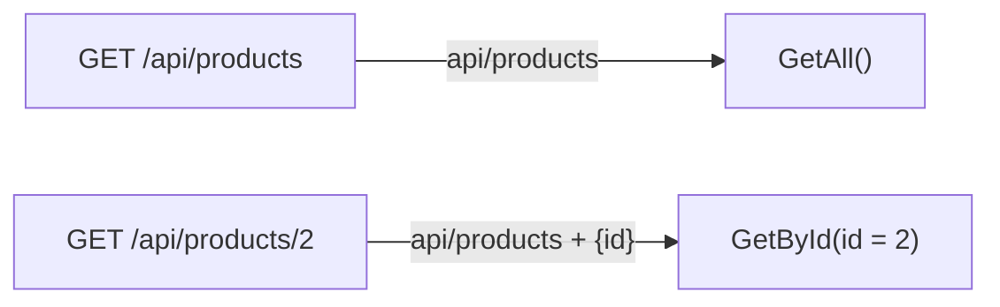

Controller mẫu trả về thời tiết, còn cửa hàng cần API sản phẩm. Bài này hướng
dẫn tự viết controller đầu tiên và xem ASP.NET Core chọn method nào của
controller để chạy khi có request tới.

## Khái niệm

🎮 **Controller**: class kế thừa `ControllerBase`, gom các action xử lý request cho cùng một tài nguyên.

⚡ **Action**: method `public` trong controller, mỗi action ứng với một cặp HTTP method và URL.

🗺️ **Routing**: cơ chế ASP.NET Core dựa vào HTTP method và URL của request để chọn action sẽ chạy.

## Ví dụ

Tạo file `Controllers/ProductsController.cs`:

```csharp
using Microsoft.AspNetCore.Mvc;

[ApiController]
[Route("api/products")]
public class ProductsController : ControllerBase
{
    private static readonly List<Product> Products =
        new List<Product>
        {
            new Product(1, "Pen", 5000m),
            new Product(2, "Notebook", 12000m),
        };

    [HttpGet]
    public List<Product> GetAll() => Products;

    [HttpGet("{id}")]
    public Product? GetById(int id) =>
        Products.FirstOrDefault(p => p.Id == id);
}

public class Product(int id, string name, decimal price)
{
    public int Id { get; } = id;
    public string Name { get; } = name;
    public decimal Price { get; } = price;
}
```

- `[Route("api/products")]` đặt đường dẫn chung cho cả controller.
- `[HttpGet]` nối `GET /api/products` tới `GetAll`.
- `[HttpGet("{id}")]` nối `GET /api/products/2` tới `GetById`. Phần `{id}`
  trong URL được gán vào tham số `id`.
- `[ApiController]` bật các hành vi dành cho API, như tự trả lỗi 400 khi dữ
  liệu gửi lên sai.
- `Product(int id, string name, decimal price)` là cách viết gọn: tham số
  đặt ngay sau tên class, dùng để gán giá trị cho property.
- Danh sách sản phẩm để tạm trong bộ nhớ. Chương 4 sẽ chuyển sang database.

Routing ghép route của controller với route của action để chọn action:



## Thử ngay

Chạy lại server, rồi gọi lần lượt:

```bash
curl -i http://localhost:5000/api/products
curl -i http://localhost:5000/api/products/2
curl -i http://localhost:5000/api/products/99
```

**Đoán trước khi chạy:** sản phẩm số 99 không có. Lần gọi cuối trả status
code nào?

<details>
<summary>Xem kết quả</summary>

```http
HTTP/1.1 200 OK
[{"id":1,"name":"Pen","price":5000},{"id":2,"name":"Notebook","price":12000}]

HTTP/1.1 200 OK
{"id":2,"name":"Notebook","price":12000}

HTTP/1.1 204 No Content
```

Không phải 404 mà là 204. Action trả về `null`, ASP.NET Core hiểu đó là
"thành công nhưng không có dữ liệu". Bài **Trả về kết quả** sẽ hướng dẫn trả
404 đúng cách.

</details>

## Lỗi hay gặp

**Controller có `[ApiController]` nhưng thiếu `[Route]`.** Mọi request đều
nhận lỗi 500, log báo action phải có route.

```csharp
// SAI — thiếu [Route], request nào cũng lỗi 500
using Microsoft.AspNetCore.Mvc;

[ApiController]
public class OrdersController : ControllerBase
{
    [HttpGet]
    public string GetAll() => "orders";
}
```

```csharp
// ĐÚNG
using Microsoft.AspNetCore.Mvc;

[ApiController]
[Route("api/orders")]
public class OrdersController : ControllerBase
{
    [HttpGet]
    public string GetAll() => "orders";
}
```

**Hai action cùng method và cùng URL.** ASP.NET Core không biết chọn cái nào,
nên request nhận lỗi 500.

```csharp
// SAI — hai action đều là GET /api/customers
using Microsoft.AspNetCore.Mvc;

[ApiController]
[Route("api/customers")]
public class CustomersController : ControllerBase
{
    [HttpGet]
    public string GetAll() => "all";

    [HttpGet]
    public string GetActive() => "active";
}
```

Sửa bằng cách cho action thứ hai một URL riêng, ví dụ `[HttpGet("active")]`.

## Tóm tắt

- Controller kế thừa `ControllerBase`, đánh dấu `[ApiController]` và
  `[Route]`.
- Mỗi action có `[HttpGet]`, `[HttpPost]`… kèm phần URL riêng nếu cần.
- `{id}` trong route được gán vào tham số cùng tên.
- Action trả về `null` thì response là 204, không phải 404.

```quiz
[
  {
    "prompt": "Controller có [Route(\"api/orders\")], action có [HttpGet(\"{id}/lines\")]. URL nào gọi tới action này?",
    "options": [
      "GET /orders/5/lines",
      "GET /api/orders/lines/5",
      "GET /api/orders/5/lines",
      "GET /api/lines/5"
    ],
    "answer": 3,
    "explain": "Route của action được nối sau route của controller: api/orders + {id}/lines."
  },
  {
    "prompt": "Action GetById(int id) trả về null khi không tìm thấy. Client nhận status code nào?",
    "options": [
      "204 No Content",
      "404 Not Found",
      "500 Internal Server Error",
      "200 OK với body null"
    ],
    "answer": 1,
    "explain": "ASP.NET Core đổi kết quả null thành 204. Muốn trả 404 thì phải chủ động trả NotFound()."
  },
  {
    "prompt": "Vì sao một class trở thành controller trong ví dụ trên?",
    "options": [
      "Vì tên file nằm trong thư mục Controllers",
      "Vì có method tên GetAll",
      "Vì được đăng ký trong appsettings.json",
      "Vì kế thừa ControllerBase"
    ],
    "answer": 4,
    "explain": "ASP.NET Core nhận ra controller nhờ kế thừa ControllerBase. Còn [Route] và [HttpGet] cho biết URL nào gọi tới action nào."
  }
]
```
