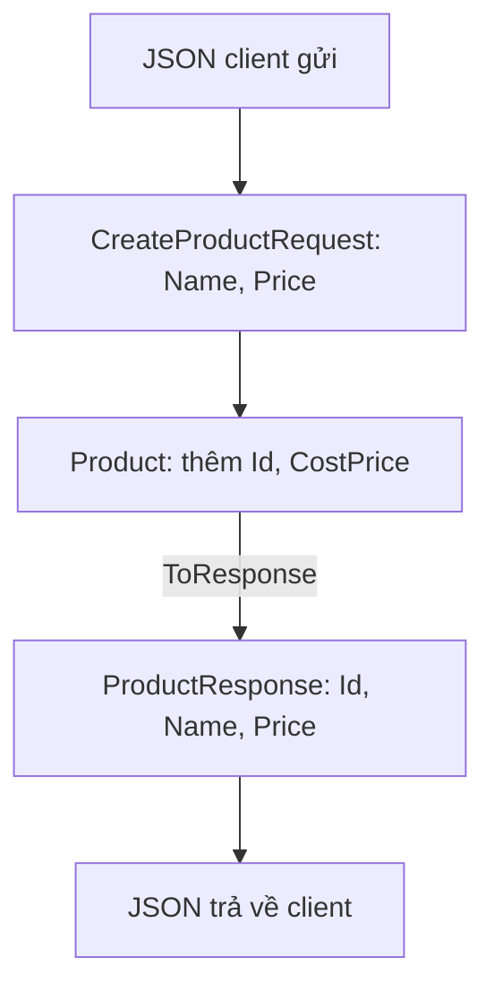

Class `Product` trong hệ thống có cả giá nhập hàng, là thông tin nội bộ. Nếu
action trả thẳng `Product` ra ngoài thì khách hàng thấy luôn giá nhập. Nếu
action nhận thẳng `Product` từ body thì client tự đặt được `Id`. DTO tách phần
dữ liệu đi qua API ra khỏi class dùng bên trong.

## Khái niệm

📦 **DTO (Data Transfer Object)**: class chỉ chứa dữ liệu đi vào hoặc đi ra qua API, tách riêng khỏi class dùng bên trong hệ thống.

Thường mỗi tài nguyên có hai loại DTO:

| DTO | Hướng | Chứa gì |
|---|---|---|
| `ProductResponse` | server → client | những gì client được xem |
| `CreateProductRequest` | client → server | những gì client được phép gửi |

## Ví dụ

```csharp
using Microsoft.AspNetCore.Mvc;

[ApiController]
[Route("api/products")]
public class ProductsController : ControllerBase
{
    private static readonly List<Product> Products =
        new List<Product>();

    [HttpPost]
    public ActionResult<ProductResponse> Create(
        CreateProductRequest request)
    {
        var product = new Product
        {
            Id = Products.Count + 1,
            Name = request.Name,
            Price = request.Price,
            CostPrice = request.Price * 70 / 100,
        };
        Products.Add(product);
        return Created(
            $"/api/products/{product.Id}",
            ToResponse(product));
    }

    private static ProductResponse ToResponse(
        Product p) =>
        new ProductResponse
        {
            Id = p.Id, Name = p.Name, Price = p.Price
        };
}

public class Product
{
    public int Id { get; set; }
    public string Name { get; set; } = "";
    public decimal Price { get; set; }
    public decimal CostPrice { get; set; }
}

public class CreateProductRequest
{
    public string Name { get; set; } = "";
    public decimal Price { get; set; }
}

public class ProductResponse
{
    public int Id { get; set; }
    public string Name { get; set; } = "";
    public decimal Price { get; set; }
}
```

- `Product` là class bên trong, có `CostPrice` là giá nhập.
- `CreateProductRequest` không có `Id` hay `CostPrice`, nên client không gửi
  được hai giá trị đó.
- `ProductResponse` không có `CostPrice`, nên giá nhập không bao giờ lộ ra.
- `ToResponse` chép dữ liệu từ `Product` sang DTO. Viết tay như vậy là đủ
  cho hầu hết dự án.
- `Created(url, data)` cũng trả 201 như `CreatedAtAction`, dùng khi chưa có
  action đọc riêng để trỏ tới.



## Thử ngay

Chạy server. Tạo file `product.json`:

```json
{ "name": "Pen", "price": 5000, "costPrice": 1, "id": 999 }
```

Rồi gửi:

```bash
curl -i -X POST http://localhost:5000/api/products -H "Content-Type: application/json" -d @product.json
```

**Đoán trước khi chạy:** client cố gửi `id` là 999 và `costPrice` là 1.
Response trả về `id` bằng bao nhiêu, và có `costPrice` không?

<details>
<summary>Xem kết quả</summary>

```http
HTTP/1.1 201 Created
{"id":1,"name":"Pen","price":5000}
```

`id` là 1, do server tự cấp. `CreateProductRequest` không có `Id` và
`CostPrice`, nên hai giá trị client gửi bị bỏ qua. Response cũng không có
`costPrice`.

</details>

## Lỗi hay gặp

**Trả thẳng class bên trong ra ngoài.** Mọi property đều lộ ra, kể cả giá
nhập.

```csharp
// SAI — response có luôn CostPrice
using Microsoft.AspNetCore.Mvc;

public class ItemsController : ControllerBase
{
    [HttpGet("{id}")]
    public Product GetById(int id) =>
        new Product { Id = id, CostPrice = 3500m };
}
```

**Nhận thẳng class bên trong từ body.** Client gửi thêm `id` hay `costPrice`
là gán được luôn. Luôn nhận qua DTO chỉ chứa những gì client được phép gửi,
như `CreateProductRequest` ở trên.

## Tóm tắt

- DTO là class chỉ chứa dữ liệu đi qua API, tách khỏi class bên trong.
- DTO response quyết định client được xem gì.
- DTO request quyết định client được gửi gì, chặn việc tự đặt `Id` hay giá
  nhập.
- Chép dữ liệu giữa class bên trong và DTO bằng một method nhỏ.

```quiz
[
  {
    "prompt": "Class User có PasswordHash. Action GET /api/users/1 nên trả về kiểu gì?",
    "options": [
      "User",
      "string chứa toàn bộ User",
      "UserResponse không có PasswordHash",
      "object"
    ],
    "answer": 3,
    "explain": "Trả qua DTO chỉ có những trường client được xem. Trả thẳng User là lộ PasswordHash."
  },
  {
    "prompt": "CreateOrderRequest không có property Status. Client gửi JSON kèm \"status\": \"Paid\". Chuyện gì xảy ra?",
    "options": [
      "Trường status bị bỏ qua",
      "Đơn hàng được tạo với trạng thái Paid",
      "Lỗi 500",
      "Lỗi compile"
    ],
    "answer": 1,
    "explain": "Model binding chỉ gán các property có trong DTO. Trường thừa trong JSON bị bỏ qua."
  },
  {
    "prompt": "Vì sao DTO request để tạo sản phẩm không nên có Id?",
    "options": [
      "Vì Id làm JSON dài hơn",
      "Vì C# không cho đặt tên Id",
      "Vì Id không phải kiểu int",
      "Vì Id do server cấp, client không được tự đặt"
    ],
    "answer": 4,
    "explain": "Client tự đặt Id có thể ghi đè hoặc trùng dữ liệu khác. Id phải do server quyết định."
  }
]
```
