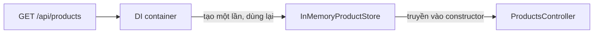

Ở chương trước, danh sách sản phẩm là một list `static` nằm ngay trong
controller. Controller vừa xử lý request vừa giữ dữ liệu, nên muốn đổi sang
database thì phải sửa controller. Bài này tách phần lưu trữ ra một service, rồi
để ASP.NET Core tự đưa service đó vào controller.

## Khái niệm

🧰 **DI container**: thành phần của ASP.NET Core tự tạo object và truyền vào constructor của class cần nó.

⏱️ **Service lifetime**: quy định container tạo object mới khi nào.

| Đăng ký bằng | Container tạo object |
|---|---|
| `AddTransient` | mới mỗi lần có nơi cần |
| `AddScoped` | một object cho mỗi request |
| `AddSingleton` | một object cho cả ứng dụng |

## Ví dụ

```csharp
using Microsoft.AspNetCore.Mvc;

var builder = WebApplication.CreateBuilder(args);
builder.Services.AddControllers();
builder.Services.AddSingleton<
    IProductStore, InMemoryProductStore>();

var app = builder.Build();
app.MapControllers();
app.Run();

public interface IProductStore
{
    List<string> GetAll();
}

public class InMemoryProductStore : IProductStore
{
    private readonly List<string> _names =
        new List<string> { "Pen", "Notebook" };

    public List<string> GetAll() => _names;
}

[ApiController]
[Route("api/products")]
public class ProductsController : ControllerBase
{
    private readonly IProductStore _store;

    public ProductsController(IProductStore store)
    {
        _store = store;
    }

    [HttpGet]
    public List<string> GetAll() => _store.GetAll();
}
```

- `AddSingleton<IProductStore, InMemoryProductStore>()`: nơi nào cần
  `IProductStore` thì nhận `InMemoryProductStore`.
- Controller chỉ khai báo tham số `IProductStore` trong constructor.
  Container tự tạo object và truyền vào. Ở bài DIP khoá OOP bạn tự tạo
  object rồi truyền vào constructor, ở đây container làm việc đó.
- Dữ liệu trong bộ nhớ phải sống suốt ứng dụng, nên đăng ký `Singleton`.
- Sang chương 4, controller vẫn nhận `IProductStore` qua constructor như
  cũ, còn phần đọc ghi database nằm trong một class store mới.



## Thử ngay

Thêm class đếm và một controller mới vào project, rồi đăng ký bằng `AddScoped`:

```csharp
using Microsoft.AspNetCore.Mvc;

var builder = WebApplication.CreateBuilder(args);
builder.Services.AddControllers();
builder.Services.AddScoped<Counter>();

var app = builder.Build();
app.MapControllers();
app.Run();

public class Counter
{
    private int _count;

    public int Next()
    {
        _count++;
        return _count;
    }
}

[ApiController]
[Route("api/count")]
public class CountController : ControllerBase
{
    [HttpGet]
    public int Get([FromServices] Counter counter) =>
        counter.Next();
}
```

Gọi `curl -i http://localhost:5000/api/count` ba lần. Sau đó đổi `AddScoped`
thành `AddSingleton`, chạy lại server và gọi thêm ba lần.

**Đoán trước khi chạy:** với `AddScoped`, ba lần gọi trả về những số nào?

<details>
<summary>Xem kết quả</summary>

```text
Status 200 cả sáu lần, body lần lượt là:
AddScoped:    1, 1, 1
AddSingleton: 1, 2, 3
```

`Scoped` tạo `Counter` mới cho mỗi request, nên lần nào cũng bắt đầu lại từ
0. `Singleton` dùng chung một `Counter` cho cả ứng dụng, nên số tăng dần.
`[FromServices]` bảo ASP.NET Core lấy tham số này từ container.

</details>

## Lỗi hay gặp

**Quên đăng ký service.** Request tới controller nhận lỗi 500, log báo không
tạo được `IProductStore`.

```csharp
// SAI — controller cần IProductStore mà chưa đăng ký
var builder = WebApplication.CreateBuilder(args);
builder.Services.AddControllers();

var app = builder.Build();
app.MapControllers();
app.Run();
```

```csharp
// ĐÚNG
var builder = WebApplication.CreateBuilder(args);
builder.Services.AddControllers();
builder.Services.AddSingleton<
    IProductStore, InMemoryProductStore>();

var app = builder.Build();
app.MapControllers();
app.Run();
```

**Singleton phụ thuộc vào Scoped.** Object sống suốt ứng dụng lại giữ một
object vốn chỉ nên sống trong một request. Ở môi trường Development, ứng dụng dừng
ngay lúc khởi động và báo lỗi này.

```csharp
// SAI — Report sống mãi, lại giữ Counter của request
var builder = WebApplication.CreateBuilder(args);
builder.Services.AddScoped<Counter>();
builder.Services.AddSingleton<Report>();
var app = builder.Build();   // báo lỗi tại đây

public class Report
{
    public Report(Counter counter) { }
}
```

```csharp
// ĐÚNG — Report cũng chỉ sống trong một request
var builder = WebApplication.CreateBuilder(args);
builder.Services.AddScoped<Counter>();
builder.Services.AddScoped<Report>();
var app = builder.Build();

public class Report
{
    public Report(Counter counter) { }
}
```

## Tóm tắt

- Đăng ký service trong `Program.cs`, nhận qua constructor của controller.
- `Transient` tạo mới mỗi lần, `Scoped` mỗi request một, `Singleton` cả ứng
  dụng một.
- Đăng ký bằng interface để đổi cách làm mà không sửa controller.
- Service sống lâu không được phụ thuộc vào service sống ngắn hơn.

```quiz
[
  {
    "prompt": "Service lưu cấu hình đọc một lần lúc khởi động và dùng chung cho mọi request. Nên đăng ký bằng gì?",
    "options": [
      "AddSingleton",
      "AddTransient",
      "AddScoped",
      "Không cần đăng ký"
    ],
    "answer": 1,
    "explain": "Dùng chung cho cả ứng dụng và không đổi theo request, nên một object duy nhất là đủ."
  },
  {
    "prompt": "Gọi API thì nhận 500, log báo \"Unable to resolve service for type 'IEmailSender'\". Nguyên nhân?",
    "options": [
      "IEmailSender phải là class",
      "Chưa đăng ký IEmailSender",
      "Controller thiếu [Route]",
      "Constructor thiếu [FromServices]"
    ],
    "answer": 2,
    "explain": "Container không biết tạo gì khi có nơi cần IEmailSender. Phải thêm builder.Services.AddScoped<IEmailSender, ...>()."
  },
  {
    "prompt": "Service đăng ký bằng AddScoped được dùng ở controller và ở một service khác trong CÙNG một request. Có bao nhiêu object được tạo?",
    "options": [
      "Hai, mỗi nơi một object",
      "Một, dùng chung cả ứng dụng",
      "Một, dùng chung trong request",
      "Mỗi lần gọi method tạo một"
    ],
    "answer": 3,
    "explain": "Scoped nghĩa là một object cho mỗi request. Mọi nơi trong cùng request nhận chung object đó."
  }
]
```
