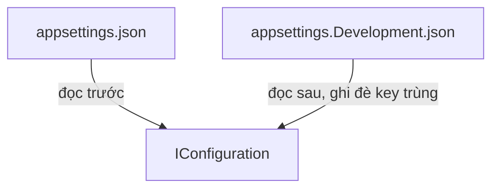

Tên cửa hàng, số món tối đa mỗi đơn, chuỗi kết nối database: những giá trị
này khác nhau giữa máy dev và server thật. Viết cứng trong code thì mỗi lần đổi
phải build lại. ASP.NET Core đọc chúng từ file cấu hình.

## Khái niệm

⚙️ **appsettings.json**: file JSON chứa cấu hình của ứng dụng, được đọc tự động khi khởi động.

🌍 **Môi trường (environment)**: tên chế độ đang chạy như `Development` hay `Production`. File `appsettings.{Môi trường}.json` được đọc sau và ghi đè giá trị của `appsettings.json`.



## Ví dụ

Thêm vào `appsettings.json`:

```json
{
  "Shop": {
    "Name": "Shop An",
    "MaxItemsPerOrder": 20
  }
}
```

Đọc trong controller qua `IConfiguration`:

```csharp
using Microsoft.AspNetCore.Mvc;

[ApiController]
[Route("api/shop")]
public class ShopController : ControllerBase
{
    private readonly IConfiguration _config;

    public ShopController(IConfiguration config)
    {
        _config = config;
    }

    [HttpGet]
    public string Get()
    {
        string? name = _config["Shop:Name"];
        int max = _config.GetValue<int>(
            "Shop:MaxItemsPerOrder");
        return $"{name}: tối đa {max} món";
    }
}
```

- `IConfiguration` có sẵn trong container, chỉ cần nhận qua constructor.
- Dấu `:` nối tên các cấp trong JSON: `Shop:Name`.
- `GetValue<int>` đọc giá trị rồi đổi sang kiểu `int`.

## Đọc cấu hình vào class

Nhiều giá trị cùng nhóm thì đọc cả nhóm vào một class:

```csharp
using Microsoft.Extensions.Options;

var builder = WebApplication.CreateBuilder(args);
builder.Services.Configure<ShopOptions>(
    builder.Configuration.GetSection("Shop"));

public class ShopOptions
{
    public string Name { get; set; } = "";
    public int MaxItemsPerOrder { get; set; }
}
```

Class cần dùng nhận `IOptions<ShopOptions>` qua constructor, rồi đọc
`options.Value.MaxItemsPerOrder`. Cách này có kiểu rõ ràng, gõ sai tên property thì
compiler báo ngay. Tên property vẫn phải khớp với key trong JSON.

## Thử ngay

Dùng `ShopController` ở phần Ví dụ. Mở file `appsettings.Development.json`
có sẵn trong project, thêm:

```json
{
  "Shop": {
    "MaxItemsPerOrder": 5
  }
}
```

Chạy lại server rồi gọi `curl http://localhost:5000/api/shop`.

**Đoán trước khi chạy:** `dotnet run` chạy ở môi trường `Development`. Số
món tối đa in ra là 20 hay 5?

<details>
<summary>Xem kết quả</summary>

```text
Shop An: tối đa 5 món
```

Là 5. File của môi trường `Development` được đọc sau và ghi đè
`MaxItemsPerOrder`. Còn `Name` không bị ghi đè nên vẫn lấy từ
`appsettings.json`.

</details>

## Lỗi hay gặp

**Gõ sai tên key.** Ứng dụng không báo lỗi, chỉ trả về giá trị mặc định.

```csharp
// SAI — thiếu chữ s, max luôn bằng 0
int max = _config.GetValue<int>(
    "Shop:MaxItemPerOrder");
```

Đọc qua class `ShopOptions` như ở trên thì tên key chỉ khai báo một lần,
không phải gõ lại chuỗi ở nhiều nơi.

**Để mật khẩu trong `appsettings.json`.** File này được commit lên git, ai có
code là thấy mật khẩu. Khi dev, lưu bí mật bằng `dotnet user-secrets`. Trên
server, lưu bằng biến môi trường.

## Tóm tắt

- Cấu hình nằm trong `appsettings.json`, đọc qua `IConfiguration`.
- `appsettings.Development.json` ghi đè giá trị khi chạy ở môi trường dev.
- Nhóm cấu hình nên đọc vào class bằng `Configure<T>` và `IOptions<T>`.
- Không để mật khẩu hay khoá bí mật trong file commit lên git.

```quiz
[
  {
    "prompt": "appsettings.json có \"Email\": { \"Smtp\": { \"Port\": 587 } }. Key nào đọc được số 587?",
    "options": [
      "Email.Smtp.Port",
      "Port",
      "Email:Smtp:Port",
      "Email/Smtp/Port"
    ],
    "answer": 3,
    "explain": "Dấu : nối tên các cấp trong JSON."
  },
  {
    "prompt": "appsettings.json đặt LogLevel là Warning, appsettings.Development.json đặt là Debug. Chạy ở Development thì dùng giá trị nào?",
    "options": [
      "Debug",
      "Warning",
      "Cả hai",
      "Báo lỗi xung đột"
    ],
    "answer": 1,
    "explain": "File của môi trường được đọc sau và ghi đè giá trị trùng key."
  },
  {
    "prompt": "Chuỗi kết nối database có mật khẩu thật. Nên lưu ở đâu khi chạy trên server?",
    "options": [
      "appsettings.json",
      "Viết cứng trong Program.cs",
      "appsettings.Development.json",
      "Biến môi trường trên server"
    ],
    "answer": 4,
    "explain": "Các file appsettings được commit lên git. Bí mật trên server nên để trong biến môi trường hoặc kho bí mật."
  }
]
```
