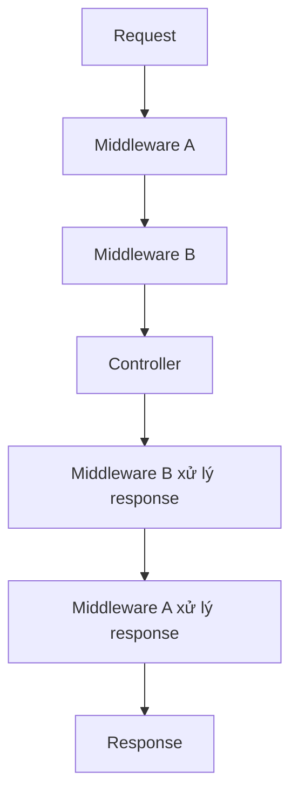

Để đo mỗi request mất bao lâu, bạn không muốn thêm code đo vào từng action.
Việc chung cho mọi request như vậy nên làm ở một chỗ, trước khi request tới
controller. Chỗ đó là pipeline.

## Khái niệm

🚰 **Pipeline**: chuỗi các bước mà mọi request đi qua trước khi tới controller, rồi response đi ngược lại qua đúng các bước đó.

🧱 **Middleware**: một bước trong pipeline, xử lý request, gọi bước tiếp theo, rồi xử lý response.



## Ví dụ

```csharp
using System.Diagnostics;

var builder = WebApplication.CreateBuilder(args);
builder.Services.AddControllers();

var app = builder.Build();

app.Use(async (context, next) =>
{
    var watch = Stopwatch.StartNew();
    await next();
    Console.WriteLine(
        $"{context.Request.Path} " +
        $"{context.Response.StatusCode} " +
        $"{watch.ElapsedMilliseconds}ms");
});

app.MapControllers();
app.Run();
```

- `app.Use(...)` thêm một middleware vào pipeline. Tham số là lambda nhận
  hai tham số `(context, next)`, thân nhiều câu lệnh đặt trong `{ }`.
- Lambda cũng đánh dấu `async` được như method.
- `context` chứa request và response hiện tại.
- Code trước `await next()` chạy khi request đi vào. Code sau nó chạy khi
  response đi ra.
- `Stopwatch` đo thời gian, cần `using System.Diagnostics`.
- Middleware chạy theo đúng thứ tự được thêm trong `Program.cs`.

## Thử ngay

Thay phần middleware ở ví dụ bằng hai middleware:

```csharp
var builder = WebApplication.CreateBuilder(args);
builder.Services.AddControllers();
var app = builder.Build();

app.Use(async (context, next) =>
{
    Console.WriteLine("A vào");
    await next();
    Console.WriteLine("A ra");
});

app.Use(async (context, next) =>
{
    Console.WriteLine("B vào");
    await next();
    Console.WriteLine("B ra");
});

app.MapControllers();
app.Run();
```

Chạy server, gọi `curl -i http://localhost:5000/api/products` rồi xem cửa sổ
đang chạy server.

**Đoán trước khi chạy:** bốn dòng in ra theo thứ tự nào?

<details>
<summary>Xem kết quả</summary>

```text
A vào
B vào
B ra
A ra
```

Request đi xuôi A rồi B, tới controller, rồi response đi ngược B rồi A.
Middleware thêm trước thì bọc ngoài middleware thêm sau.

</details>

## Lỗi hay gặp

**Quên `await next()`.** Request dừng ở middleware này, controller không bao
giờ chạy. Client nhận response rỗng.

```csharp
// SAI — không gọi next, request không đi tiếp
var app = WebApplication.Create(args);
app.Use(async (context, next) =>
{
    Console.WriteLine("Có request");
});
```

```csharp
// ĐÚNG
var app = WebApplication.Create(args);
app.Use(async (context, next) =>
{
    Console.WriteLine("Có request");
    await next();
});
```

**Sửa response sau khi đã gửi.** Sau `await next()`, response thường đã bắt
đầu gửi về client. Đổi header lúc đó sẽ báo lỗi.

```csharp
// SAI — header đã gửi đi, không đổi được nữa
var app = WebApplication.Create(args);
app.Use(async (context, next) =>
{
    await next();
    context.Response.Headers["X-Shop"] = "An";
});
```

Muốn thêm header thì đặt code đó trước `await next()`.

```csharp
// ĐÚNG — đổi header khi response chưa gửi
var app = WebApplication.Create(args);
app.Use(async (context, next) =>
{
    context.Response.Headers["X-Shop"] = "An";
    await next();
});
```

## Tóm tắt

- Pipeline là chuỗi middleware mà mọi request đi qua.
- Middleware xử lý request trước `await next()`, xử lý response sau đó.
- Thứ tự thêm middleware trong `Program.cs` là thứ tự chạy.
- Việc chung cho mọi request như đo thời gian, ghi log nên làm ở middleware.

```quiz
[
  {
    "prompt": "Ba middleware X, Y, Z được thêm theo thứ tự đó. Response đi ra qua chúng theo thứ tự nào?",
    "options": [
      "X, Y, Z",
      "Z, Y, X",
      "Y, X, Z",
      "Chỉ qua Z"
    ],
    "answer": 2,
    "explain": "Request đi xuôi X, Y, Z. Response đi ngược lại Z, Y, X."
  },
  {
    "prompt": "Việc nào hợp để làm bằng middleware?",
    "options": [
      "Tính phí ship của một đơn hàng",
      "Kiểm tra tên sản phẩm không rỗng",
      "Ghi log thời gian của mọi request",
      "Lấy sản phẩm theo id"
    ],
    "answer": 3,
    "explain": "Middleware dành cho việc chung của mọi request. Ba việc còn lại là nghiệp vụ, thuộc về controller và service."
  },
  {
    "prompt": "Một middleware không gọi await next(). Chuyện gì xảy ra với request?",
    "options": [
      "Vẫn tới controller bình thường",
      "ASP.NET Core tự gọi next() thay",
      "Trả 500 vì thiếu next()",
      "Dừng ở đó, controller không chạy"
    ],
    "answer": 4,
    "explain": "next() là bước chuyển sang middleware tiếp theo. Không gọi thì pipeline dừng tại đó."
  }
]
```
