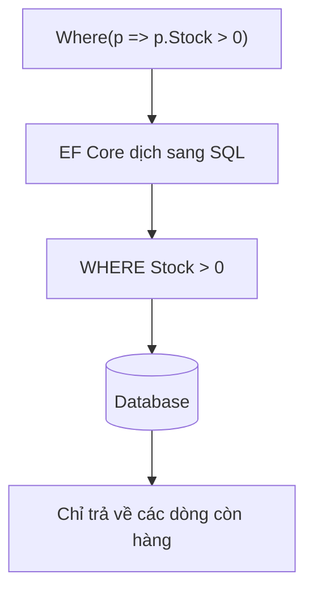

Database đã có bảng. Giờ API cần đọc, lọc, thêm, sửa, xoá sản phẩm thật. Với
EF Core, bạn viết LINQ như với list trong bộ nhớ, còn EF Core dịch nó sang
SQL và chạy trong database.

## Khái niệm

🔍 **Truy vấn trên DbSet**: LINQ viết trên `DbSet` không chạy trong bộ nhớ, mà được EF Core dịch sang câu SQL và chạy trong database.

💾 **SaveChangesAsync**: method ghi mọi thay đổi (thêm, sửa, xoá) mà `DbContext` đang theo dõi xuống database trong một lần.

| Việc | Code |
|---|---|
| Đọc hết | `await _db.Products.ToListAsync()` |
| Lọc | `await _db.Products.Where(...).ToListAsync()` |
| Tìm theo khoá | `await _db.Products.FindAsync(id)` |
| Thêm | `_db.Products.Add(p)` rồi `SaveChangesAsync()` |
| Sửa | đổi property rồi `SaveChangesAsync()` |
| Xoá | `_db.Products.Remove(p)` rồi `SaveChangesAsync()` |

## Ví dụ

Phần đọc ghi database nằm trong `DbProductStore`, sau interface `IProductStore`
như bài Dependency injection. Controller không biết có EF Core:

```csharp
using Microsoft.AspNetCore.Mvc;
using Microsoft.EntityFrameworkCore;

public interface IProductStore
{
    Task<List<Product>> InStockAsync();
    Task<bool> SetStockAsync(int id, int stock);
}

public class DbProductStore : IProductStore
{
    private readonly ShopDbContext _db;

    public DbProductStore(ShopDbContext db)
    {
        _db = db;
    }

    public async Task<List<Product>> InStockAsync() =>
        await _db.Products
            .Where(p => p.Stock > 0)
            .ToListAsync();

    public async Task<bool> SetStockAsync(
        int id, int stock)
    {
        var product = await _db.Products.FindAsync(id);
        if (product == null)
        {
            return false;
        }
        product.Stock = stock;
        await _db.SaveChangesAsync();
        return true;
    }
}

[ApiController]
[Route("api/products")]
public class ProductsController : ControllerBase
{
    private readonly IProductStore _store;

    public ProductsController(IProductStore store)
    {
        _store = store;
    }

    [HttpGet("in-stock")]
    public async Task<List<Product>> InStock() =>
        await _store.InStockAsync();

    [HttpPut("{id}/stock")]
    public async Task<IActionResult> SetStock(
        int id, int stock)
    {
        if (!await _store.SetStockAsync(id, stock))
        {
            return NotFound();
        }
        return NoContent();
    }
}

public class Product
{
    public int Id { get; set; }
    public string Name { get; set; } = "";
    public int Stock { get; set; }
}

public class ShopDbContext : DbContext
{
    public ShopDbContext(
        DbContextOptions<ShopDbContext> options)
        : base(options)
    {
    }

    public DbSet<Product> Products => Set<Product>();
}
```

- Đăng ký trong `Program.cs`:
  `builder.Services.AddScoped<IProductStore, DbProductStore>();`. Phải là
  `Scoped` vì `DbContext` là `Scoped`, đúng lỗi "Singleton phụ thuộc
  Scoped" của bài Dependency injection.
- `Where(...).ToListAsync()`: điều kiện lọc chạy trong database, chỉ các dòng
  khớp mới được gửi về.
- `FindAsync(id)` tìm theo khoá chính, không có thì trả `null`.
- Sửa: chỉ cần đổi property rồi gọi `SaveChangesAsync`. `DbContext` tự biết
  object nào đã đổi và sinh câu `UPDATE`.
- `SaveChangesAsync` gói mọi câu `INSERT`, `UPDATE`, `DELETE` vào một
  transaction như bài Transaction của khoá SQL: một câu lỗi thì không câu nào
  được lưu.
- Mọi method đọc ghi database đều có bản `Async`, dùng kèm `await`.
- Giá trị lấy từ biến C# được EF Core gửi bằng bind variable, như bài SQL
  injection của khoá SQL, nên truy vấn LINQ không bị chèn SQL.



## Thử ngay

Để xem câu SQL mà EF Core sinh ra, thêm vào mục `Logging:LogLevel` của
`appsettings.Development.json`:

```json
"Microsoft.EntityFrameworkCore.Database.Command": "Information"
```

Chạy server, gọi `curl http://localhost:5000/api/products/in-stock` rồi xem
cửa sổ đang chạy server.

**Đoán trước khi chạy:** điều kiện `Stock > 0` được lọc trong C# sau khi đọc
hết bảng, hay nằm ngay trong câu SQL?

<details>
<summary>Xem kết quả</summary>

```sql
SELECT "p"."ID", "p"."NAME", "p"."STOCK"
FROM "PRODUCTS" "p"
WHERE "p"."STOCK" > 0
```

Nằm trong câu SQL. EF Core dịch lambda `p => p.Stock > 0` thành
`WHERE "p"."STOCK" > 0`, nên Oracle chỉ trả về các dòng còn hàng.

</details>

## Lỗi hay gặp

**Gọi `ToListAsync()` trước khi lọc.** Cả bảng được đọc về bộ nhớ rồi mới lọc.
Bảng có một triệu dòng thì cả một triệu dòng bị đọc vào bộ nhớ.

```csharp
// SAI — đọc hết bảng rồi mới lọc trong C#
var all = await _db.Products.ToListAsync();
var inStock = all.Where(p => p.Stock > 0).ToList();
```

```csharp
// ĐÚNG — lọc trong database
var inStock = await _db.Products
    .Where(p => p.Stock > 0)
    .ToListAsync();
```

**Quên `SaveChangesAsync()`.** `Add`, `Remove` hay đổi property chỉ được ghi
nhận trong `DbContext`. Không gọi `SaveChangesAsync` thì không có gì được ghi xuống
database.

## Tóm tắt

- LINQ trên `DbSet` được dịch sang SQL và chạy trong database.
- Lọc bằng `Where` trước, gọi `ToListAsync` sau cùng.
- Thêm, sửa, xoá xong phải gọi `SaveChangesAsync` mới được ghi.
- Dùng bản `Async` kèm `await` cho mọi thao tác với database.

```quiz
[
  {
    "prompt": "Code: var p = await _db.Products.FindAsync(3); p.Price = 9000m; return Ok(); Giá trong database có đổi không?",
    "options": [
      "Có, đổi ngay khi gán",
      "Có, khi request kết thúc",
      "Không, vì thiếu SaveChangesAsync",
      "Lỗi compile"
    ],
    "answer": 3,
    "explain": "Gán property chỉ đổi object trong DbContext. Phải gọi SaveChangesAsync thì mới sinh UPDATE xuống database."
  },
  {
    "prompt": "Cần 10 đơn hàng mới nhất. Cách nào chỉ lấy đúng 10 dòng từ database?",
    "options": [
      "await _db.Orders.OrderByDescending(o => o.Id).Take(10).ToListAsync()",
      "(await _db.Orders.ToListAsync()).OrderByDescending(o => o.Id).Take(10)",
      "await _db.Orders.ToListAsync() rồi lấy 10 phần tử cuối",
      "Đọc từng đơn bằng FindAsync"
    ],
    "answer": 1,
    "explain": "OrderByDescending và Take đứng trước ToListAsync nên được dịch sang SQL. Database chỉ trả về 10 dòng."
  },
  {
    "prompt": "Vì sao dùng ToListAsync thay vì ToList khi đọc database trong controller?",
    "options": [
      "ToList không dùng được với DbSet",
      "ToListAsync trả kết quả khác",
      "ToListAsync tự lọc dữ liệu",
      "Trong lúc chờ database, server không bị chặn và phục vụ được request khác"
    ],
    "answer": 4,
    "explain": "Đọc database là việc chậm. Dùng async thì luồng được trả lại để phục vụ request khác trong lúc chờ."
  }
]
```
