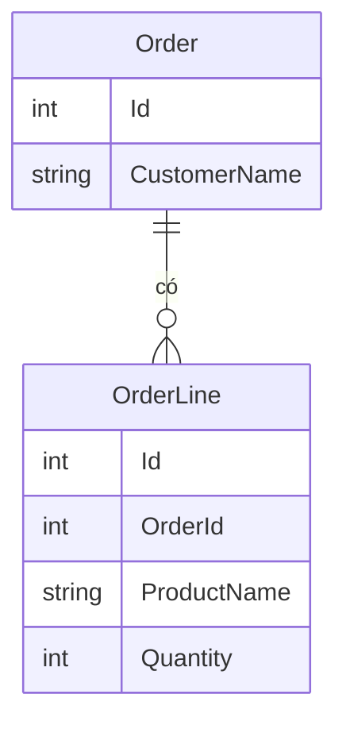

Một đơn hàng có nhiều dòng hàng: 2 bút, 3 vở. Hai loại dữ liệu này nằm ở hai
bảng, nối với nhau qua mã đơn hàng. Bài này khai báo quan hệ đó bằng EF Core
và lấy đơn hàng kèm các dòng hàng của nó.

## Khái niệm

🔗 **Quan hệ một-nhiều (one-to-many)**: một dòng ở bảng này ứng với nhiều dòng ở bảng khác, ví dụ một đơn hàng có nhiều dòng hàng.

🧲 **Navigation property**: property trỏ tới object liên quan, như `Order.Lines`, để đi từ đơn hàng tới các dòng hàng.

## Ví dụ

```csharp
using Microsoft.AspNetCore.Mvc;
using Microsoft.EntityFrameworkCore;

public class Order
{
    public int Id { get; set; }
    public string CustomerName { get; set; } = "";
    public List<OrderLine> Lines { get; set; } =
        new List<OrderLine>();
}

public class OrderLine
{
    public int Id { get; set; }
    public int OrderId { get; set; }
    public string ProductName { get; set; } = "";
    public int Quantity { get; set; }
}

public class ShopDbContext : DbContext
{
    public ShopDbContext(
        DbContextOptions<ShopDbContext> options)
        : base(options)
    {
    }

    public DbSet<Order> Orders => Set<Order>();
}

[ApiController]
[Route("api/orders")]
public class OrdersController : ControllerBase
{
    private readonly ShopDbContext _db;

    public OrdersController(ShopDbContext db)
    {
        _db = db;
    }

    [HttpGet("{id}")]
    public async Task<ActionResult<Order>> GetById(
        int id)
    {
        var order = await _db.Orders
            .Include(o => o.Lines)
            .FirstOrDefaultAsync(o => o.Id == id);
        if (order == null) return NotFound();
        return Ok(order);
    }
}
```

- `Order.Lines` là navigation property, cho biết một đơn có nhiều dòng.
- `OrderLine.OrderId` là khoá ngoại. EF Core tự nhận ra nhờ tên theo mẫu
  `TênClass` + `Id`.
- Migration tạo hai bảng `Orders` và `OrderLine`, nối với nhau qua cột
  `OrderId`.
- `Include(o => o.Lines)` bảo EF Core đọc luôn các dòng hàng cùng đơn hàng.



## Thử ngay

Tạo migration, cập nhật database, rồi thêm action sau vào `OrdersController`
để tạo một đơn mẫu có hai dòng hàng:

```csharp
using Microsoft.AspNetCore.Mvc;

// Thêm action này vào trong OrdersController
[HttpPost("sample")]
public async Task<IActionResult> CreateSample()
{
    var order = new Order { CustomerName = "An" };
    order.Lines.Add(new OrderLine
    {
        ProductName = "Bút",
        Quantity = 2
    });
    order.Lines.Add(new OrderLine
    {
        ProductName = "Vở",
        Quantity = 3
    });

    _db.Orders.Add(order);
    await _db.SaveChangesAsync();
    return Ok(order.Id);
}
```

Chạy server, tạo đơn mẫu rồi đọc lại:

```bash
curl -X POST http://localhost:5000/api/orders/sample
curl http://localhost:5000/api/orders/1
```

Rồi xoá dòng `.Include(o => o.Lines)` và gọi lại.

**Đoán trước khi chạy:** bỏ `Include` thì `lines` trong response là `null`,
mảng rỗng, hay vẫn đủ hai dòng?

<details>
<summary>Xem kết quả</summary>

```text
Có Include:   {"id":1,"customerName":"An","lines":[{...},{...}]}
Bỏ Include:   {"id":1,"customerName":"An","lines":[]}
```

Mảng rỗng. Không có `Include`, EF Core chỉ đọc bảng `Orders`. `Lines` giữ giá
trị khởi tạo là list rỗng, dù trong database vẫn có hai dòng hàng.

</details>

## Lỗi hay gặp

**Quên `Include`.** Không báo lỗi gì, chỉ âm thầm trả về dữ liệu thiếu. Hễ cần
dữ liệu liên quan thì phải `Include` nó.

**Navigation hai chiều khi trả JSON.** Thêm `Order` vào `OrderLine` để đi
ngược lại, rồi trả thẳng entity ra API. `Order` chứa `Lines`, mỗi dòng lại
chứa `Order`, JSON lặp vô tận và báo lỗi.

```csharp
// SAI — trả thẳng entity có vòng lặp Order ↔ OrderLine
public class LineWithOrder
{
    public int Id { get; set; }
    public Order? Order { get; set; }
}
```

Trả dữ liệu qua DTO như bài **DTO**, chỉ chọn những trường cần gửi, vòng lặp
sẽ không xảy ra.

## Tóm tắt

- Một-nhiều: một đơn hàng có nhiều dòng hàng.
- Khai báo bằng navigation property (`List<OrderLine> Lines`) và khoá ngoại
  (`OrderId`).
- Muốn đọc dữ liệu liên quan thì dùng `Include`.
- Trả dữ liệu có quan hệ ra API qua DTO để tránh vòng lặp JSON.

```quiz
[
  {
    "prompt": "Class Comment có property PostId, class Post có List<Comment> Comments. EF Core hiểu PostId là gì?",
    "options": [
      "Khoá chính của Comment",
      "Một cột bình thường, không liên quan Post",
      "Khoá ngoại trỏ tới Post",
      "Lỗi, phải khai báo thủ công"
    ],
    "answer": 3,
    "explain": "Tên theo mẫu TênClass + Id nên EF Core tự nhận PostId là khoá ngoại trỏ tới Post."
  },
  {
    "prompt": "Đọc khách hàng bằng _db.Customers.FirstOrDefaultAsync(...), rồi thấy customer.Orders rỗng dù database có đơn hàng. Vì sao?",
    "options": [
      "Thiếu .Include(c => c.Orders)",
      "Database bị lỗi",
      "Thiếu SaveChangesAsync",
      "Orders phải là mảng"
    ],
    "answer": 1,
    "explain": "Không Include thì EF Core không đọc bảng liên quan. Navigation property giữ nguyên giá trị khởi tạo."
  },
  {
    "prompt": "Trả thẳng entity Order có Lines, mà mỗi OrderLine lại có Order, thì chuyện gì xảy ra?",
    "options": [
      "JSON gọn hơn",
      "Lỗi compile",
      "Không có gì khác",
      "Lỗi khi tạo JSON vì vòng lặp object"
    ],
    "answer": 4,
    "explain": "Order chứa OrderLine, OrderLine lại chứa Order, nên JSON lặp mãi. Trả qua DTO để tránh."
  }
]
```
