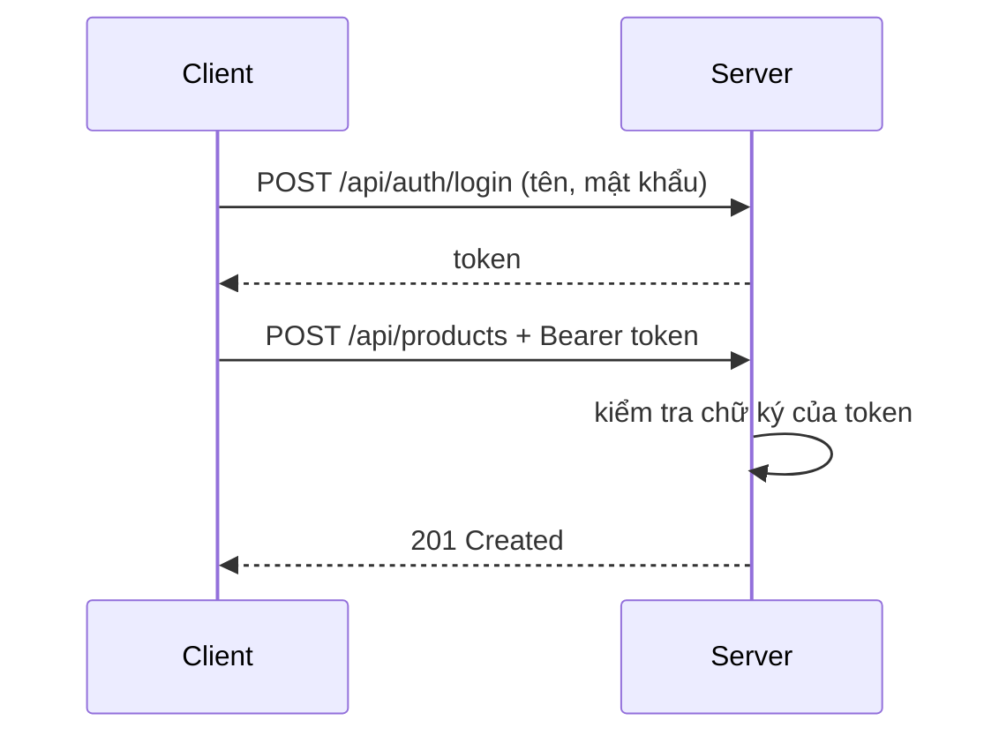

Ai cũng gọi được `POST /api/products` để thêm sản phẩm, kể cả người lạ. API
cần biết người gọi là ai, và chỉ cho người có quyền làm những việc quan trọng.
Bài này dùng JWT để làm việc đó.

## Khái niệm

🔑 **Authentication (xác thực)**: xác định người gọi API là ai.

🚦 **Authorization (phân quyền)**: quyết định người đó có được làm việc này không.

🎫 **JWT (JSON Web Token)**: chuỗi chứa thông tin người dùng kèm chữ ký của server, client gửi theo mỗi request trong header `Authorization: Bearer <token>`.

Luồng làm việc:



## Ví dụ

Cài package:

```bash
dotnet add package Microsoft.AspNetCore.Authentication.JwtBearer
```

Cấu hình trong `Program.cs`:

```csharp
using System.Text;
using Microsoft.AspNetCore.Authentication.JwtBearer;
using Microsoft.IdentityModel.Tokens;

var builder = WebApplication.CreateBuilder(args);
var secret = builder.Configuration["Jwt:Key"]!;
var key = new SymmetricSecurityKey(
    Encoding.UTF8.GetBytes(secret));

builder.Services.AddControllers();
builder.Services
    .AddAuthentication(
        JwtBearerDefaults.AuthenticationScheme)
    .AddJwtBearer(options =>
        options.TokenValidationParameters =
            new TokenValidationParameters
            {
                ValidateIssuer = false,
                ValidateAudience = false,
                IssuerSigningKey = key,
            });
builder.Services.AddAuthorization();

var app = builder.Build();
app.UseAuthentication();
app.UseAuthorization();
app.MapControllers();
app.Run();
```

Chặn action bằng `[Authorize]`:

```csharp
using Microsoft.AspNetCore.Authorization;
using Microsoft.AspNetCore.Mvc;

[ApiController]
[Route("api/products")]
public class ProductsController : ControllerBase
{
    [HttpGet]
    public string GetAll() => "Ai cũng xem được";

    [Authorize]
    [HttpPost]
    public IActionResult Create() => StatusCode(201);
}
```

- `Jwt:Key` là khoá bí mật để ký token, đặt trong cấu hình và dài ít nhất
  32 ký tự. Ai có khoá này là tự tạo được token.
- `AddJwtBearer` bảo server kiểm tra chữ ký của token trong mỗi request.
- `UseAuthentication()` đọc token để biết người gọi là ai.
  `UseAuthorization()` kiểm tra quyền. Hai dòng phải theo đúng thứ tự này.
- `[Authorize]` chặn action: không có token hợp lệ thì trả 401.

## Cấp token khi đăng nhập

```csharp
using System.IdentityModel.Tokens.Jwt;
using System.Security.Claims;
using System.Text;
using Microsoft.AspNetCore.Mvc;
using Microsoft.IdentityModel.Tokens;

[ApiController]
[Route("api/auth")]
public class AuthController : ControllerBase
{
    private readonly IConfiguration _config;

    public AuthController(IConfiguration config)
    {
        _config = config;
    }

    [HttpPost("login")]
    public string Login(string userName)
    {
        var secret = _config["Jwt:Key"]!;
        var key = new SymmetricSecurityKey(
            Encoding.UTF8.GetBytes(secret));
        var token = new JwtSecurityToken(
            claims: new[]
            {
                new Claim(ClaimTypes.Name, userName),
            },
            expires: DateTime.UtcNow.AddHours(1),
            signingCredentials: new SigningCredentials(
                key, SecurityAlgorithms.HmacSha256));
        var handler = new JwtSecurityTokenHandler();
        return handler.WriteToken(token);
    }
}
```

- Token chứa tên người dùng (claim) và hết hạn sau 1 giờ.
- Ví dụ bỏ qua bước kiểm tra mật khẩu để gọn. Dự án thật dùng ASP.NET Core
  Identity để lưu và kiểm tra mật khẩu.
- `!` sau `["Jwt:Key"]` báo với compiler giá trị này chắc chắn không
  `null`.

## Thử ngay

Thêm vào `appsettings.Development.json` một khoá đủ dài. Khoá này chỉ để thử
trên máy, khoá thật để trong biến môi trường như bài Cấu hình:

```json
"Jwt": { "Key": "day-la-khoa-bi-mat-dai-hon-32-ky-tu-nhe" }
```

Chạy server rồi gọi:

```bash
curl -i -X POST http://localhost:5000/api/products
curl -X POST "http://localhost:5000/api/auth/login?userName=an"
curl -i -X POST http://localhost:5000/api/products -H "Authorization: Bearer <token vừa nhận>"
```

**Đoán trước khi chạy:** lần gọi đầu, chưa có token, trả status code nào?

<details>
<summary>Xem kết quả</summary>

```text
Lần 1 (không token):  HTTP/1.1 401 Unauthorized
Lần 2 (đăng nhập):    eyJhbGciOiJIUzI1NiIsInR5cCI6IkpXVCJ9...
Lần 3 (có token):     HTTP/1.1 201 Created
```

Chưa có token thì `[Authorize]` trả 401. Có token đúng chữ ký, còn hạn thì
action được chạy. `GET /api/products` không có `[Authorize]` nên ai cũng gọi
được.

</details>

## Lỗi hay gặp

**Đặt `UseAuthorization()` trước `UseAuthentication()`.** Lúc kiểm tra quyền,
server chưa đọc token nên chưa biết người gọi là ai. Mọi request vào action có
`[Authorize]` đều nhận 401, dù token đúng.

```csharp
// SAI — kiểm tra quyền trước khi biết người gọi là ai
var app = WebApplication.Create(args);
app.UseAuthorization();
app.UseAuthentication();
```

**Nhầm 401 với 403.** 401 là chưa xác thực: không có token hoặc token sai.
403 là đã biết là ai nhưng không đủ quyền, ví dụ action có
`[Authorize(Roles = "Admin")]` mà người gọi không phải Admin.

## Tóm tắt

- Authentication: người gọi là ai. Authorization: người đó được làm gì.
- Client đăng nhập để lấy JWT, rồi gửi theo header `Authorization: Bearer`.
- Cấu hình `AddJwtBearer`, gọi `UseAuthentication()` rồi mới
  `UseAuthorization()`.
- `[Authorize]` chặn action. Thiếu token là 401, thiếu quyền là 403.

```quiz
[
  {
    "prompt": "Người dùng đã đăng nhập (token hợp lệ) nhưng gọi action [Authorize(Roles = \"Admin\")] mà không phải Admin. Nhận status code nào?",
    "options": [
      "401 Unauthorized",
      "200 OK",
      "403 Forbidden",
      "404 Not Found"
    ],
    "answer": 3,
    "explain": "Server đã biết người gọi là ai (đã xác thực) nhưng người đó không đủ quyền, nên trả 403."
  },
  {
    "prompt": "Client gửi token theo mỗi request ở đâu?",
    "options": [
      "Header Authorization: Bearer <token>",
      "Trong URL, dạng ?token=",
      "Trong tên action",
      "Không cần gửi, server tự nhớ"
    ],
    "answer": 1,
    "explain": "JWT được gửi trong header Authorization với tiền tố Bearer. Server không lưu phiên, chỉ kiểm tra token."
  },
  {
    "prompt": "Vì sao khoá bí mật Jwt:Key không được lộ ra ngoài?",
    "options": [
      "Vì làm server chạy chậm",
      "Vì client cần nó để gửi request",
      "Vì khoá dài quá",
      "Vì ai có khoá là tự ký được token giả, đăng nhập thành bất kỳ ai"
    ],
    "answer": 4,
    "explain": "Server tin mọi token có chữ ký đúng. Lộ khoá là người ngoài tự tạo được token hợp lệ."
  }
]
```
