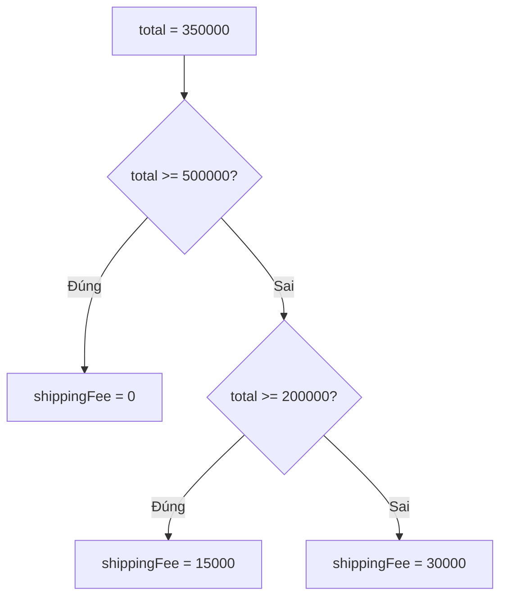

Đơn trên 500.000đ thì miễn phí ship, khách VIP được giảm giá, mỗi phương thức
thanh toán xử lý một kiểu. Chương trình cần chọn làm việc này hay việc kia tuỳ
điều kiện. Đó là nhiệm vụ của `if` và `switch`.

## Khái niệm

🔀 **if/else**: chạy một khối code khi điều kiện đúng, và khối khác khi điều kiện sai.

🎛️ **switch**: chọn một nhánh để chạy dựa trên giá trị cụ thể của một biến.

Điều kiện trong `if` phải là một giá trị `bool`, thường là kết quả của phép so
sánh như `total > 500000`.

## Ví dụ

```csharp
decimal total = 350000m;
decimal shippingFee;

if (total >= 500000)
{
    shippingFee = 0;
}
else if (total >= 200000)
{
    shippingFee = 15000;
}
else
{
    shippingFee = 30000;
}

Console.WriteLine(shippingFee);   // 15000
```

- C# xét từng điều kiện từ trên xuống, gặp điều kiện đúng đầu tiên thì chạy
  khối đó rồi bỏ qua phần còn lại.
- `else if` thêm điều kiện tiếp theo, `else` là trường hợp còn lại.
- Code bên trong mỗi nhánh đặt trong cặp ngoặc `{ }`.



## switch

Khi so một biến với nhiều giá trị cụ thể, `switch` gọn hơn một chuỗi
`else if`:

```csharp
string payment = "card";

switch (payment)
{
    case "cash":
        Console.WriteLine("Thu tiền khi giao");
        break;
    case "card":
        Console.WriteLine("Trừ tiền qua thẻ");
        break;
    default:
        Console.WriteLine("Không hỗ trợ");
        break;
}
```

- Mỗi `case` là một giá trị cần so, kết thúc bằng `break`.
- `default` chạy khi không `case` nào khớp.

## Thử ngay

Dán vào `Program.cs`, đổi giá trị `total` vài lần rồi chạy `dotnet run`:

```csharp
decimal total = 500000m;

if (total > 500000)
{
    Console.WriteLine("Miễn phí ship");
}
else
{
    Console.WriteLine("Phí ship 30000");
}
```

**Đoán trước khi chạy:** với `total` bằng đúng 500000, dòng nào được in?

<details>
<summary>Xem kết quả</summary>

```text
Phí ship 30000
```

`500000 > 500000` là sai, nên chương trình chạy nhánh `else`. Muốn tính cả
mốc 500000 thì phải dùng `>=`.

</details>

## Lỗi hay gặp

**Dùng `=` thay cho `==`.** `=` là gán, không phải so sánh.

```csharp
// SAI — lỗi compile: điều kiện phải là bool
int quantity = 0;
if (quantity = 0)
{
    Console.WriteLine("Hết hàng");
}
```

```csharp
// ĐÚNG
int quantity = 0;
if (quantity == 0)
{
    Console.WriteLine("Hết hàng");
}
```

**Quên `break` trong `switch`.** C# không cho chạy tràn sang `case` kế tiếp.

```csharp
// SAI — lỗi compile: thiếu break
string status = "new";
switch (status)
{
    case "new":
        Console.WriteLine("Đơn mới");
    case "paid":
        Console.WriteLine("Đã thanh toán");
        break;
}
```

```csharp
// ĐÚNG
string status = "new";
switch (status)
{
    case "new":
        Console.WriteLine("Đơn mới");
        break;
    case "paid":
        Console.WriteLine("Đã thanh toán");
        break;
}
```

## Tóm tắt

- `if` / `else if` / `else` xét điều kiện từ trên xuống, chỉ chạy nhánh đúng
  đầu tiên.
- Điều kiện phải là `bool`. So sánh dùng `==`, không dùng `=`.
- `switch` gọn hơn khi so một biến với nhiều giá trị cụ thể.
- Mỗi `case` kết thúc bằng `break`, `default` bắt mọi trường hợp còn lại.

```quiz
[
  {
    "prompt": "int stock = 3; if (stock > 10) {...} else if (stock > 0) {...} else {...}. Nhánh nào chạy?",
    "options": [
      "Nhánh stock > 10",
      "Cả nhánh else if và else",
      "Nhánh else if (stock > 0)",
      "Nhánh else"
    ],
    "answer": 3,
    "explain": "3 > 10 sai nên bỏ qua nhánh đầu. 3 > 0 đúng nên chạy nhánh else if, rồi dừng, không xét else nữa."
  },
  {
    "prompt": "Trong switch, không case nào khớp với giá trị của biến. Chuyện gì xảy ra?",
    "options": [
      "Lỗi khi chạy",
      "Nhánh default chạy, nếu có",
      "Case đầu tiên chạy",
      "Case cuối cùng chạy"
    ],
    "answer": 2,
    "explain": "default là nhánh dành cho mọi giá trị không khớp case nào. Không có default thì switch không làm gì."
  },
  {
    "prompt": "Bạn cần phân loại khách theo 4 hạng cố định: \"silver\", \"gold\", \"platinum\", \"diamond\". Cách viết nào gọn nhất?",
    "options": [
      "switch với 4 case",
      "4 câu if riêng rẽ, không có else",
      "Một if duy nhất với điều kiện dài",
      "Vòng lặp"
    ],
    "answer": 1,
    "explain": "So một biến với nhiều giá trị cụ thể là đúng việc của switch. Bốn if rời nhau vẫn chạy nhưng dài và dễ sót."
  }
]
```
