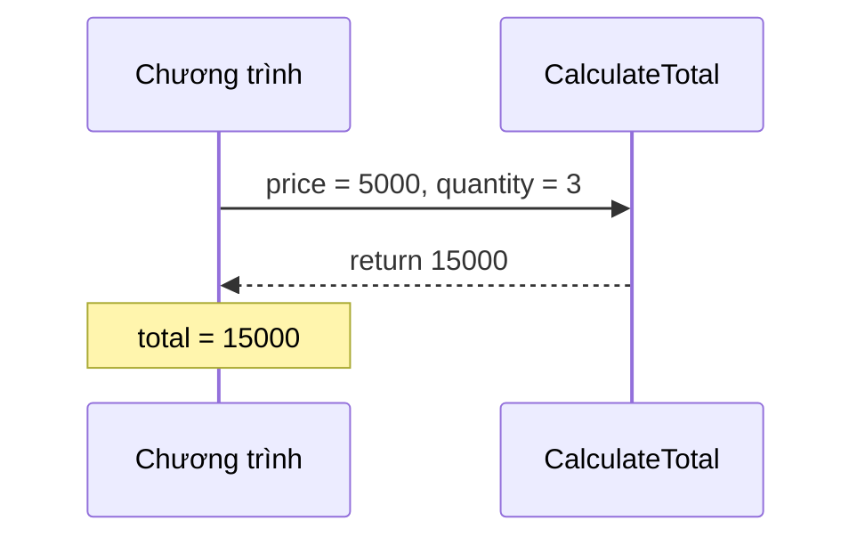

Công thức tính tiền đơn hàng được dùng ở trang giỏ hàng, trang thanh toán và
hoá đơn. Chép công thức ra ba nơi thì lúc sửa phải nhớ sửa cả ba. Method giúp
bạn viết một lần, đặt tên, rồi gọi ở bất cứ đâu.

## Khái niệm

🛠️ **Method**: một khối code có tên, nhận đầu vào và có thể trả về kết quả, gọi được nhiều lần.

📥 **Tham số (parameter)**: biến khai báo trong ngoặc của method, nhận giá trị được truyền vào lúc gọi.

📤 **Giá trị trả về (return value)**: kết quả method gửi lại cho nơi gọi, bằng từ khoá `return`.

## Ví dụ

```csharp
decimal total = CalculateTotal(5000m, 3);
Console.WriteLine(total);   // 15000

PrintLine("Cảm ơn quý khách");

decimal CalculateTotal(decimal price, int quantity)
{
    return price * quantity;
}

void PrintLine(string message)
{
    Console.WriteLine("--- " + message + " ---");
}
```

Một method gồm bốn phần, lấy `CalculateTotal` làm ví dụ:

- `decimal`: kiểu của giá trị trả về.
- `CalculateTotal`: tên method, viết hoa chữ cái đầu, thường là động từ.
- `(decimal price, int quantity)`: danh sách tham số.
- `{ ... }`: thân method, `return` gửi kết quả về và kết thúc method.

Method không trả về gì thì dùng `void`, như `PrintLine`.



## Thử ngay

Dán vào `Program.cs` rồi chạy `dotnet run`:

```csharp
decimal price = 100000m;
decimal result = ApplyDiscount(price, 10);

Console.WriteLine(price);
Console.WriteLine(result);

decimal ApplyDiscount(decimal amount, int percent)
{
    amount = amount - amount * percent / 100;
    return amount;
}
```

**Đoán trước khi chạy:** method đã sửa `amount`. Vậy biến `price` bên ngoài
có bị đổi thành 90000 không?

<details>
<summary>Xem kết quả</summary>

```text
100000
90000
```

Không đổi. Lúc gọi, giá trị của `price` được chép vào tham số `amount`. Method
sửa bản chép, còn `price` giữ nguyên.

</details>

## Lỗi hay gặp

**Thiếu `return`.** Method khai báo có kiểu trả về thì mọi nhánh đều phải
`return`.

```csharp
// SAI — lỗi compile: total < 500000 thì không có return
Console.WriteLine(ShippingFee(100000m));

decimal ShippingFee(decimal total)
{
    if (total >= 500000)
    {
        return 0;
    }
}
```

```csharp
// ĐÚNG
Console.WriteLine(ShippingFee(100000m));   // 30000

decimal ShippingFee(decimal total)
{
    if (total >= 500000)
    {
        return 0;
    }
    return 30000;
}
```

**Lấy kết quả từ method `void`.** Method `void` không trả về gì để gán.

```csharp
// SAI — lỗi compile: PrintLine không trả về giá trị
var text = PrintLine("Xin chào");

void PrintLine(string message)
{
    Console.WriteLine(message);
}
```

```csharp
// ĐÚNG — chỉ gọi, không gán
PrintLine("Xin chào");

void PrintLine(string message)
{
    Console.WriteLine(message);
}
```

## Tóm tắt

- Method là khối code có tên, viết một lần và gọi nhiều lần.
- Khai báo: `kiểu_trả_về Tên(tham số) { ... }`.
- `return` gửi kết quả về, `void` nghĩa là không trả về gì.
- Tham số nhận bản chép của giá trị truyền vào, nên sửa tham số không làm đổi
  biến bên ngoài.

```quiz
[
  {
    "prompt": "Method int Square(int n) { return n * n; } Gọi Console.WriteLine(Square(4) + 1); in ra gì?",
    "options": [
      "17",
      "16",
      "25",
      "Lỗi compile"
    ],
    "answer": 1,
    "explain": "Square(4) trả về 16, cộng thêm 1 được 17."
  },
  {
    "prompt": "Method nào nên khai báo void?",
    "options": [
      "Method tính thuế của đơn hàng",
      "Method in hoá đơn ra màn hình",
      "Method kiểm tra email có hợp lệ không",
      "Method đổi chuỗi thành số"
    ],
    "answer": 2,
    "explain": "In ra màn hình là một hành động, nơi gọi không cần nhận lại kết quả gì. Ba method còn lại đều phải trả về một giá trị."
  },
  {
    "prompt": "int count = 5; AddOne(count); Console.WriteLine(count); với void AddOne(int n) { n = n + 1; }. In ra gì?",
    "options": [
      "6",
      "0",
      "5",
      "Lỗi compile"
    ],
    "answer": 3,
    "explain": "n nhận bản chép giá trị của count. Tăng n không làm count thay đổi, nên vẫn in 5."
  }
]
```
