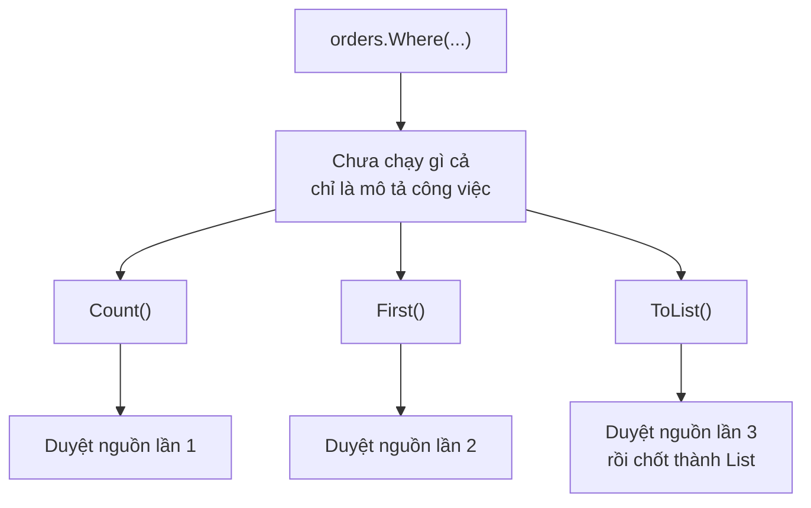

Trang báo cáo của bạn chạy ngon ở máy local. Lên production, cùng một API mất 8
giây. Mở log ra thì thấy câu truy vấn nặng nhất **chạy ba lần**, dù trong code
bạn chỉ viết nó đúng một lần.

Không ai gọi nhầm cả. Đó là cách `IEnumerable<T>` hoạt động — và khi đã hiểu, bạn
sẽ tránh được cả một họ bug hiệu năng.

## Truy vấn LINQ là lời hứa, không phải dữ liệu

```csharp
IEnumerable<Order> pending = orders.Where(o => o.IsPending);
// Tới đây CHƯA có đơn hàng nào được kiểm tra
```

`Where` không lọc gì cả. Nó trả về một object biết **cách** lọc, và chỉ bắt tay
vào làm khi có người hỏi tới từng phần tử. Cơ chế này gọi là **deferred
execution** — hoãn thực thi.

Ai là "người hỏi tới"? `foreach`, `ToList()`, `Count()`, `First()`, `Sum()`… Mỗi
lần hỏi là một lần chạy lại từ đầu.

## Thử ngay: nhìn tận mắt lúc nó chạy

Tạo project mới rồi dán đoạn này vào `Program.cs`:

```csharp
var so = new List<int> { 1, 2, 3, 4 };

var chan = so.Where(n =>
{
    Console.WriteLine($"  đang xét {n}");
    return n % 2 == 0;
});

Console.WriteLine("Viết xong truy vấn.");
Console.WriteLine($"Đếm: {chan.Count()}");
Console.WriteLine($"Số chẵn đầu tiên: {chan.First()}");
```

Kết quả:

```text
Viết xong truy vấn.
  đang xét 1
  đang xét 2
  đang xét 3
  đang xét 4
Đếm: 2
  đang xét 1
  đang xét 2
Số chẵn đầu tiên: 2
```

Ba điều đọc được từ đây:

- Dòng "Viết xong truy vấn" in ra **trước** mọi dòng "đang xét": lúc viết truy vấn, không có gì chạy.
- `Count()` duyệt **cả bốn** phần tử.
- `First()` duyệt **lại từ đầu**, nhưng dừng ngay khi tìm thấy — đây cũng là lý do `Any()` nhanh hơn `Count() > 0`.

Giờ thêm `.ToList()` vào cuối dòng `so.Where(...)` rồi chạy lại: bốn dòng "đang
xét" in đúng một lần, `Count` và `First` không sinh thêm dòng nào nữa.



## Bẫy 1: duyệt nhiều lần là chạy nhiều lần

Đây chính là API 8 giây ở đầu bài:

```csharp
// SAI — truy vấn chạy 3 lần
var donCho = db.Orders.Where(o => o.IsPending && o.Total > 1_000_000);

return new Report(
    Tong: donCho.Count(),          // lần 1
    TienMax: donCho.Max(o => o.Total),  // lần 2
    Top5: donCho.Take(5).ToList());     // lần 3
```

```csharp
// ĐÚNG — chốt kết quả một lần rồi dùng lại
var donCho = await db.Orders
    .Where(o => o.IsPending && o.Total > 1_000_000)
    .ToListAsync();

return new Report(
    Tong: donCho.Count,
    TienMax: donCho.Max(o => o.Total),
    Top5: donCho.Take(5).ToList());
```

Dữ liệu trong bộ nhớ thì ba lần duyệt chỉ tốn chút CPU. Dữ liệu ở database thì đó
là **ba lần đi mạng, ba câu SQL**. Con số 8 giây không tới từ đâu xa.

## Bẫy 2: nguồn đổi thì kết quả đổi theo

```csharp
var list = new List<int> { 1, 2, 3 };
var chan = list.Where(n => n % 2 == 0);

list.Add(4);

Console.WriteLine(string.Join(",", chan));   // 2,4 — không phải 2
```

Truy vấn giữ **tham chiếu tới nguồn**, không giữ bản sao. Rất khó lần ra khi
`chan` được truyền qua vài tầng rồi mới có người sửa `list`.

## Bẫy 3: exception nổ ở chỗ không ngờ

```csharp
var noiDung = duongDanFile.Select(f => File.ReadAllText(f));   // chưa đọc file nào

Console.WriteLine("Đã chuẩn bị xong");    // vẫn chạy bình thường
var texts = noiDung.ToList();             // FileNotFoundException nổ Ở ĐÂY
```

Khi debug mà thấy stack trace toàn tên hàm lạ của LINQ, hãy nhớ: chỗ ném lỗi
không phải chỗ viết truy vấn.

## Mặt tốt của sự lười biếng

Hoãn thực thi không chỉ toàn bẫy — nó cho phép xử lý dữ liệu lớn hơn cả RAM:

```csharp
public IEnumerable<string> DocTungDong(string path)
{
    using var reader = new StreamReader(path);
    string? line;
    while ((line = reader.ReadLine()) is not null)
    {
        if (line.Length > 0)
            yield return line;     // trả một dòng rồi DỪNG lại ở đây
    }
}

foreach (var line in DocTungDong("nhat-ky.log").Take(10))
    Console.WriteLine(line);
```

`yield return` biến method thành một nguồn sinh dữ liệu dần. File 10 GB vẫn chạy
được vì mỗi lúc chỉ có một dòng nằm trong bộ nhớ, và `Take(10)` nghĩa là phần còn
lại của file **không bao giờ** bị đọc.

## Quy tắc thực dụng

- **Trong nội bộ một method**: cứ để lười. Nối nhiều phép lọc rồi chốt một lần ở cuối.
- **Trả ra khỏi service**: `ToList()` trước khi trả. Trả `IEnumerable<T>` ra ngoài là mời người gọi duyệt lại nhiều lần, hoặc duyệt lúc connection đã đóng — lỗi `Cannot access a disposed context` sinh ra từ đây.

## Ghi nhớ

- LINQ chưa chạy cho tới khi có người duyệt (`foreach`, `ToList`, `Count`, `First`…).
- Dùng lại kết quả nhiều lần → `ToList()` **một lần**, rồi dùng danh sách đó.
- Truy vấn giữ tham chiếu tới nguồn, không phải bản sao.
- `yield return` xử lý dữ liệu lớn mà không nạp hết vào bộ nhớ.

```quiz
[
  {
    "prompt": "so là List<int> có 4 phần tử dương. Truy vấn q = so.Where(n => in ra một dòng rồi trả n > 0). Gọi liên tiếp q.Any() rồi q.Count() thì in ra mấy dòng?",
    "options": ["4 dòng", "5 dòng", "8 dòng", "0 dòng — truy vấn chưa chạy"],
    "answer": 2,
    "explain": "Any() dừng ngay ở phần tử đầu (1 dòng), rồi Count() duyệt lại từ đầu cả 4 phần tử (4 dòng). Chốt bằng ToList() trước thì chỉ còn 4."
  },
  {
    "prompt": "Method trả về IEnumerable<Order> lấy từ DbContext, gọi xong thì context bị dispose. Người gọi duyệt kết quả sẽ gặp gì?",
    "options": [
      "Nhận danh sách bình thường, dữ liệu đã tải sẵn",
      "Nhận danh sách rỗng",
      "ObjectDisposedException, vì truy vấn chạy lúc duyệt chứ không phải lúc gọi",
      "Truy vấn tự mở lại connection mới"
    ],
    "answer": 3,
    "explain": "Hoãn thực thi: lúc method return chưa có truy vấn nào chạy. Sửa bằng ToListAsync() ngay trong method trước khi trả ra."
  },
  {
    "prompt": "Khi nào KHÔNG nên gọi ToList() ngay?",
    "options": [
      "Khi còn định lọc tiếp trên dữ liệu ở database",
      "Khi sắp dùng lại kết quả cho nhiều phép tính",
      "Khi trả dữ liệu ra khỏi tầng service",
      "Khi muốn kết quả không đổi theo nguồn"
    ],
    "answer": 1,
    "explain": "ToList() giữa chuỗi kéo cả tập về bộ nhớ rồi mới lọc — mất hết lợi thế lọc ở database. Ba trường hợp còn lại đều là lý do nên chốt sớm."
  }
]
```
