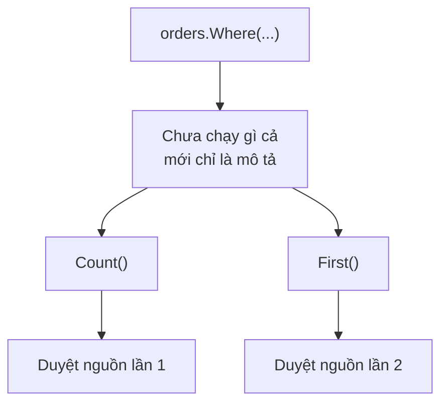

Trang báo cáo chạy ngon ở máy local. Lên production, cùng API ấy mất 8 giây.

Bạn mở log. Câu truy vấn nặng nhất **chạy ba lần**, trong khi code chỉ viết nó
một lần. Không ai gọi nhầm. Đó là cách `IEnumerable<T>` hoạt động.

> **Học xong bài này bạn sẽ:** nhìn một đoạn LINQ và nói được nó chạy lúc nào,
> chạy mấy lần; tự rà project của mình để tìm chỗ đang duyệt lại nhiều lần.
>
> **Cần biết trước:** `List<T>`, lambda `n => n > 0`, và biết `Where`/`Select`
> dùng để làm gì (bài trước).

## Truy vấn LINQ là lời hứa, không phải dữ liệu

```csharp
var pending = orders.Where(o => o.IsPending);
// Tới đây CHƯA đơn nào được kiểm tra
```

`Where` không lọc gì cả. Nó chỉ trả về một object biết **cách** lọc. Object ấy
nằm im cho tới khi có người hỏi tới từng phần tử.

Cơ chế này gọi là **deferred execution**, hoãn thực thi.

| Phép | Chạy truy vấn chưa |
|---|---|
| `Where`, `Select`, `OrderBy` | chưa, chỉ mô tả việc cần làm |
| `foreach`, `ToList`, `ToArray` | có, duyệt hết |
| `Count`, `Sum`, `Max` | có, duyệt hết |
| `Any`, `First` | có, nhưng dừng sớm khi tìm thấy |

Mỗi lần hỏi là một lần chạy lại từ đầu.

## Thử ngay: nhìn tận mắt lúc nó chạy

```bash
dotnet new console -o ThuLinq
cd ThuLinq
```

Mở `Program.cs`, dán đoạn này vào rồi chạy `dotnet run`:

```csharp
var numbers = new List<int> { 1, 2, 3, 4 };

var evens = numbers.Where(n =>
{
    Console.WriteLine($"  xét {n}");
    return n % 2 == 0;
});

Console.WriteLine("Viết xong truy vấn.");
Console.WriteLine($"Đếm: {evens.Count()}");
Console.WriteLine($"Đầu tiên: {evens.First()}");
```

**Đoán trước khi chạy:** màn hình in ra bao nhiêu dòng "xét"? Và dòng "Viết
xong truy vấn" đứng ở đâu?

Đoán sai một lần nhớ lâu hơn đọc đúng mười lần. Hãy đoán thật rồi mới mở.

<details>
<summary>Đoán xong rồi — xem kết quả</summary>

```text
Viết xong truy vấn.
  xét 1
  xét 2
  xét 3
  xét 4
Đếm: 2
  xét 1
  xét 2
Đầu tiên: 2
```

</details>

Ba điều đọc được từ đây:

- "Viết xong truy vấn" in ra **trước** mọi dòng "xét": lúc viết truy vấn, không có gì chạy.
- `Count()` duyệt **cả bốn** phần tử.
- `First()` duyệt **lại từ đầu**, nhưng dừng ngay khi tìm thấy — cũng là lý do `Any()` nhanh hơn `Count() > 0`.

Giờ thêm `.ToList()` vào cuối `numbers.Where(...)` rồi chạy lại: bốn dòng "xét" in
đúng một lần, `Count` và `First` không sinh thêm dòng nào nữa.



## Bẫy 1: duyệt nhiều lần là chạy nhiều lần

Đây chính là API 8 giây ở đầu bài:

```csharp
// SAI — truy vấn chạy 3 lần
var pending = db.Orders.Where(o => o.IsPending);

return new Report(
    Tong: pending.Count(),             // lần 1
    Max: pending.Max(o => o.Total),    // lần 2
    Top5: pending.Take(5).ToList());   // lần 3
```

```csharp
// ĐÚNG — chốt một lần rồi dùng lại
var pending = await db.Orders
    .Where(o => o.IsPending)
    .ToListAsync();

return new Report(
    Tong: pending.Count,
    Max: pending.Max(o => o.Total),
    Top5: pending.Take(5).ToList());
```

Dữ liệu trong bộ nhớ thì ba lần duyệt chỉ tốn chút CPU. Dữ liệu ở database
thì đó là **ba lần đi mạng, ba câu SQL**.

Con số 8 giây không tới từ đâu xa.

## Bẫy 2: nguồn đổi thì kết quả đổi theo

```csharp
var list = new List<int> { 1, 2, 3 };
var evens = list.Where(n => n % 2 == 0);

list.Add(4);

// in ra 2,4 — không phải 2
Console.WriteLine(string.Join(",", evens));
```

Truy vấn giữ **tham chiếu tới nguồn**, không giữ bản sao. Rất khó lần ra khi
`evens` được truyền qua vài tầng rồi mới có người sửa `list`.

## Bẫy 3: exception nổ ở chỗ không ngờ

```csharp
var noiDung = files.Select(f => File.ReadAllText(f));

Console.WriteLine("Đã chuẩn bị xong");  // vẫn chạy
var texts = noiDung.ToList();           // nổ Ở ĐÂY
```

Stack trace khi đó trông như dưới đây. Chỗ ném lỗi là `ToList()`. Còn dòng
`Select` viết sai thì không hề xuất hiện:

```text
Unhandled exception. System.IO.FileNotFoundException:
  Could not find file 'C:\data\thieu.txt'.
   at System.IO.File.ReadAllText(String path)
   at Program.<>c.<Main>b__0_0(String f)
   at System.Linq.Enumerable.SelectEnumerableIterator`2.MoveNext()
   at System.Linq.Enumerable.ToList[TSource](IEnumerable`1 source)
   at Program.Main()
```

Thấy `SelectEnumerableIterator` và `MoveNext` trong stack trace là dấu hiệu:
lỗi xảy ra lúc **duyệt**, hãy đi ngược lên tìm chỗ viết truy vấn.

## Mặt tốt của sự lười biếng

Hoãn thực thi không chỉ toàn bẫy. Nó cho phép xử lý dữ liệu lớn hơn cả RAM:

```csharp
public IEnumerable<string> DocDong(string path)
{
    using var reader = new StreamReader(path);
    string? line;
    while ((line = reader.ReadLine()) is not null)
    {
        if (line.Length > 0)
            yield return line;   // trả 1 dòng rồi DỪNG
    }
}

foreach (var line in DocDong("nhat-ky.log").Take(10))
    Console.WriteLine(line);
```

`yield return` biến method thành nguồn sinh dữ liệu dần. Mỗi lúc chỉ một dòng
nằm trong bộ nhớ, nên file 10 GB vẫn chạy được.

Thêm `Take(10)` nữa thì phần còn lại của file **không bao giờ** bị đọc.

## Dấu hiệu trong code của bạn

Mở project đang làm và tìm bốn thứ này:

- Một biến `IQueryable`/`IEnumerable` được **dùng lại từ hai lần trở lên** (`.Count()` rồi `.ToList()`, hoặc dùng trong hai nhánh `if`). Mỗi lần dùng là một lần chạy.
- Method `public` trả về `IEnumerable<T>` mà bên trong lấy dữ liệu từ `DbContext` — người gọi duyệt lúc nào là chuyện của họ, còn connection thì đã đóng.
- `foreach` lồng trong `foreach` trên cùng một truy vấn LINQ.
- Lỗi `Cannot access a disposed context` trong log — gần như luôn là bài này.

## Ghi nhớ

- LINQ chưa chạy cho tới khi có người duyệt (`foreach`, `ToList`, `Count`, `First`…).
- Dùng lại kết quả nhiều lần → `ToList()` **một lần**, rồi dùng danh sách đó.
- Truy vấn giữ tham chiếu tới nguồn, không phải bản sao.
- Trong nội bộ một method thì cứ để lười; **trả ra khỏi service thì chốt** bằng `ToList()`.
- `yield return` xử lý dữ liệu lớn mà không nạp hết vào bộ nhớ.

## Bước tiếp theo

Bài sau — **LINQ thường dùng** — đi qua bộ phép toán hay dùng nhất (`GroupBy`,
`SelectMany`, `First` và `Single`…). Mọi phép trong đó đều mang đúng tính lười
vừa học ở đây, nên đọc tiếp sẽ nhẹ.

```quiz
[
  {
    "prompt": "Đoạn này gửi mấy truy vấn xuống database?",
    "code": "var q = db.Orders.Where(o => o.IsPaid);\n\nif (q.Any())\n{\n    foreach (var o in q)\n        Xuly(o);\n}",
    "options": [
      "Hai truy vấn: một cho Any(), một cho foreach",
      "Một truy vấn, vì q chỉ được khai báo một lần",
      "Không truy vấn nào, vì chưa gọi ToList()",
      "Ba truy vấn: khai báo, Any() và foreach"
    ],
    "answer": 1,
    "explain": "Any() duyệt một lần, foreach duyệt lại lần nữa. Muốn một truy vấn thì ToListAsync() trước rồi kiểm tra Count trên danh sách."
  },
  {
    "prompt": "Bạn thấy trong log lỗi 'Cannot access a disposed context' ở một API. Chỗ nào đáng ngờ nhất?",
    "options": [
      "Một truy vấn có quá nhiều điều kiện Where",
      "Một method trả về List<T> sau khi đã ToListAsync()",
      "Một method trả về IEnumerable<T> lấy dữ liệu từ DbContext",
      "Một câu SQL thiếu index"
    ],
    "answer": 3,
    "explain": "Trả IEnumerable<T> ra ngoài nghĩa là truy vấn chạy lúc người gọi duyệt — khi đó context đã bị dispose. Chốt bằng ToListAsync() ngay trong method."
  },
  {
    "prompt": "DocDong() đọc file 10 GB bằng yield return. Đoạn này chạy ra sao?",
    "code": "foreach (var d in DocDong(\"log.txt\").Take(3))\n    Console.WriteLine(d);",
    "options": [
      "Đọc hết file rồi mới lấy 3 dòng đầu",
      "Chỉ đọc tới khi đủ 3 dòng rồi dừng",
      "Ném OutOfMemoryException",
      "Take(3) không dùng được với yield return"
    ],
    "answer": 2,
    "explain": "yield return sinh từng dòng theo yêu cầu, Take(3) ngừng hỏi sau dòng thứ 3 nên phần còn lại của file không bị đọc."
  },
  {
    "prompt": "Trường hợp nào KHÔNG nên gọi ToList() ngay?",
    "options": [
      "Khi muốn kết quả không đổi theo nguồn",
      "Khi sắp dùng lại kết quả cho nhiều phép tính",
      "Khi trả dữ liệu ra khỏi tầng service",
      "Khi còn định lọc tiếp trên dữ liệu ở database"
    ],
    "answer": 4,
    "explain": "ToList() giữa chuỗi kéo cả tập về bộ nhớ rồi mới lọc — mất lợi thế lọc ở database. Ba trường hợp còn lại đều là lý do nên chốt sớm."
  }
]
```
