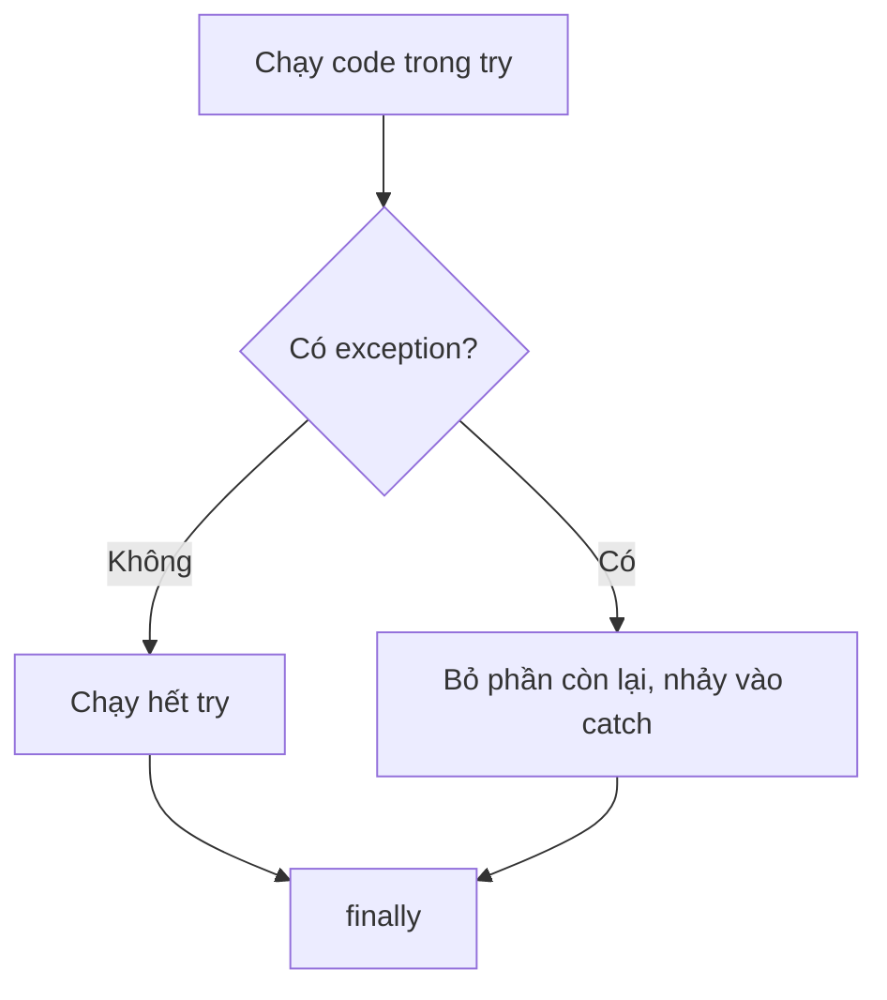

Người dùng gõ "abc" vào ô số lượng, file cấu hình bị xoá, mạng rớt giữa chừng.
Những lỗi này chỉ xuất hiện lúc chạy. Không xử lý thì chương trình dừng ngay.
Bài này hướng dẫn cách bắt lỗi và cách tự báo lỗi.

## Khái niệm

💥 **Exception**: object mô tả một lỗi xảy ra lúc chạy, làm chương trình dừng nếu không ai bắt.

🧯 **try/catch**: cặp khối dùng để chạy thử code trong `try` và xử lý exception trong `catch` nếu có lỗi.

🚨 **throw**: câu lệnh ném ra một exception, thường viết kèm `new` để tạo exception đó.

## Ví dụ

```csharp
string input = "abc";

try
{
    int quantity = int.Parse(input);
    Console.WriteLine($"Số lượng: {quantity}");
}
catch (FormatException)
{
    Console.WriteLine("Vui lòng nhập một con số");
}
```

- `int.Parse("abc")` ném `FormatException`. Code còn lại trong `try` bị bỏ
  qua, chương trình nhảy sang `catch`.
- `catch (FormatException)` chỉ bắt đúng loại lỗi đó. Loại khác vẫn làm
  chương trình dừng.
- Có thể thêm khối `finally` sau `catch`. Code trong `finally` luôn chạy, dù
  có lỗi hay không.



Tên exception hay gặp: `FormatException` (sai định dạng),
`NullReferenceException` (dùng biến đang là `null`), `ArgumentException` (tham số không
hợp lệ), `InvalidOperationException` (thao tác không hợp lệ lúc đó).

## Tự ném exception

Khi method nhận dữ liệu vô lý, hãy `throw` để báo ngay thay vì âm thầm chạy
sai:

```csharp
decimal Total(decimal price, int quantity)
{
    if (quantity <= 0)
    {
        throw new ArgumentException(
            "Số lượng phải lớn hơn 0");
    }
    return price * quantity;
}

Console.WriteLine(Total(5000m, 2));   // 10000
```

## Thử ngay

Chép method `Total` ở trên vào `Program.cs`, thay dòng gọi `Total` bằng:

```csharp
try
{
    Console.WriteLine("A");
    Console.WriteLine(Total(5000m, 0));
    Console.WriteLine("B");
}
catch (ArgumentException ex)
{
    Console.WriteLine($"Lỗi: {ex.Message}");
}
finally
{
    Console.WriteLine("C");
}
```

**Đoán trước khi chạy:** chữ "B" có được in không?

<details>
<summary>Xem kết quả</summary>

```text
A
Lỗi: Số lượng phải lớn hơn 0
C
```

"B" không được in. Exception xảy ra ở dòng giữa, nên phần còn lại của `try` bị
bỏ qua.

`ex.Message` là nội dung đã truyền lúc `throw`. `finally` vẫn chạy.

</details>

## Lỗi hay gặp

**`catch` rỗng.** Lỗi bị nuốt mất, chương trình chạy sai mà không ai biết.

```csharp
// SAI — lỗi xảy ra nhưng không ai hay
try
{
    int quantity = int.Parse("abc");
}
catch (Exception)
{
}
```

```csharp
// ĐÚNG — ít nhất phải báo cho người dùng
try
{
    int quantity = int.Parse("abc");
}
catch (FormatException)
{
    Console.WriteLine("Số lượng không hợp lệ");
}
```

**Bắt `Exception` trước loại cụ thể.** `Exception` bắt được mọi lỗi, nên
`catch` đứng sau nó không bao giờ chạy tới.

```csharp
// SAI — lỗi compile: catch thứ hai không bao giờ chạy
try
{
    int.Parse("abc");
}
catch (Exception)
{
    Console.WriteLine("Có lỗi");
}
catch (FormatException)
{
    Console.WriteLine("Sai định dạng");
}
```

```csharp
// ĐÚNG — loại cụ thể đứng trước
try
{
    int.Parse("abc");
}
catch (FormatException)
{
    Console.WriteLine("Sai định dạng");
}
catch (Exception)
{
    Console.WriteLine("Có lỗi");
}
```

## Tóm tắt

- Exception là lỗi lúc chạy, không bắt thì chương trình dừng.
- `try` chạy thử, `catch` xử lý lỗi, `finally` luôn chạy.
- Bắt đúng loại exception cụ thể và đặt nó trước `Exception`.
- Dùng `throw` khi dữ liệu vô lý, đừng âm thầm chạy tiếp.
- Không để `catch` rỗng.

```quiz
[
  {
    "prompt": "Trong try, int.Parse(\"abc\") ném FormatException. Sau try chỉ có catch (ArgumentException). Chuyện gì xảy ra?",
    "options": [
      "Chương trình dừng lại",
      "catch đó vẫn bắt được lỗi",
      "Lỗi bị bỏ qua, chạy tiếp",
      "Lỗi compile"
    ],
    "answer": 1,
    "explain": "catch chỉ bắt đúng loại exception ghi trong ngoặc. FormatException không phải ArgumentException nên không ai bắt, chương trình dừng."
  },
  {
    "prompt": "Method SetPrice(decimal price) nhận giá âm. Cách xử lý nào hợp lý nhất?",
    "options": [
      "Âm thầm đổi giá thành 0",
      "Ném ArgumentException",
      "Bỏ qua, không gán giá",
      "In cảnh báo rồi vẫn gán"
    ],
    "answer": 2,
    "explain": "Dữ liệu vô lý thì báo lỗi ngay. Âm thầm sửa hay bỏ qua làm lỗi lộ ra ở chỗ khác, khó tìm hơn nhiều."
  },
  {
    "prompt": "Khối nào luôn chạy, dù try có lỗi hay không?",
    "options": [
      "catch",
      "throw",
      "finally",
      "Khối if sau try"
    ],
    "answer": 3,
    "explain": "finally luôn chạy sau try và catch, thường dùng để dọn dẹp như đóng file."
  }
]
```
