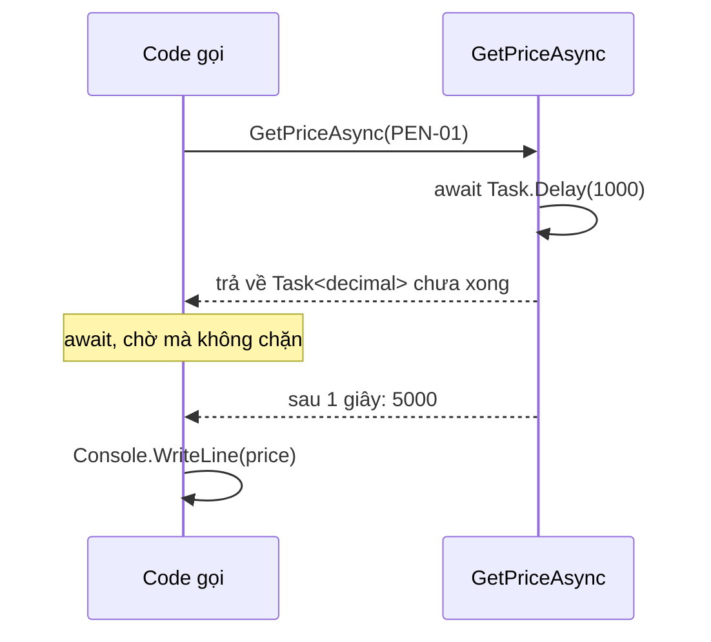

Gọi API thanh toán, đọc database, tải file: những việc này mất từ vài chục
mili giây tới vài giây. Trong lúc chờ, chương trình không nên đứng im. Bài này
hướng dẫn cách viết code chờ việc chậm bằng `async` và `await`.

## Khái niệm

📨 **Task**: object đại diện cho một việc đang chạy và sẽ xong sau.

`Task<T>` là việc sẽ trả về một giá trị kiểu `T`.

⏳ **async/await**: `async` đánh dấu method có chờ việc chậm bên trong, `await` chờ một `Task` xong rồi lấy kết quả mà không chặn chương trình.

## Ví dụ

```csharp
decimal price = await GetPriceAsync("PEN-01");
Console.WriteLine(price);   // 5000

async Task<decimal> GetPriceAsync(string code)
{
    await Task.Delay(1000);   // giả lập gọi mạng 1 giây
    return 5000m;
}
```

- Method có `await` bên trong phải khai báo `async`.
- Kiểu trả về là `Task<decimal>` chứ không phải `decimal`. Method không trả về
  gì thì dùng `Task`.
- Theo quy ước .NET, tên method async kết thúc bằng `Async`.
- `await` lấy ra giá trị `decimal` từ `Task<decimal>`.
- `Task.Delay(1000)` chờ 1 giây mà không chặn chương trình, dùng để giả lập
  việc chậm.



## Thử ngay

Dán vào `Program.cs` rồi chạy `dotnet run`:

```csharp
Console.WriteLine("1. Bắt đầu");
Task<decimal> task = GetPriceAsync("PEN-01");
Console.WriteLine("2. Đã gọi, chưa chờ");

decimal price = await task;
Console.WriteLine($"3. Giá: {price}");

async Task<decimal> GetPriceAsync(string code)
{
    Console.WriteLine("   đang tra giá...");
    await Task.Delay(500);
    Console.WriteLine("   tra xong");
    return 5000m;
}
```

**Đoán trước khi chạy:** dòng "2. Đã gọi, chưa chờ" in trước hay sau
"tra xong"?

<details>
<summary>Xem kết quả</summary>

```text
1. Bắt đầu
   đang tra giá...
2. Đã gọi, chưa chờ
   tra xong
3. Giá: 5000
```

In trước. Gọi `GetPriceAsync` thì việc tra giá bắt đầu chạy ngay, tới
`await Task.Delay` thì quay về nơi gọi.

Chương trình in dòng 2 trong lúc việc tra giá vẫn đang chờ. Chỉ tới
`await task` mới thật sự đứng đợi kết quả.

</details>

## Lỗi hay gặp

**Quên `await`.** Không có `await` thì bạn nhận về `Task`, không phải giá trị.

```csharp
// SAI — lỗi compile: Task<decimal> không phải decimal
decimal price = GetPriceAsync("PEN-01");

async Task<decimal> GetPriceAsync(string code)
{
    await Task.Delay(1000);
    return 5000m;
}
```

```csharp
// ĐÚNG
decimal price = await GetPriceAsync("PEN-01");
```

**Dùng `.Result` để lấy kết quả.** `.Result` chặn luồng hiện tại cho tới khi có kết quả. Trong
ứng dụng web, việc này làm server chậm đi, có khi treo hẳn.

```csharp
// SAI — chặn luồng trong lúc chờ
decimal price = GetPriceAsync("PEN-01").Result;
```

```csharp
// ĐÚNG — await không chặn luồng
decimal price = await GetPriceAsync("PEN-01");
```

## Tóm tắt

- `Task<T>` là việc sẽ trả về `T` khi xong.
- Method có `await` phải là `async`, trả về `Task` hoặc `Task<T>`.
- `await` chờ việc xong và lấy kết quả mà không chặn chương trình.
- Tên method async kết thúc bằng `Async`.
- Không dùng `.Result` hay `.Wait()` để chờ, luôn dùng `await`.

```quiz
[
  {
    "prompt": "Method async không trả về giá trị nào nên khai báo kiểu trả về là gì?",
    "options": [
      "void",
      "Task<void>",
      "object",
      "Task"
    ],
    "answer": 4,
    "explain": "Method async không trả về giá trị thì dùng Task, để nơi gọi vẫn await được."
  },
  {
    "prompt": "async Task<string> GetNameAsync() trả về \"An\". Dòng nào lấy đúng chuỗi \"An\"?",
    "options": [
      "string name = await GetNameAsync();",
      "string name = GetNameAsync();",
      "Task name = await GetNameAsync;",
      "string name = GetNameAsync().ToString();"
    ],
    "answer": 1,
    "explain": "await lấy giá trị string ra từ Task<string>. Thiếu await thì chỉ nhận được Task."
  },
  {
    "prompt": "Việc nào nên viết bằng async/await?",
    "options": [
      "Cộng hai số nguyên",
      "Gọi API kiểm tra thanh toán",
      "Viết hoa một chuỗi",
      "Tính tổng list 10 phần tử"
    ],
    "answer": 2,
    "explain": "async/await dành cho việc phải chờ bên ngoài như gọi mạng, database, file. Tính toán trong bộ nhớ thì không cần."
  }
]
```
