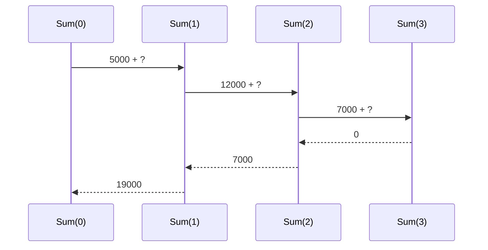

Danh mục sản phẩm có danh mục con, danh mục con lại có danh mục con nữa. Viết
vòng lặp cho dữ liệu lồng nhau không biết bao nhiêu tầng thì rất rối. Đệ quy
giải những bài như vậy bằng cách cho method tự gọi lại chính nó. Merge sort,
cây và đồ thị ở các chương sau đều dựa vào kỹ thuật này.

## Khái niệm

🌀 **Đệ quy (recursion)**: method tự gọi lại chính nó, mỗi lần với một bài toán nhỏ hơn.

🛑 **Điểm dừng (base case)**: trường hợp nhỏ nhất mà method trả lời thẳng, không gọi lại chính nó nữa.

📚 **Call stack**: vùng nhớ ghi các lời gọi method đang chờ kết quả, gọi thì chồng thêm một tầng, `return` thì gỡ tầng trên cùng.

Method đệ quy luôn có hai phần: điểm dừng, và lời gọi lại với bài toán nhỏ
hơn để tiến dần tới điểm dừng.

## Ví dụ

Tính tổng giá: tổng tính từ vị trí `index` bằng giá ở `index` cộng tổng phần
còn lại.

```csharp
List<decimal> prices = new List<decimal>
{
    5000m, 12000m, 7000m
};
Console.WriteLine(Sum(prices, 0));   // 24000

decimal Sum(List<decimal> items, int index)
{
    if (index == items.Count)
    {
        return 0;   // điểm dừng: hết list
    }
    return items[index] + Sum(items, index + 1);
}
```

- Điểm dừng là khi `index` đã qua phần tử cuối: không còn gì để cộng.
- Mỗi lần gọi lại, `index` tăng 1, nên phần còn lại ngắn dần.
- `Sum(prices, 0)` chờ `Sum(prices, 1)`, `Sum(prices, 1)` lại chờ
  `Sum(prices, 2)`. Tới điểm dừng, các kết quả cộng dồn ngược lên.



Tính tổng thế này viết bằng vòng lặp cũng được, lại gọn hơn. Đệ quy thật sự
có ích khi dữ liệu lồng nhau, như cây ở chương 5.

## Thử ngay

Thay dòng in `Sum(prices, 0)` bằng đoạn dưới đây. Method `CountDown` in một
dòng trước và một dòng sau lời gọi lại:

```csharp
CountDown(3);

void CountDown(int n)
{
    if (n == 0)
    {
        return;
    }
    Console.WriteLine("Vào " + n);
    CountDown(n - 1);
    Console.WriteLine("Ra " + n);
}
```

**Đoán trước khi chạy:** sáu dòng in ra theo thứ tự nào?

<details>
<summary>Xem kết quả</summary>

```text
Vào 3
Vào 2
Vào 1
Ra 1
Ra 2
Ra 3
```

Các dòng "Vào" in ra khi lời gọi chồng lên call stack. Dòng "Ra" chỉ chạy khi
lời gọi bên trong đã xong, nên tầng vào sau cùng lại ra đầu tiên.

</details>

## Lỗi hay gặp

**Thiếu điểm dừng, hoặc gọi lại mà bài toán không nhỏ đi.** Lời gọi chồng lên
mãi tới khi call stack đầy. Chương trình sập với dòng `Stack overflow.`, và
`try/catch` cũng không bắt được lỗi này.

```csharp
// SAI — index không tăng, không bao giờ tới điểm dừng
decimal Sum(List<decimal> items, int index)
{
    if (index == items.Count)
    {
        return 0;
    }
    return items[index] + Sum(items, index);
}
```

```csharp
// ĐÚNG — mỗi lần gọi, phần còn lại ngắn đi một
decimal Sum(List<decimal> items, int index)
{
    if (index == items.Count)
    {
        return 0;
    }
    return items[index] + Sum(items, index + 1);
}
```

## Tóm tắt

- Đệ quy: method tự gọi lại chính nó với bài toán nhỏ hơn.
- Luôn có điểm dừng, và mỗi lời gọi phải tiến gần điểm dừng hơn.
- Call stack giữ các lời gọi đang chờ, vào sau thì ra trước.
- Đệ quy không dừng làm sập chương trình với `Stack overflow.`

```quiz
[
  {
    "prompt": "Method đệ quy CountItems(category) đếm sản phẩm trong danh mục và mọi danh mục con. Điểm dừng hợp lý là gì?",
    "options": [
      "Khi đã gọi đúng 100 lần",
      "Khi danh mục không có danh mục con nào",
      "Khi chương trình hết bộ nhớ",
      "Không cần điểm dừng"
    ],
    "answer": 2,
    "explain": "Danh mục không có con thì đếm thẳng được, không cần gọi lại. Đó là trường hợp nhỏ nhất."
  },
  {
    "prompt": "A gọi B, B gọi C. Cái nào return trước?",
    "options": [
      "A",
      "B",
      "Cả ba cùng lúc",
      "C"
    ],
    "answer": 4,
    "explain": "Call stack vào sau ra trước: C nằm trên cùng nên xong trước, rồi mới tới B, rồi A."
  },
  {
    "prompt": "Chương trình sập với dòng Stack overflow. Nguyên nhân nhiều khả năng nhất?",
    "options": [
      "List quá nhiều phần tử",
      "Thiếu try/catch",
      "Đệ quy không bao giờ tới điểm dừng",
      "Dùng vòng lặp for lồng nhau"
    ],
    "answer": 3,
    "explain": "Mỗi lời gọi chiếm một tầng trên call stack. Không dừng thì stack đầy và chương trình sập."
  }
]
```
