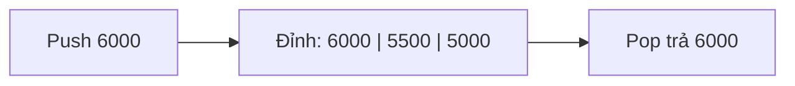

Nhân viên sửa giá ba lần rồi bấm "Hoàn tác". Việc bị huỷ phải là lần sửa gần
nhất, bấm tiếp thì tới lần trước đó. Cấu trúc làm đúng việc này là stack, và
bạn đã gặp nó ở call stack của bài Đệ quy.

## Khái niệm

🥞 **Stack (ngăn xếp)**: danh sách chỉ thêm và lấy ở một đầu gọi là đỉnh, phần tử vào sau cùng được lấy ra trước tiên (LIFO: last in, first out).

| Thao tác | Việc làm | Big-O |
|---|---|---|
| `Push(x)` | đặt `x` lên đỉnh | O(1) |
| `Pop()` | lấy và bỏ phần tử ở đỉnh | O(1) |
| `Peek()` | xem phần tử ở đỉnh, không bỏ | O(1) |

## Ví dụ

Tự viết một stack giá nhỏ bằng `List<decimal>`, với đỉnh là cuối list:

```csharp
var history = new PriceHistory();
history.Push(5000m);
history.Push(5500m);
history.Push(6000m);
Console.WriteLine(history.Pop());    // 6000
Console.WriteLine(history.Peek());   // 5500

class PriceHistory
{
    private readonly List<decimal> _items =
        new List<decimal>();

    public void Push(decimal price)
    {
        _items.Add(price);
    }

    public decimal Pop()
    {
        decimal top = _items[_items.Count - 1];
        _items.RemoveAt(_items.Count - 1);
        return top;
    }

    public decimal Peek()
    {
        return _items[_items.Count - 1];
    }
}
```

- Đỉnh là cuối list, vì thêm và xoá ở cuối `List<T>` là O(1), không phải dời
  phần tử nào (bài Array và List bên trong).
- `Pop` trả về 6000 là giá thêm sau cùng. `Peek` sau đó thấy 5500.
- Chọn đỉnh là đầu list thì mỗi lần `Pop` phải dời cả list, thành O(n).

.NET có sẵn `Stack<T>` với đúng ba method `Push`, `Pop`, `Peek`.



## Thử ngay

Dùng `Stack<T>` của .NET để lưu lịch sử thao tác:

```csharp
var undo = new Stack<string>();
undo.Push("Sửa giá Bút bi");
undo.Push("Xoá Vở");
undo.Push("Thêm Thước");

Console.WriteLine(undo.Pop());
Console.WriteLine(undo.Pop());
Console.WriteLine(undo.Peek());
Console.WriteLine(undo.Count);
```

**Đoán trước khi chạy:** bốn dòng in ra là gì?

<details>
<summary>Xem kết quả</summary>

```text
Thêm Thước
Xoá Vở
Sửa giá Bút bi
1
```

Hai lần `Pop` huỷ hai thao tác gần nhất. `Peek` chỉ xem thao tác còn lại,
không bỏ nó, nên `Count` vẫn là 1.

</details>

## Lỗi hay gặp

**`Pop` khi stack rỗng.** Không còn gì để lấy, `Stack<T>` ném
`InvalidOperationException` với lời nhắn `Stack empty.`

```csharp
// SAI — bấm Hoàn tác khi chưa làm gì là lỗi
var undo = new Stack<string>();
Console.WriteLine(undo.Pop());
```

```csharp
// ĐÚNG — kiểm tra Count trước khi Pop
var undo = new Stack<string>();
if (undo.Count > 0)
{
    Console.WriteLine(undo.Pop());
}
```

## Tóm tắt

- Stack thêm và lấy ở cùng một đầu: vào sau ra trước (LIFO).
- `Push`, `Pop`, `Peek` đều O(1).
- Dùng cho hoàn tác, call stack, và kiểm tra dấu ngoặc đóng mở.
- Kiểm tra `Count` trước khi `Pop` hoặc `Peek`.

```quiz
[
  {
    "prompt": "Push lần lượt A, B, C vào stack rồi Pop hai lần. Phần tử còn lại là gì?",
    "options": [
      "A",
      "B",
      "C",
      "Stack rỗng"
    ],
    "answer": 1,
    "explain": "Pop lấy C rồi B, vì vào sau ra trước. Còn lại A."
  },
  {
    "prompt": "Tự viết stack bằng List<T>. Nên chọn đỉnh ở đầu hay cuối list?",
    "options": [
      "Đầu list, cho dễ nhìn",
      "Chỗ nào cũng như nhau",
      "Giữa list",
      "Cuối list, vì Add và RemoveAt ở cuối là O(1)"
    ],
    "answer": 4,
    "explain": "Xoá ở đầu List phải dời mọi phần tử, thành O(n). Ở cuối thì không phải dời gì."
  },
  {
    "prompt": "Peek khác Pop ở điểm nào?",
    "options": [
      "Peek nhanh hơn Pop",
      "Peek lấy phần tử ở đáy",
      "Peek chỉ xem phần tử ở đỉnh, không bỏ nó ra",
      "Không khác gì"
    ],
    "answer": 3,
    "explain": "Pop lấy và bỏ phần tử ở đỉnh. Peek chỉ đọc, Count giữ nguyên."
  }
]
```
