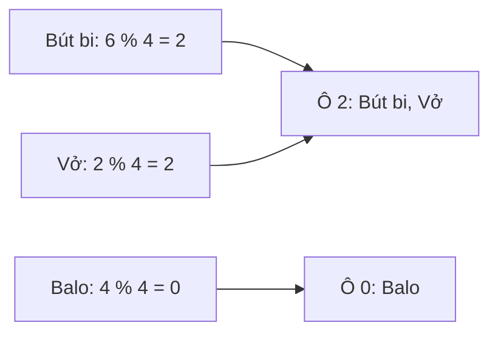

Bài Big-O nói `Dictionary.ContainsKey` chỉ tốn một bước, dù dictionary có
một triệu key. Tìm trong `List<T>` thì phải so từng phần tử. `Dictionary`
nhanh hơn vì bên trong nó là một hash table.

## Khái niệm

🗳️ **Hash table (bảng băm)**: một array các ô (bucket), mỗi key được xếp vào đúng một ô để khi tìm chỉ cần xem ô đó.

🎲 **Hàm băm (hash function)**: hàm biến một key thành một con số, dùng con số đó để chọn ô chứa key.

🚧 **Va chạm (collision)**: hai key khác nhau được hàm băm đưa vào cùng một ô.

`Dictionary<TKey, TValue>` và `HashSet<T>` của .NET đều là hash table.

## Ví dụ

Một bản `Dictionary` tối giản lưu tồn kho theo tên, dùng hàm băm rất đơn giản
là độ dài tên chia lấy dư cho số ô:

```csharp
var stock = new MiniDictionary();
stock.Set("Bút bi", 120);
stock.Set("Vở", 0);
stock.Set("Balo", 8);
Console.WriteLine(stock.Get("Vở"));   // 0

class Entry
{
    public string Key { get; }
    public int Value { get; set; }

    public Entry(string key, int value)
    {
        Key = key;
        Value = value;
    }
}

class MiniDictionary
{
    private readonly List<Entry>[] _buckets =
        new List<Entry>[4];

    public MiniDictionary()
    {
        for (int i = 0; i < _buckets.Length; i++)
        {
            _buckets[i] = new List<Entry>();
        }
    }

    public int BucketOf(string key)
    {
        return key.Length % _buckets.Length;
    }

    public void Set(string key, int value)
    {
        List<Entry> bucket = _buckets[BucketOf(key)];
        foreach (Entry e in bucket)
        {
            if (e.Key == key)
            {
                e.Value = value;
                return;
            }
        }
        bucket.Add(new Entry(key, value));
    }

    public int Get(string key)
    {
        foreach (Entry e in _buckets[BucketOf(key)])
        {
            if (e.Key == key)
            {
                return e.Value;
            }
        }
        throw new KeyNotFoundException(key);
    }
}
```

- `new List<Entry>[4]` là array 4 ô, mỗi ô là một list các cặp key-value.
  Constructor tạo sẵn list rỗng cho từng ô.
- `BucketOf` là hàm băm: "Vở" dài 2 ký tự, `2 % 4` bằng 2, nên nằm ở ô 2.
- `Set` và `Get` chỉ duyệt đúng một ô. Mỗi ô chỉ có vài phần tử nên gần như
  là O(1).
- Không có key thì ném `KeyNotFoundException`, giống lỗi ở bài Dictionary của
  khoá C# Core.



Hàm băm thật của .NET dùng mọi ký tự của key, nên các key rải đều ra các ô.
Khi số phần tử quá nhiều so với số ô, `Dictionary` tự tăng số ô và xếp lại,
giống `List<T>` gấp đôi array.

## Thử ngay

In ra ô của từng sản phẩm:

```csharp
var table = new MiniDictionary();
Console.WriteLine(table.BucketOf("Bút bi"));
Console.WriteLine(table.BucketOf("Vở"));
Console.WriteLine(table.BucketOf("Balo"));
Console.WriteLine(table.BucketOf("Thước"));
Console.WriteLine(table.BucketOf("Máy tính"));
```

**Đoán trước khi chạy:** ngoài "Bút bi" và "Vở", còn cặp nào rơi vào cùng
một ô?

<details>
<summary>Xem kết quả</summary>

```text
2
2
0
1
0
```

"Bút bi" (6 ký tự) và "Vở" (2 ký tự) cùng ở ô 2. "Balo" (4) và "Máy tính"
(8) cùng ở ô 0.

Đó là va chạm: tìm trong ô này phải so từng key trong list của ô. Nếu mọi
key rơi vào một ô, hash table chậm như duyệt list, O(n).

</details>

## Lỗi hay gặp

**Dùng object của class làm key.** Bài Value type và reference type của khoá
C# Core đã cho thấy hai object khác nhau thì không bằng nhau, dù dữ liệu giống
hệt. Mặc định, `Dictionary` cũng băm và so key theo tham chiếu.

```csharp
// SAI — tạo object mới thì không tìm lại được
var prices = new Dictionary<ProductCode, decimal>();
prices[new ProductCode { Sku = "PEN-01" }] = 5000m;
Console.WriteLine(prices.ContainsKey(
    new ProductCode { Sku = "PEN-01" }));   // False

class ProductCode
{
    public string Sku { get; set; } = "";
}
```

```csharp
// ĐÚNG — dùng chính mã string làm key
var prices = new Dictionary<string, decimal>();
prices["PEN-01"] = 5000m;
Console.WriteLine(prices.ContainsKey("PEN-01")); // True
```

Muốn dùng class làm key thì class đó phải `override` hai method `Equals` và
`GetHashCode` để so theo dữ liệu.

## Tóm tắt

- Hash table là array các ô. Hàm băm chọn ô cho từng key.
- Tra, thêm, xoá theo key trung bình là O(1).
- Va chạm là chuyện bình thường. Mọi key cùng một ô thì chậm thành O(n).
- Key là object của class thì so theo tham chiếu, trừ khi class override
  `Equals` và `GetHashCode`.

```quiz
[
  {
    "prompt": "Vì sao Dictionary tìm theo key nhanh hơn List tìm theo giá trị?",
    "options": [
      "Hàm băm chỉ ra ngay ô cần xem",
      "Dictionary sắp xếp sẵn các key",
      "Dictionary xếp các key liền nhau",
      "Mỗi lần so key rẻ hơn so giá trị"
    ],
    "answer": 1,
    "explain": "Tính hàm băm là biết ô, chỉ so vài key trong ô đó thay vì so mọi phần tử. Dictionary không sắp xếp key, và mỗi lần so thì tốn như nhau."
  },
  {
    "prompt": "Hàm băm tồi đưa mọi key vào cùng một ô. Tra theo key lúc này tốn bao nhiêu?",
    "options": [
      "O(1)",
      "O(n)",
      "O(log n)",
      "O(n²)"
    ],
    "answer": 2,
    "explain": "Tính hàm băm vẫn một bước, nhưng ô duy nhất chứa cả n key nên phải so từng key, chẳng khác gì duyệt list."
  },
  {
    "prompt": "Dictionary<Customer, int> với Customer là class thường. Thêm new Customer { Id = 1 }, rồi ContainsKey(new Customer { Id = 1 }) trả về gì?",
    "options": [
      "True",
      "Lỗi compile",
      "False",
      "Ném KeyNotFoundException"
    ],
    "answer": 3,
    "explain": "Mặc định Dictionary so key theo tham chiếu. Class chưa override Equals và GetHashCode thì hai object khác nhau luôn là hai key khác nhau."
  }
]
```
