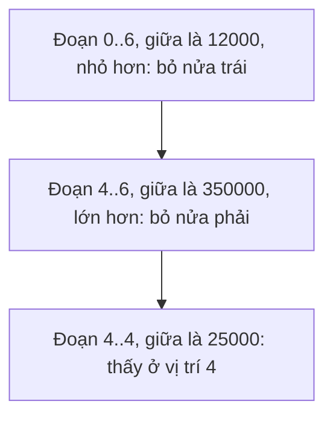

Tìm một giá trong list một triệu phần tử bằng cách duyệt từ đầu, xấu nhất phải
so một triệu lần. Nếu list đã sắp xếp, chỉ cần khoảng 20 lần so. Index ở bài
Index của khoá SQL tìm nhanh cũng nhờ dữ liệu đã sắp xếp như vậy.

## Khái niệm

🌓 **Tìm kiếm nhị phân (binary search)**: trên dãy đã sắp xếp, so với phần tử ở giữa rồi bỏ đi nửa không thể chứa giá trị cần tìm, lặp lại tới khi thấy hoặc hết dãy.

Mỗi bước bỏ một nửa, nên 1.000.000 phần tử chỉ cần khoảng 20 bước, vì 2 mũ
20 là 1.048.576. Đó là O(log n): gấp đôi dữ liệu chỉ thêm một bước.

## Ví dụ

```csharp
int[] prices =
{
    3000, 5000, 7000, 12000, 25000, 350000, 450000
};
Console.WriteLine(Find(prices, 12000));   // 3
Console.WriteLine(Find(prices, 8000));    // -1

int Find(int[] items, int target)
{
    int low = 0;
    int high = items.Length - 1;
    while (low <= high)
    {
        int mid = (low + high) / 2;
        if (items[mid] == target)
        {
            return mid;
        }
        if (items[mid] < target)
        {
            low = mid + 1;
        }
        else
        {
            high = mid - 1;
        }
    }
    return -1;
}
```

- `low` và `high` là hai đầu của đoạn còn phải tìm. Ban đầu là cả array.
- `mid` là vị trí giữa. `/` giữa hai số nguyên bỏ phần lẻ, như bài Toán tử
  và ép kiểu của khoá C# Core.
- Giá ở giữa nhỏ hơn giá cần tìm thì bỏ nửa trái, lớn hơn thì bỏ nửa phải.
- Đoạn còn lại rỗng (`low > high`) mà vẫn chưa thấy thì trả `-1`.



.NET có sẵn `Array.BinarySearch(array, x)` và `list.BinarySearch(x)`. Không
thấy thì chúng trả về một số âm.

## Thử ngay

Chép `Find` thành `CountSteps`, thêm biến đếm số bước, rồi tìm trong một triệu
số:

```csharp
int[] big = new int[1000000];
for (int i = 0; i < big.Length; i++)
{
    big[i] = i + 1;
}
Console.WriteLine(CountSteps(big, 500000));
Console.WriteLine(CountSteps(big, 1000000));

int CountSteps(int[] items, int target)
{
    int steps = 0;
    int low = 0;
    int high = items.Length - 1;
    while (low <= high)
    {
        steps++;
        int mid = (low + high) / 2;
        if (items[mid] == target)
        {
            return steps;
        }
        if (items[mid] < target)
        {
            low = mid + 1;
        }
        else
        {
            high = mid - 1;
        }
    }
    return steps;
}
```

**Đoán trước khi chạy:** tìm 500000 và tìm 1000000 mất bao nhiêu bước?

<details>
<summary>Xem kết quả</summary>

```text
1
20
```

500000 nằm đúng giữa nên thấy ngay ở bước đầu. 1000000 nằm cuối, gần như
trường hợp xấu nhất, cũng chỉ mất 20 bước. Duyệt từ đầu thì mất một triệu
bước.

</details>

## Lỗi hay gặp

**Tìm nhị phân trên dãy chưa sắp xếp.** Chương trình không báo lỗi, chỉ trả
về kết quả sai, vì bỏ nửa dãy chỉ đúng khi dãy có thứ tự.

```csharp
// SAI — 3000 có trong dãy nhưng trả về -1
int[] prices = { 12000, 3000, 450000, 5000, 7000 };
Console.WriteLine(Array.BinarySearch(prices, 3000));
```

```csharp
// ĐÚNG — sắp xếp trước rồi mới tìm
int[] prices = { 12000, 3000, 450000, 5000, 7000 };
Array.Sort(prices);
Console.WriteLine(Array.BinarySearch(prices, 3000));
```

## Tóm tắt

- Tìm nhị phân so với phần tử giữa rồi bỏ một nửa dãy mỗi bước.
- O(log n): một triệu phần tử chỉ khoảng 20 bước.
- Chỉ đúng trên dãy đã sắp xếp.
- .NET có `Array.BinarySearch` và `List<T>.BinarySearch`, không thấy thì trả
  số âm.

```quiz
[
  {
    "prompt": "Dãy đã sắp xếp có khoảng 1.000 phần tử. Tìm nhị phân cần tối đa khoảng bao nhiêu bước?",
    "options": [
      "1.000",
      "500",
      "10",
      "1"
    ],
    "answer": 3,
    "explain": "Mỗi bước bỏ một nửa: 1.000 → 500 → 250... tới 1 mất khoảng 10 bước, vì 2 mũ 10 là 1.024."
  },
  {
    "prompt": "Tìm 7000 trong dãy { 3000, 5000, 7000, 12000, 25000 }. Phần tử được so đầu tiên là gì?",
    "options": [
      "7000, vì nằm ở giữa",
      "3000, vì nằm đầu",
      "25000, vì nằm cuối",
      "12000"
    ],
    "answer": 1,
    "explain": "low = 0, high = 4, mid = 2. Phần tử ở vị trí 2 là 7000, thấy ngay."
  },
  {
    "prompt": "Vì sao Array.BinarySearch trên dãy chưa sắp xếp có thể trả sai?",
    "options": [
      "Vì BinarySearch chỉ tìm được số chẵn",
      "Vì nó ném exception",
      "Vì dãy chưa sắp xếp quá dài",
      "Vì bỏ một nửa dãy chỉ đúng khi các phần tử có thứ tự"
    ],
    "answer": 4,
    "explain": "Tìm nhị phân dựa vào thứ tự để biết nửa nào chắc chắn không chứa giá trị. Không có thứ tự thì có thể bỏ nhầm nửa chứa nó."
  }
]
```
