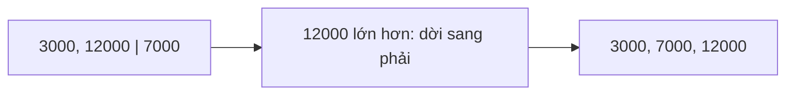

Tìm nhị phân cần dãy đã sắp xếp, vậy sắp xếp bằng cách nào? Sắp xếp chèn là
cách dễ hiểu nhất: lấy từng phần tử và chèn vào đúng chỗ trong phần đã xếp.
Nó cũng cho thấy rõ một thuật toán O(n²) trông như thế nào.

## Khái niệm

🃏 **Sắp xếp chèn (insertion sort)**: lấy lần lượt từng phần tử, dời các phần tử lớn hơn nó trong phần đã xếp sang phải một ô, rồi đặt nó vào ô trống.

Phần đầu dãy luôn có thứ tự, và mỗi vòng nó dài thêm một phần tử. Xấu nhất,
mỗi phần tử phải so với mọi phần tử đứng trước, nên là O(n²).

## Ví dụ

```csharp
int[] prices = { 12000, 3000, 7000, 5000 };
InsertionSort(prices);
Console.WriteLine(string.Join(", ", prices));
// 3000, 5000, 7000, 12000

void InsertionSort(int[] items)
{
    for (int i = 1; i < items.Length; i++)
    {
        int current = items[i];
        int j = i - 1;
        while (j >= 0 && items[j] > current)
        {
            items[j + 1] = items[j];
            j--;
        }
        items[j + 1] = current;
    }
}
```

- `i` bắt đầu từ 1, vì một phần tử đứng một mình đã là dãy có thứ tự.
- `current` là giá đang cần chèn. Vòng `while` dời các giá lớn hơn nó sang
  phải.
- Gặp giá không lớn hơn hoặc hết dãy thì dừng, đặt `current` vào ô trống
  `j + 1`.
- Sắp xếp ngay trong array, không tạo array mới.



## Thử ngay

Đếm số lần so sánh khi dãy vào đã có thứ tự và khi dãy vào xếp ngược. Chép
`InsertionSort` thành `CountComparisons`, thêm biến `comparisons` và trả nó về:

```csharp
int[] sorted = { 3000, 5000, 7000, 12000, 25000 };
int[] reversed = { 25000, 12000, 7000, 5000, 3000 };
Console.WriteLine(CountComparisons(sorted));
Console.WriteLine(CountComparisons(reversed));

int CountComparisons(int[] items)
{
    int comparisons = 0;
    for (int i = 1; i < items.Length; i++)
    {
        int current = items[i];
        int j = i - 1;
        while (j >= 0)
        {
            comparisons++;
            if (items[j] <= current)
            {
                break;
            }
            items[j + 1] = items[j];
            j--;
        }
        items[j + 1] = current;
    }
    return comparisons;
}
```

**Đoán trước khi chạy:** với 5 phần tử, mỗi trường hợp tốn bao nhiêu lần so?

<details>
<summary>Xem kết quả</summary>

```text
4
10
```

Dãy đã có thứ tự: mỗi phần tử so một lần với phần tử liền trước là dừng, tổng
4 lần, tức O(n). Dãy ngược: phần tử thứ hai so 1 lần, thứ ba 2 lần... tổng
1 + 2 + 3 + 4 = 10 lần, tức O(n²).

</details>

## Lỗi hay gặp

**Dùng sắp xếp chèn cho dữ liệu lớn.** Một trăm nghìn đơn hàng xếp ngược thì
tốn khoảng 5 tỉ lần so. Dữ liệu lớn nên dùng thuật toán O(n log n) như merge
sort, hoặc hàm có sẵn của .NET.

```csharp
// SAI — tự viết O(n²) cho dữ liệu lớn
int[] prices = new int[100000];
for (int i = 0; i < prices.Length; i++)
{
    prices[i] = prices.Length - i;   // xếp ngược
}
InsertionSort(prices);
```

```csharp
// ĐÚNG — Array.Sort của .NET là O(n log n)
int[] prices = new int[100000];
for (int i = 0; i < prices.Length; i++)
{
    prices[i] = prices.Length - i;
}
Array.Sort(prices);
```

## Tóm tắt

- Sắp xếp chèn lấy từng phần tử, dời phần tử lớn hơn sang phải, rồi chèn vào.
- Xấu nhất O(n²), khi dãy vào xếp ngược.
- Tốt nhất O(n), khi dãy vào đã có thứ tự, nên hợp với dãy nhỏ hoặc gần như
  đã xếp.
- Dữ liệu lớn dùng thuật toán O(n log n) như merge sort hoặc `Array.Sort`.

```quiz
[
  {
    "prompt": "Sắp xếp chèn dãy { 5, 2, 9 }. Sau vòng đầu tiên (i = 1), dãy là gì?",
    "options": [
      "{ 5, 2, 9 }",
      "{ 2, 5, 9 }",
      "{ 2, 9, 5 }",
      "{ 9, 5, 2 }"
    ],
    "answer": 2,
    "explain": "Vòng đầu cầm 2, dời 5 sang phải rồi đặt 2 vào đầu. Phần 2, 5 đã có thứ tự, 9 chưa xét tới."
  },
  {
    "prompt": "Danh sách đơn hàng gần như đã xếp theo ngày, chỉ vài đơn lệch chỗ. Sắp xếp chèn chạy thế nào?",
    "options": [
      "Rất chậm, luôn O(n²)",
      "Báo lỗi vì dãy đã có thứ tự",
      "Không làm gì cả",
      "Nhanh, gần O(n), vì hầu hết phần tử chỉ so một lần"
    ],
    "answer": 4,
    "explain": "Phần tử đã đúng chỗ chỉ so với phần tử liền trước là dừng."
  },
  {
    "prompt": "Vì sao sắp xếp chèn xấu nhất là O(n²)?",
    "options": [
      "Vì dùng array",
      "Vì phải tạo array mới",
      "Vì mỗi phần tử có thể phải so với mọi phần tử đứng trước nó",
      "Vì dùng đệ quy"
    ],
    "answer": 3,
    "explain": "Tổng 1 + 2 + ... + (n - 1) lần so, cỡ n²/2, bỏ hằng số là O(n²)."
  }
]
```
