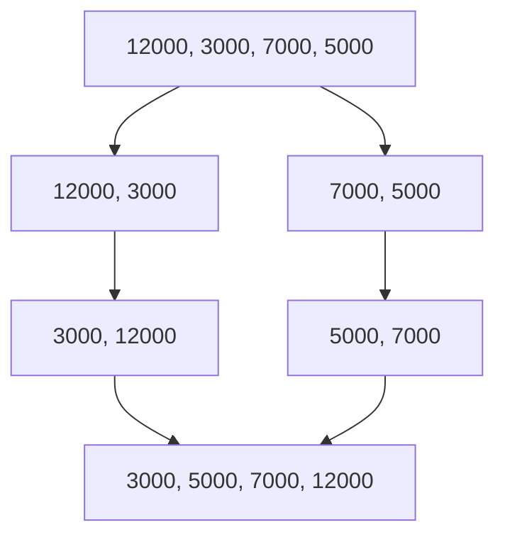

Sắp xếp chèn chậm hẳn khi dữ liệu lớn. Merge sort chia dãy làm đôi, sắp xếp
từng nửa bằng cách gọi lại chính nó, rồi trộn hai nửa đã có thứ tự. Đây là
đệ quy của bài Đệ quy ở chương 1.

## Khái niệm

🔪 **Chia để trị (divide and conquer)**: chia bài toán thành các bài toán nhỏ cùng dạng, giải từng phần, rồi ghép kết quả.

🪡 **Trộn (merge)**: ghép hai dãy đã có thứ tự thành một dãy có thứ tự, bằng cách mỗi lần lấy phần tử nhỏ hơn ở đầu hai dãy.

Chia đôi liên tục thì có khoảng log n tầng, mỗi tầng trộn tổng cộng n phần
tử, nên merge sort luôn là O(n log n), kể cả khi dãy vào xếp ngược.

## Ví dụ

```csharp
var prices = new List<int>
{
    12000, 3000, 7000, 5000, 450000, 25000
};
List<int> sorted = MergeSort(prices);
Console.WriteLine(string.Join(", ", sorted));

List<int> MergeSort(List<int> items)
{
    if (items.Count <= 1)
    {
        return items;
    }
    int mid = items.Count / 2;
    List<int> left = MergeSort(items.GetRange(0, mid));
    List<int> right = MergeSort(
        items.GetRange(mid, items.Count - mid));
    return Merge(left, right);
}

List<int> Merge(List<int> left, List<int> right)
{
    var result = new List<int>();
    int i = 0;
    int j = 0;
    while (i < left.Count && j < right.Count)
    {
        if (left[i] <= right[j])
        {
            result.Add(left[i]);
            i++;
        }
        else
        {
            result.Add(right[j]);
            j++;
        }
    }
    while (i < left.Count)
    {
        result.Add(left[i]);
        i++;
    }
    while (j < right.Count)
    {
        result.Add(right[j]);
        j++;
    }
    return result;
}
```

- Điểm dừng: dãy 0 hoặc 1 phần tử đã có thứ tự, như bài Đệ quy.
- `GetRange(start, count)` lấy một đoạn của list thành list mới.
- `Merge` so hai phần tử ở đầu hai list, lấy cái nhỏ hơn. Một bên hết thì
  chép nốt bên kia.
- Merge sort tạo list mới khi chia và trộn, nên tốn thêm bộ nhớ cỡ n.



## Thử ngay

Thêm dòng này vào `MergeSort`, ngay trên `return Merge(left, right);`:

```csharp
Console.WriteLine(
    $"Trộn [{string.Join(", ", left)}]"
    + $" + [{string.Join(", ", right)}]");
```

**Đoán trước khi chạy:** với 6 giá trong ví dụ, lần trộn đầu tiên và lần trộn
cuối cùng là gì?

<details>
<summary>Xem kết quả</summary>

```text
Trộn [3000] + [7000]
Trộn [12000] + [3000, 7000]
Trộn [450000] + [25000]
Trộn [5000] + [25000, 450000]
Trộn [3000, 7000, 12000] + [5000, 25000, 450000]
3000, 5000, 7000, 12000, 25000, 450000
```

Nửa trái `12000, 3000, 7000` chia thành `12000` và `3000, 7000`, rồi
`3000, 7000` chia tiếp thành hai phần tử đơn. Hai phần tử này được trộn đầu
tiên. Lần trộn cuối ghép hai nửa lớn đã có thứ tự.

</details>

## Lỗi hay gặp

**Quên chép phần còn lại sau vòng trộn chính.** Vòng `while` đầu dừng khi một
bên hết. Thiếu hai vòng sau thì mất phần tử của bên còn lại.

```csharp
// SAI — thiếu phần còn lại, kết quả hụt phần tử
while (i < left.Count && j < right.Count)
{
    // lấy phần tử nhỏ hơn
}
return result;
```

```csharp
// ĐÚNG — chép nốt bên chưa hết
while (i < left.Count)
{
    result.Add(left[i]);
    i++;
}
while (j < right.Count)
{
    result.Add(right[j]);
    j++;
}
return result;
```

## Tóm tắt

- Merge sort chia đôi, sắp xếp từng nửa bằng đệ quy, rồi trộn.
- Luôn O(n log n), nhưng tốn thêm bộ nhớ cỡ n.
- Trộn: lấy phần tử nhỏ hơn ở đầu hai dãy, hết một bên thì chép nốt bên kia.
- Quicksort cũng O(n log n) trung bình, nhưng xấu nhất O(n²).

```quiz
[
  {
    "prompt": "Trộn hai dãy đã có thứ tự { 2, 8 } và { 3, 5 }. Kết quả là gì?",
    "options": [
      "{ 2, 8, 3, 5 }",
      "{ 2, 3, 5, 8 }",
      "{ 3, 5, 2, 8 }",
      "{ 8, 5, 3, 2 }"
    ],
    "answer": 2,
    "explain": "Lấy 2 (2 < 3), rồi 3 (3 < 8), rồi 5 (5 < 8), bên phải hết thì chép nốt 8."
  },
  {
    "prompt": "Vì sao merge sort vẫn O(n log n) khi dãy vào xếp ngược, còn sắp xếp chèn thành O(n²)?",
    "options": [
      "Vì merge sort không so sánh",
      "Vì merge sort dùng HashSet",
      "Vì merge sort bỏ qua dãy ngược",
      "Vì merge sort luôn chia đôi, số tầng và công việc mỗi tầng không phụ thuộc thứ tự ban đầu"
    ],
    "answer": 4,
    "explain": "Luôn có khoảng log n tầng chia, mỗi tầng trộn n phần tử, dù dãy vào ra sao."
  },
  {
    "prompt": "Điểm dừng của MergeSort là gì?",
    "options": [
      "Khi dãy có 2 phần tử",
      "Khi dãy đã có thứ tự",
      "Khi dãy có 0 hoặc 1 phần tử",
      "Khi gọi quá 10 lần"
    ],
    "answer": 3,
    "explain": "Dãy 0 hoặc 1 phần tử luôn có thứ tự, trả về luôn không cần chia nữa."
  }
]
```
