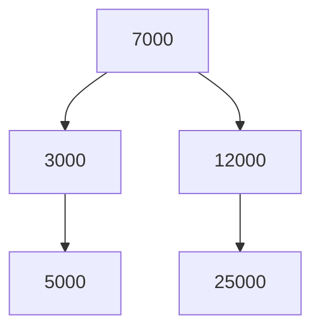

Tìm nhị phân nhanh nhưng cần array đã sắp xếp, mà chèn vào array thì phải dời
chỗ, tốn O(n). Cây nhị phân tìm kiếm giữ dữ liệu luôn có thứ tự, vừa tìm vừa
thêm đều nhanh. Index của Oracle ở khoá SQL cũng dựa trên một loại cây tìm
kiếm tên là B-tree.

## Khái niệm

🎄 **Cây nhị phân tìm kiếm (binary search tree, BST)**: mỗi node có tối đa hai con, mọi giá trị ở nhánh trái nhỏ hơn node, mọi giá trị ở nhánh phải lớn hơn hoặc bằng node.

⛰️ **Chiều cao cây**: số node trên đường dài nhất từ gốc xuống lá, cũng là số bước tìm hoặc thêm trong trường hợp xấu nhất.

Node trên cùng gọi là gốc, node không có con gọi là lá.

Cây cân đối cao khoảng log n, nên tìm và thêm là O(log n). Node ở
đây giống node của linked list, chỉ khác là có hai tham chiếu `Left`,
`Right` thay vì một `Next`.

## Ví dụ

```csharp
TreeNode? root = null;
int[] prices = { 7000, 3000, 12000, 5000, 25000 };
foreach (int price in prices)
{
    root = Insert(root, price);
}
PrintInOrder(root);   // 3000 5000 7000 12000 25000

TreeNode Insert(TreeNode? node, int value)
{
    if (node == null)
    {
        return new TreeNode(value);
    }
    if (value < node.Value)
    {
        node.Left = Insert(node.Left, value);
    }
    else
    {
        node.Right = Insert(node.Right, value);
    }
    return node;
}

void PrintInOrder(TreeNode? node)
{
    if (node == null)
    {
        return;
    }
    PrintInOrder(node.Left);
    Console.Write(node.Value + " ");
    PrintInOrder(node.Right);
}

class TreeNode
{
    public int Value { get; }
    public TreeNode? Left { get; set; }
    public TreeNode? Right { get; set; }

    public TreeNode(int value)
    {
        Value = value;
    }
}
```

- `Insert` là đệ quy: nhỏ hơn thì đi trái, không thì đi phải, gặp chỗ trống
  (`null`) thì đặt node mới.
- `PrintInOrder` in nhánh trái, rồi node, rồi nhánh phải, nên giá in ra luôn
  tăng dần.



.NET có `SortedDictionary<TKey, TValue>` và `SortedSet<T>`: bên trong là cây
tự cân đối, nên luôn O(log n) và duyệt ra theo thứ tự key.

## Thử ngay

Thêm method đo chiều cao, rồi so hai cây cùng 7 số nhưng thêm theo thứ tự
khác nhau:

```csharp
int[] ascending = { 1, 2, 3, 4, 5, 6, 7 };
int[] shuffled = { 4, 2, 6, 1, 3, 5, 7 };

TreeNode? sorted = null;
foreach (int x in ascending)
{
    sorted = Insert(sorted, x);
}
TreeNode? mixed = null;
foreach (int x in shuffled)
{
    mixed = Insert(mixed, x);
}
Console.WriteLine(Height(sorted));
Console.WriteLine(Height(mixed));

int Height(TreeNode? node)
{
    if (node == null)
    {
        return 0;
    }
    return 1 + Math.Max(
        Height(node.Left), Height(node.Right));
}
```

`Math.Max` trả về số lớn hơn trong hai số.

**Đoán trước khi chạy:** hai cây cao bao nhiêu?

<details>
<summary>Xem kết quả</summary>

```text
7
3
```

Thêm theo thứ tự tăng dần, số nào cũng lớn hơn nên đi sang phải hết: cây
thành một đường thẳng như linked list, tìm mất O(n). Thêm xen kẽ thì cây cân
đối, chỉ cao 3.

</details>

## Lỗi hay gặp

**Tự viết BST rồi nạp dữ liệu đã sắp xếp.** Dữ liệu đọc ra thường đã sắp
xếp sẵn, nên cây lệch hẳn về một bên và mất hết ưu điểm.

```csharp
// SAI — nạp giá đã sắp xếp: cây lệch thành O(n)
TreeNode? root = null;
int[] fromDb = { 3000, 5000, 7000 };
foreach (int price in fromDb)
{
    root = Insert(root, price);
}
```

```csharp
// ĐÚNG — SortedSet tự cân đối, luôn O(log n)
var prices = new SortedSet<int> { 3000, 5000, 7000 };
Console.WriteLine(prices.Contains(5000));   // True
```

## Tóm tắt

- BST: trái nhỏ hơn, phải lớn hơn hoặc bằng. Duyệt trái, node, phải thì ra
  thứ tự tăng.
- Tìm và thêm tốn số bước bằng chiều cao: cây cân đối là O(log n).
- Nạp dữ liệu đã sắp xếp vào BST tự viết thì cây lệch thành O(n).
- Dùng `SortedDictionary`, `SortedSet` của .NET: cây tự cân đối (cây đỏ-đen).

```quiz
[
  {
    "prompt": "Thêm lần lượt 50, 30, 70 vào BST rỗng. Node 30 nằm ở đâu?",
    "options": [
      "Gốc",
      "Con phải của 50",
      "Con trái của 70",
      "Con trái của 50"
    ],
    "answer": 4,
    "explain": "50 là gốc. 30 nhỏ hơn 50 nên đặt ở nhánh trái."
  },
  {
    "prompt": "Duyệt BST theo thứ tự trái, node, phải thì các giá trị ra thế nào?",
    "options": [
      "Ngẫu nhiên",
      "Tăng dần",
      "Giảm dần",
      "Theo thứ tự đã thêm"
    ],
    "answer": 2,
    "explain": "Mọi giá trị bên trái nhỏ hơn node, bên phải lớn hơn, nên in trái trước rồi node rồi phải sẽ ra dãy tăng dần."
  },
  {
    "prompt": "Vì sao nên dùng SortedDictionary thay vì tự viết BST?",
    "options": [
      "SortedDictionary dùng hash table",
      "SortedDictionary không cần so sánh key",
      "SortedDictionary tự cân đối nên luôn O(log n), kể cả khi thêm dữ liệu đã sắp xếp",
      "BST tự viết không chạy được trong .NET"
    ],
    "answer": 3,
    "explain": "Cây tự cân đối xoay lại khi bị lệch, nên chiều cao luôn khoảng log n."
  }
]
```
