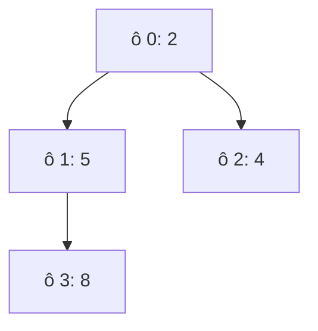

Queue phục vụ ai đến trước. Nhưng đơn gấp phải được đóng gói trước đơn
thường, dù đến sau. Cần một hàng đợi luôn đưa ra phần tử ưu tiên nhất, và
thêm vào vẫn nhanh. Đó là priority queue, bên trong là một heap.

## Khái niệm

🏔️ **Min-heap**: cây nhị phân mà node cha luôn nhỏ hơn hoặc bằng hai con, nên phần tử nhỏ nhất luôn nằm ở gốc.

⏫ **Priority queue (hàng đợi ưu tiên)**: hàng đợi mà `Dequeue` luôn lấy phần tử có mức ưu tiên nhỏ nhất, không theo thứ tự đến.

Heap không cần xếp hết thứ tự như BST, chỉ cần cha không lớn hơn con. Cây
được lấp đầy từng tầng, từ trái sang phải, nên lưu gọn trong một array: con
của ô `i` nằm ở ô `2i + 1` và `2i + 2`, cha nằm ở ô `(i - 1) / 2`.



| Thao tác | Big-O |
|---|---|
| Xem phần tử nhỏ nhất (`Peek`) | O(1) |
| Thêm (`Enqueue`) | O(log n) |
| Lấy phần tử nhỏ nhất (`Dequeue`) | O(log n) |

## Ví dụ

Thêm vào heap: đặt ở cuối array, rồi đổi chỗ với cha chừng nào còn nhỏ hơn
cha.

```csharp
var heap = new MiniHeap();
int[] values = { 7, 3, 9, 1 };
foreach (int x in values)
{
    heap.Add(x);
    Console.WriteLine(string.Join(", ", heap.Items));
}

class MiniHeap
{
    public List<int> Items { get; } = new List<int>();

    public void Add(int value)
    {
        Items.Add(value);
        int i = Items.Count - 1;
        while (i > 0)
        {
            int parent = (i - 1) / 2;
            if (Items[parent] <= Items[i])
            {
                break;
            }
            int temp = Items[parent];
            Items[parent] = Items[i];
            Items[i] = temp;
            i = parent;
        }
    }
}
```

- Mỗi lần đổi chỗ đi lên một tầng. Cây có khoảng log n tầng, nên `Add` là
  O(log n).
- Lấy ra làm ngược lại: đưa phần tử cuối lên gốc, rồi đổi chỗ với con nhỏ
  hơn chừng nào còn lớn hơn con.
- Ví dụ in ra `7`, `3, 7`, `3, 7, 9`, `1, 3, 9, 7`. Số 1 thêm sau cùng đổi
  chỗ hai lần để lên gốc. Array không sắp xếp hẳn, nhưng gốc luôn nhỏ nhất.

.NET có sẵn `PriorityQueue<TElement, TPriority>`: `Enqueue(phần tử, mức)`,
`Dequeue()` trả phần tử có mức nhỏ nhất.

## Thử ngay

Dùng `PriorityQueue` của .NET cho ba đơn, mức 1 là gấp nhất:

```csharp
var orders = new PriorityQueue<string, int>();
orders.Enqueue("DH1 thường", 3);
orders.Enqueue("DH2 gấp", 1);
orders.Enqueue("DH3 vừa", 2);
while (orders.Count > 0)
{
    Console.WriteLine(orders.Dequeue());
}
```

**Đoán trước khi chạy:** ba đơn ra theo thứ tự nào?

<details>
<summary>Xem kết quả</summary>

```text
DH2 gấp
DH3 vừa
DH1 thường
```

`Dequeue` luôn lấy mức nhỏ nhất, không quan tâm đơn nào vào trước. DH1 vào
đầu tiên nhưng ra cuối cùng.

</details>

## Lỗi hay gặp

**Tưởng đơn cùng mức ưu tiên ra theo thứ tự đến.** `PriorityQueue` không giữ
thứ tự cho các phần tử cùng mức.

```csharp
// SAI — DH1 đến trước nhưng DH3 có thể ra trước
var pq = new PriorityQueue<string, int>();
pq.Enqueue("DH1 thường", 2);
pq.Enqueue("DH2 gấp", 1);
pq.Enqueue("DH3 thường", 2);
// Dequeue lần lượt: DH2 gấp, DH3 thường, DH1 thường
```

```csharp
// ĐÚNG — mức ưu tiên kèm số thứ tự đến
var pq = new PriorityQueue<string, int>();
pq.Enqueue("DH1 thường", 2 * 1000 + 1);
pq.Enqueue("DH2 gấp", 1 * 1000 + 2);
pq.Enqueue("DH3 thường", 2 * 1000 + 3);
// Dequeue lần lượt: DH2 gấp, DH1 thường, DH3 thường
```

Muốn lấy lớn nhất trước, ví dụ đơn có tổng tiền cao nhất, thì đặt mức ưu
tiên là số âm: `pq.Enqueue(order, -total)`.

## Tóm tắt

- Min-heap: cha nhỏ hơn hoặc bằng con, gốc là nhỏ nhất, lưu gọn trong array.
- `Peek` O(1), `Enqueue` và `Dequeue` O(log n).
- `PriorityQueue` của .NET lấy mức nhỏ nhất trước.
- Cùng mức ưu tiên thì không giữ thứ tự đến. Cần thì ghép thêm số thứ tự.

```quiz
[
  {
    "prompt": "PriorityQueue<string, int> có (A, 5), (B, 1), (C, 3). Dequeue trả về gì?",
    "options": [
      "A, vì thêm đầu tiên",
      "C",
      "B, vì mức ưu tiên nhỏ nhất",
      "A, vì mức lớn nhất"
    ],
    "answer": 3,
    "explain": "PriorityQueue của .NET là min-heap: Dequeue lấy phần tử có mức ưu tiên nhỏ nhất."
  },
  {
    "prompt": "Trong min-heap lưu bằng array, phần tử nhỏ nhất nằm ở đâu?",
    "options": [
      "Ô 0, tức gốc",
      "Ô cuối cùng",
      "Ô giữa",
      "Không biết trước được"
    ],
    "answer": 1,
    "explain": "Cha luôn nhỏ hơn hoặc bằng con, nên gốc ở ô 0 là nhỏ nhất."
  },
  {
    "prompt": "Vì sao Enqueue vào heap là O(log n)?",
    "options": [
      "Vì phải sắp xếp lại cả array",
      "Vì heap dùng hash table",
      "Vì heap là linked list",
      "Vì phần tử mới chỉ đổi chỗ đi lên qua tối đa log n tầng"
    ],
    "answer": 4,
    "explain": "Heap là cây nhị phân gần đầy, cao khoảng log n. Phần tử mới đi từ đáy lên, mỗi bước một tầng."
  }
]
```
