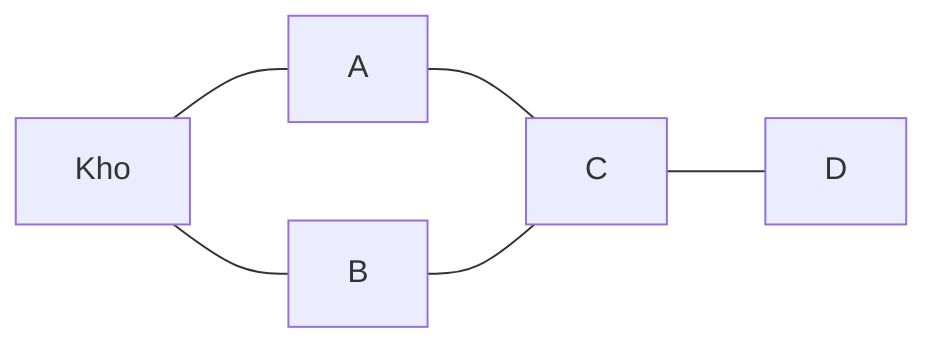

Xe giao hàng đi từ kho qua các điểm nối nhau bằng đường. Từ kho tới điểm D
phải qua ít nhất mấy điểm? Dữ liệu dạng "điểm nối với điểm" là đồ thị, và câu
hỏi "ít bước nhất" được giải bằng BFS, dùng đúng `Queue` của chương 2.

## Khái niệm

🕸️ **Đồ thị (graph)**: tập các đỉnh nối với nhau bằng cạnh, ví dụ các điểm giao hàng nối bằng đường.

🌊 **BFS (breadth-first search, tìm theo chiều rộng)**: đi từ điểm xuất phát, thăm hết các điểm cách 1 bước, rồi các điểm cách 2 bước, cứ thế loang ra như vết nước.

Đồ thị thường lưu bằng danh sách kề: mỗi đỉnh giữ list các đỉnh nối trực tiếp
với nó. Trong C#, đó là `Dictionary<string, List<string>>`. Cây ở hai bài
trước là một đồ thị đặc biệt, không có vòng.

## Ví dụ

```csharp
var roads = new Dictionary<string, List<string>>();
AddRoad("Kho", "A");
AddRoad("Kho", "B");
AddRoad("A", "C");
AddRoad("B", "C");
AddRoad("C", "D");

Dictionary<string, int> steps = Bfs("Kho");
foreach (var item in steps)
{
    Console.WriteLine($"{item.Key}: {item.Value}");
}

void AddRoad(string from, string to)
{
    if (!roads.ContainsKey(from))
    {
        roads[from] = new List<string>();
    }
    if (!roads.ContainsKey(to))
    {
        roads[to] = new List<string>();
    }
    roads[from].Add(to);
    roads[to].Add(from);
}

Dictionary<string, int> Bfs(string start)
{
    var distance = new Dictionary<string, int>();
    var queue = new Queue<string>();
    distance[start] = 0;
    queue.Enqueue(start);
    while (queue.Count > 0)
    {
        string current = queue.Dequeue();
        foreach (string next in roads[current])
        {
            if (!distance.ContainsKey(next))
            {
                distance[next] = distance[current] + 1;
                queue.Enqueue(next);
            }
        }
    }
    return distance;
}
```

- Đường đi được hai chiều, nên `AddRoad` thêm vào list của cả hai đầu.
- `distance` vừa ghi số bước, vừa đánh dấu điểm đã thăm để không thăm lại.
- Queue bảo đảm điểm gần được xử lý hết trước điểm xa, nên số bước ghi lần
  đầu cho mỗi điểm là ít nhất.
- Mỗi điểm và mỗi con đường được xét một lần: O(số điểm + số đường).



## Thử ngay

Chạy ví dụ, rồi thêm `Console.WriteLine("Thăm " + current);` ngay dưới dòng
`string current = queue.Dequeue();` và chạy lại.

**Đoán trước khi chạy:** D cách kho mấy bước? Các điểm được thăm theo thứ tự
nào?

<details>
<summary>Xem kết quả</summary>

```text
Thăm Kho
Thăm A
Thăm B
Thăm C
Thăm D
Kho: 0
A: 1
B: 1
C: 2
D: 3
```

D cách kho 3 bước: Kho → A → C → D. BFS thăm hết các điểm cách 1 bước (A, B)
rồi mới tới điểm cách 2 bước (C).

</details>

## Lỗi hay gặp

**Không đánh dấu điểm đã thăm.** Đồ thị có vòng: A nối C, C nối B, B nối lại
kho. Không đánh dấu thì BFS đi vòng mãi, queue không bao giờ rỗng.

```csharp
// SAI — không kiểm đã thăm, chạy mãi không dừng
foreach (string next in roads[current])
{
    queue.Enqueue(next);
}
```

```csharp
// ĐÚNG — chỉ thêm điểm chưa có trong distance
foreach (string next in roads[current])
{
    if (!distance.ContainsKey(next))
    {
        distance[next] = distance[current] + 1;
        queue.Enqueue(next);
    }
}
```

## Tóm tắt

- Đồ thị gồm đỉnh và cạnh, lưu bằng danh sách kề `Dictionary<string, List<string>>`.
- BFS dùng queue, thăm theo từng lớp khoảng cách.
- BFS cho số bước ít nhất khi mọi cạnh dài như nhau.
- Luôn đánh dấu đỉnh đã thăm. Đường có độ dài khác nhau thì cần Dijkstra.

```quiz
[
  {
    "prompt": "BFS dùng cấu trúc nào để giữ các đỉnh chờ thăm?",
    "options": [
      "Stack",
      "HashSet",
      "Queue",
      "SortedSet"
    ],
    "answer": 3,
    "explain": "Queue vào trước ra trước, nên đỉnh gần xuất phát được thăm hết trước đỉnh xa."
  },
  {
    "prompt": "Đồ thị có 1.000 điểm và 3.000 con đường. BFS tốn cỡ bao nhiêu bước?",
    "options": [
      "Khoảng 4.000, tức O(số điểm + số đường)",
      "1.000.000",
      "3.000.000",
      "10"
    ],
    "answer": 1,
    "explain": "Mỗi điểm vào queue một lần, mỗi con đường được xét từ hai đầu. Tổng cộng tỉ lệ với số điểm cộng số đường."
  },
  {
    "prompt": "Vì sao BFS cần đánh dấu đỉnh đã thăm?",
    "options": [
      "Để in đẹp hơn",
      "Vì Queue không chứa được chuỗi trùng",
      "Để BFS chạy nhanh gấp đôi",
      "Vì đồ thị có thể có vòng, không đánh dấu thì đi vòng mãi"
    ],
    "answer": 4,
    "explain": "Có vòng thì từ một đỉnh đi một vòng lại quay về nó. Đánh dấu giúp mỗi đỉnh chỉ vào queue một lần."
  }
]
```
