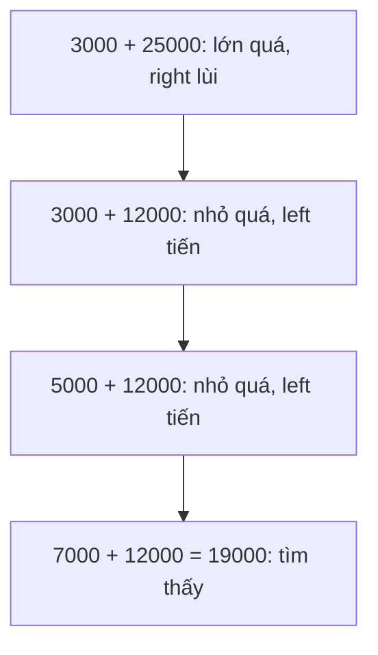

Nhiều bài toán trên array có lời giải dễ nghĩ ra là hai vòng lặp lồng nhau,
O(n²). Hai kỹ thuật trong bài này đưa chúng về một lượt duyệt, không cần thêm
`HashSet` hay `Dictionary`. Riêng hai con trỏ là O(n) sau khi dãy đã sắp xếp.

## Khái niệm

👉 **Hai con trỏ (two pointers)**: dùng hai chỉ số cùng duyệt một array, thường một từ đầu và một từ cuối, mỗi bước dời một chỉ số dựa theo kết quả so sánh.

🎞️ **Cửa sổ trượt (sliding window)**: đoạn liền nhau độ dài cố định, trượt sang phải từng ô bằng cách cộng phần tử mới và trừ phần tử cũ.

## Ví dụ

Tìm hai món có tổng đúng 19.000đ trong dãy giá **đã sắp xếp**:

```csharp
int[] prices = { 3000, 5000, 7000, 12000, 25000 };
int budget = 19000;
int left = 0;
int right = prices.Length - 1;
while (left < right)
{
    int sum = prices[left] + prices[right];
    if (sum == budget)
    {
        Console.WriteLine(
            $"{prices[left]} + {prices[right]}");
        break;
    }
    if (sum < budget)
    {
        left++;
    }
    else
    {
        right--;
    }
}
```

- Tổng nhỏ quá thì dời `left` sang phải để lấy món đắt hơn. Lớn quá thì dời
  `right` sang trái để lấy món rẻ hơn.
- Mỗi bước bỏ đi một món chắc chắn không ghép được, nên nhiều nhất n bước.
- So với cách dùng `HashSet` ở chương 3, cách này không tốn thêm bộ nhớ,
  nhưng cần dãy đã sắp xếp như tìm nhị phân.



## Cửa sổ trượt

Doanh thu 7 ngày (triệu đồng). Tìm 3 ngày liên tiếp có tổng doanh thu cao
nhất.

Cộng lại từ đầu cho mỗi đoạn 3 ngày thì tốn khoảng n × 3 bước. Cửa sổ trượt
mỗi bước chỉ cộng một số và trừ một số.

```csharp
int[] revenue = { 5, 8, 2, 9, 7, 1, 6 };
int k = 3;
int window = 0;
for (int i = 0; i < k; i++)
{
    window = window + revenue[i];
}
int best = window;
for (int i = k; i < revenue.Length; i++)
{
    window = window + revenue[i] - revenue[i - k];
    if (window > best)
    {
        best = window;
    }
}
Console.WriteLine(best);   // 19
```

- Vòng đầu tính tổng 3 ngày đầu tiên.
- Mỗi vòng sau, ngày `i` vào cửa sổ, ngày `i - k` rời cửa sổ.

## Thử ngay

Trong ví dụ cửa sổ trượt, in tổng của từng cửa sổ: thêm
`Console.Write(window + " ");` ngay sau dòng `int best = window;` và ngay sau
dòng tính lại `window` trong vòng `for` thứ hai.

**Đoán trước khi chạy:** 7 ngày với cửa sổ 3 ngày thì có mấy cửa sổ, tổng
từng cửa sổ là bao nhiêu?

<details>
<summary>Xem kết quả</summary>

```text
15 19 18 17 14 19
```

Có 7 - 3 + 1 = 5 cửa sổ: 5+8+2, 8+2+9, 2+9+7, 9+7+1, 7+1+6. Số 19 cuối cùng là
dòng in `best`. Cửa sổ thứ hai, ngày 2 tới ngày 4, có doanh thu cao nhất.

</details>

## Lỗi hay gặp

**Dùng hai con trỏ trên dãy chưa sắp xếp.** Cách dời con trỏ dựa vào việc số
bên phải luôn lớn hơn. Dãy chưa sắp xếp thì con trỏ có thể bỏ qua đúng cặp
cần tìm.

```csharp
// SAI — 7000 + 12000 có trong dãy nhưng không tìm ra
int[] prices = { 12000, 3000, 25000, 7000, 5000 };
```

```csharp
// ĐÚNG — sắp xếp trước rồi mới dùng hai con trỏ
int[] prices = { 12000, 3000, 25000, 7000, 5000 };
Array.Sort(prices);
```

## Tóm tắt

- Hai con trỏ: một từ đầu, một từ cuối, dời theo kết quả so sánh. Cần dãy đã
  sắp xếp.
- Cửa sổ trượt: đoạn liền nhau, mỗi bước cộng phần tử vào, trừ phần tử ra.
- Cả hai chỉ duyệt một lượt, không tốn thêm bộ nhớ. Cửa sổ trượt là O(n),
  hai con trỏ là O(n) sau khi dãy đã sắp xếp.
- Gặp bài "cặp có tổng", "đoạn liên tiếp" thì nghĩ tới hai kỹ thuật này.

```quiz
[
  {
    "prompt": "Hai con trỏ trên dãy giá đã sắp xếp: tổng prices[left] + prices[right] lớn hơn ngân sách. Nên làm gì?",
    "options": [
      "Tăng left",
      "Dừng lại, không có cặp nào",
      "Giảm right",
      "Tăng cả left và right"
    ],
    "answer": 3,
    "explain": "Tổng lớn quá thì cần món rẻ hơn. Món rẻ hơn nằm bên trái right, nên giảm right."
  },
  {
    "prompt": "Cửa sổ 7 ngày trượt trên dữ liệu 30 ngày. Có bao nhiêu cửa sổ?",
    "options": [
      "30",
      "7",
      "23",
      "24"
    ],
    "answer": 4,
    "explain": "Số cửa sổ là n - k + 1 = 30 - 7 + 1 = 24."
  },
  {
    "prompt": "Khi cửa sổ trượt sang phải một ô, tổng mới tính thế nào?",
    "options": [
      "Cộng phần tử mới, trừ phần tử cũ",
      "Cộng lại toàn bộ k phần tử",
      "Chỉ trừ phần tử vừa rời đi",
      "Chỉ cộng phần tử mới"
    ],
    "answer": 1,
    "explain": "Chỉ hai phần tử thay đổi, nên chỉ cần một phép cộng và một phép trừ, O(1) mỗi bước."
  }
]
```
