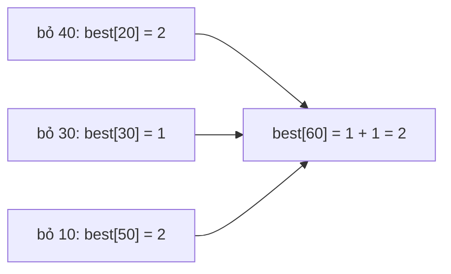

Cửa hàng phát voucher mệnh giá 10, 30 và 40 nghìn. Khách được hoàn 60 nghìn,
cần đưa ít voucher nhất. Cách tham lam (lấy voucher lớn nhất trước) nghe hợp
lý nhưng không phải lúc nào cũng ít tờ nhất. Quy hoạch động thì luôn tìm ra.

## Khái niệm

🧠 **Quy hoạch động (dynamic programming)**: giải bài toán lớn từ kết quả của các bài toán con, mỗi bài toán con chỉ giải một lần rồi ghi lại để dùng tiếp.

📒 **Memoization (ghi nhớ)**: lưu kết quả đã tính của một hàm đệ quy vào `Dictionary`, lần sau gặp lại đầu vào đó thì trả luôn.

Với voucher: số tờ ít nhất cho 60 nghìn bằng 1 cộng số tờ ít nhất cho
60 - 10, 60 - 30 hoặc 60 - 40, lấy cách nhỏ nhất. Mỗi số tiền nhỏ hơn lại tính
theo cùng cách đó.

## Ví dụ

Tính dần từ số tiền 1 lên tới số tiền cần, lưu vào array `best`:

```csharp
int[] vouchers = { 10, 30, 40 };
Console.WriteLine(Fewest(vouchers, 60));   // 2

int Fewest(int[] values, int amount)
{
    int[] best = new int[amount + 1];
    for (int a = 1; a <= amount; a++)
    {
        best[a] = -1;
        foreach (int v in values)
        {
            if (v <= a && best[a - v] != -1)
            {
                int count = best[a - v] + 1;
                if (best[a] == -1 || count < best[a])
                {
                    best[a] = count;
                }
            }
        }
    }
    return best[amount];
}
```

- `best[a]` là số voucher ít nhất cho số tiền `a`. `best[0]` bằng 0.
- `-1` nghĩa là không ghép được, ví dụ 55 nghìn.
- Mỗi `best[a]` tính một lần từ các ô nhỏ hơn đã có sẵn: O(số tiền × số mệnh
  giá).



## Thử ngay

Viết thêm cách tham lam và so với quy hoạch động:

```csharp
Console.WriteLine(Greedy(vouchers, 60));

int Greedy(int[] values, int amount)
{
    int count = 0;
    for (int i = values.Length - 1; i >= 0; i--)
    {
        while (amount >= values[i])
        {
            amount = amount - values[i];
            count++;
        }
    }
    return count;
}
```

**Đoán trước khi chạy:** với 60 nghìn, tham lam cho mấy tờ?

<details>
<summary>Xem kết quả</summary>

```text
2
3
```

Dòng đầu là `Fewest` của ví dụ, dòng sau là `Greedy`. Tham lam lấy 40 trước,
còn 20 thì phải dùng hai tờ 10. Quy hoạch động xét hết các cách ghép nên thấy
30 + 30.

</details>

## Lỗi hay gặp

**Viết đệ quy mà không ghi nhớ.** Cùng một số tiền con bị tính lại rất nhiều
lần. Chạy thử với 200 nghìn: bản không ghi nhớ gọi hàm 20.736 lần, bản có ghi
nhớ chỉ 56 lần.

```csharp
// SAI — tính lại cùng một số tiền con nhiều lần
int Fewest(int[] values, int amount)
{
    if (amount == 0)
    {
        return 0;
    }
    int best = -1;
    foreach (int v in values)
    {
        if (v <= amount)
        {
            int sub = Fewest(values, amount - v);
            bool better = best == -1 || sub + 1 < best;
            if (sub != -1 && better)
            {
                best = sub + 1;
            }
        }
    }
    return best;
}
```

```csharp
// ĐÚNG — tra memo trước, tính xong thì ghi vào memo
int Fewest(
    int[] values, int amount, Dictionary<int, int> memo)
{
    if (amount == 0)
    {
        return 0;
    }
    if (memo.ContainsKey(amount))
    {
        return memo[amount];
    }
    int best = -1;
    foreach (int v in values)
    {
        if (v <= amount)
        {
            int sub = Fewest(values, amount - v, memo);
            bool better = best == -1 || sub + 1 < best;
            if (sub != -1 && better)
            {
                best = sub + 1;
            }
        }
    }
    memo[amount] = best;
    return best;
}
```

Gọi lần đầu với một memo rỗng:
`Fewest(vouchers, 200, new Dictionary<int, int>())`.

Số lần gọi tăng theo hàm mũ khi số tiền lớn dần. Memoization đưa nó về cỡ
số tiền × số mệnh giá, như bản tính dần trong ví dụ.

## Tóm tắt

- Quy hoạch động: dựng lời giải từ các bài toán con, mỗi bài con giải một lần.
- Hai cách: tính dần từ nhỏ lên bằng array, hoặc đệ quy kèm memoization.
- Tham lam nhanh nhưng không phải lúc nào cũng cho kết quả tốt nhất.
- Đệ quy không ghi nhớ có thể tính lại cùng một bài con hàng nghìn lần.

```quiz
[
  {
    "prompt": "Mệnh giá 10, 30, 40 nghìn. Số voucher ít nhất cho 70 nghìn là bao nhiêu?",
    "options": [
      "3",
      "2",
      "4",
      "Không ghép được"
    ],
    "answer": 2,
    "explain": "30 + 40 = 70, chỉ 2 tờ. Tham lam cũng ra 40 + 30, lần này tình cờ đúng."
  },
  {
    "prompt": "Memoization khác đệ quy thường ở điểm nào?",
    "options": [
      "Không dùng đệ quy nữa",
      "Chạy song song nhiều luồng",
      "Lưu kết quả đã tính để dùng lại",
      "Không cần điểm dừng"
    ],
    "answer": 3,
    "explain": "Gặp lại đầu vào cũ thì trả luôn kết quả đã lưu. Mỗi đầu vào chỉ tính một lần. Các lần gọi sau với cùng đầu vào chỉ tra Dictionary."
  },
  {
    "prompt": "Mệnh giá 10, 50, 60 nghìn, cần hoàn 100 nghìn. Vì sao cách tham lam (lấy mệnh giá lớn nhất trước) không cho ít tờ nhất?",
    "options": [
      "Vì 100 không chia hết cho 60",
      "Vì tham lam lấy tờ nhỏ nhất trước",
      "Vì tham lam bỏ qua tờ 10",
      "Vì lấy 60 trước thì phần còn lại khó ghép"
    ],
    "answer": 4,
    "explain": "Tham lam lấy 60, còn 40 phải dùng bốn tờ 10, tổng 5 tờ. Bỏ qua 60 thì 50 + 50 chỉ cần 2 tờ."
  }
]
```
