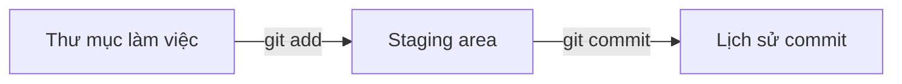

Sửa code xong, chạy thấy hỏng, mà không nhớ đã đổi những gì. Hoặc muốn quay
lại bản chạy được hôm qua nhưng đã lưu đè mất. Git lưu lại từng mốc thay đổi
của project, xem lại hay quay về lúc nào cũng được.

## Khái niệm

📸 **Commit**: một ảnh chụp trạng thái các file của project tại một thời điểm, kèm lời mô tả và tên người tạo.

🛒 **Staging area**: nơi gom những thay đổi sẽ đi vào commit tiếp theo, thêm vào bằng `git add`.

🙈 **.gitignore**: file liệt kê những file, thư mục Git bỏ qua, không bao giờ đưa vào commit.

Mỗi file đi qua ba chỗ: sửa trong thư mục làm việc, `git add` vào staging
area, rồi `git commit` thành một mốc trong lịch sử.



## Ví dụ

Cài Git một lần, khai báo tên và email để gắn vào mỗi commit:

```bash
git config --global user.name "An"
git config --global user.email "an@shop.vn"
```

Đưa project `ShopApi` vào Git:

```bash
cd ShopApi
git init -b main
dotnet new gitignore
git add .
git commit -m "Tạo ShopApi"
git log --oneline
```

- `git init -b main` tạo kho Git trong thư mục, nhánh chính tên `main`.
- `dotnet new gitignore` tạo sẵn `.gitignore` cho project .NET, bỏ qua
  `bin/`, `obj/` là những thứ build ra.
- `git add .` đưa mọi file vào staging area, `git commit -m` tạo commit kèm
  lời mô tả.
- `git log --oneline` in mỗi commit một dòng: mã commit và lời mô tả.

## Thử ngay

Thêm một dòng comment vào cuối `Program.cs`, tạo file mới `Notes.txt`, rồi
chạy:

```bash
git status
```

**Đoán trước khi chạy:** Git nói gì về hai file này?

<details>
<summary>Xem kết quả</summary>

```text
On branch main
Changes not staged for commit:
  (use "git add <file>..." to update what will be committed)
  (use "git restore <file>..." to discard changes in working directory)
	modified:   Program.cs

Untracked files:
  (use "git add <file>..." to include in what will be committed)
	Notes.txt

no changes added to commit (use "git add" and/or "git commit -a")
```

`Program.cs` đã có trong commit trước nên là "modified", đã sửa nhưng chưa
`git add`. `Notes.txt` là file mới, Git chưa theo dõi nên là "untracked".
Muốn đưa cả hai vào commit tiếp theo thì `git add` chúng.

</details>

## Lỗi hay gặp

**Commit trước khi có `.gitignore`.** `bin/`, `obj/` nặng và đổi sau mỗi lần
build, làm lịch sử rối. Tệ hơn, `appsettings.Development.json` chứa mật khẩu
database bị đẩy lên cho cả nhóm xem, điều bài Cấu hình của khoá ASP.NET Core
đã cảnh báo.

```bash
# SAI — add hết khi chưa có .gitignore
git init -b main
git add .
```

```bash
# ĐÚNG — tạo .gitignore trước khi add
git init -b main
dotnet new gitignore
git add .
```

File chứa mật khẩu thì mở `.gitignore`, thêm một dòng
`appsettings.Development.json` ở cuối, trước khi `git add`.

## Tóm tắt

- Commit là một mốc trạng thái của project, kèm lời mô tả.
- Sửa file, `git add` vào staging area, rồi `git commit`.
- `git status` cho biết file nào đã sửa, file nào mới. `git log` xem lịch sử.
- Tạo `.gitignore` trước commit đầu tiên, không commit `bin/`, `obj/` và
  file chứa mật khẩu.

```quiz
[
  {
    "prompt": "Sửa Product.cs rồi chạy git commit -m \"Sửa giá\" mà chưa git add. Commit mới có thay đổi đó không?",
    "options": [
      "Có, commit tự lấy mọi thay đổi",
      "Không, chỉ những gì đã git add vào staging area mới vào commit",
      "Có, nhưng chỉ dòng đầu",
      "Git báo lỗi và xoá thay đổi"
    ],
    "answer": 2,
    "explain": "Commit lấy nội dung trong staging area. Thay đổi chưa add vẫn nằm ở thư mục làm việc."
  },
  {
    "prompt": "git status báo một file là \"Untracked\". Nghĩa là gì?",
    "options": [
      "File đã bị xoá",
      "File đã commit nhưng bị sửa",
      "File mới, Git chưa từng theo dõi",
      "File nằm trong .gitignore"
    ],
    "answer": 3,
    "explain": "Untracked là file chưa từng được add. File trong .gitignore thì git status không hiện ra."
  },
  {
    "prompt": "Thư mục nào không nên commit trong project .NET?",
    "options": [
      "Controllers",
      "Migrations",
      "Properties",
      "bin và obj"
    ],
    "answer": 4,
    "explain": "bin và obj do build sinh ra, ai build cũng tạo lại được. Migrations là code nên phải commit."
  }
]
```
