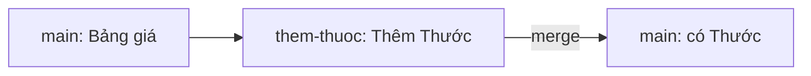

Đang làm dở tính năng phí giao hàng thì có lỗi gấp cần sửa trên bản đang chạy.
Nếu mọi thứ nằm chung một chỗ, code dở dang sẽ lẫn vào bản sửa lỗi. Với
branch, mỗi việc nằm trên một nhánh riêng, xong việc nào thì gộp việc đó vào
nhánh chính.

## Khái niệm

🌿 **Branch (nhánh)**: một dòng commit riêng tách ra từ nhánh khác, commit trên nhánh này không ảnh hưởng nhánh kia.

🤲 **Merge**: gộp các commit của một nhánh vào nhánh đang đứng.

Nhánh `main` giữ bản ổn định. Mỗi tính năng làm trên một nhánh riêng, xong
và kiểm tra rồi mới merge vào `main`.



## Ví dụ

Tạo một thư mục thử riêng, chạy `git init -b main`, rồi commit file
`prices.txt` có hai dòng `Bút bi: 5000` và `Vở: 12000`. Sau đó chạy:

```bash
git switch -c them-thuoc
# thêm dòng "Thước: 7000" vào cuối prices.txt
git commit -am "Thêm Thước"
git switch main
git merge them-thuoc
```

- `git switch -c them-thuoc` tạo nhánh mới và chuyển sang nó ngay.
- `git commit -am` tự `add` mọi file Git đang theo dõi rồi commit. File mới
  vẫn phải `git add` riêng.
- `git switch main` quay về nhánh chính.
- `git merge them-thuoc` gộp commit "Thêm Thước" vào `main`.

Kết quả của `merge`:

```text
Updating ea9213a..041e7c3
Fast-forward
 prices.txt | 1 +
 1 file changed, 1 insertion(+)
```

Mã commit trên máy bạn sẽ khác. Từ lúc tách nhánh, `main` chưa có commit
mới nào, nên Git chỉ cần dời `main` tới commit cuối của `them-thuoc`. Kiểu
merge này gọi là fast-forward.

## Thử ngay

Chạy các lệnh của ví dụ nhưng dừng sau `git switch main`, **chưa merge**.
Xem nội dung file:

```bash
cat prices.txt
```

**Đoán trước khi chạy:** file có dòng "Thước: 7000" không?

<details>
<summary>Xem kết quả</summary>

```text
Bút bi: 5000
Vở: 12000
```

Không có. Khi chuyển nhánh, Git đổi file trong thư mục làm việc cho đúng với
nhánh đó. Dòng "Thước" chỉ có trên `them-thuoc`, tới khi merge mới vào
`main`.

</details>

## Lỗi hay gặp

**Commit nhầm nhánh.** Không để ý đang đứng ở nhánh nào, commit luôn tính
năng làm dở vào `main`.

```bash
# SAI — không kiểm tra nhánh trước khi commit
git commit -am "Phí giao hàng làm dở"
```

```bash
# ĐÚNG — xem nhánh hiện tại, tạo nhánh riêng nếu cần
git branch --show-current
git switch -c phi-ship
git commit -am "Phí giao hàng làm dở"
```

`git status` cũng in tên nhánh ở dòng đầu: `On branch main`.

## Tóm tắt

- Mỗi việc làm trên một branch riêng, `main` giữ bản ổn định.
- `git switch -c ten` tạo và chuyển nhánh, `git switch ten` chuyển nhánh.
- `git merge ten` gộp nhánh `ten` vào nhánh đang đứng.
- Chuyển nhánh thì file trong thư mục đổi theo nhánh đó.

```quiz
[
  {
    "prompt": "Đang ở main, chạy git merge phi-ship. Commit của nhánh nào được gộp vào nhánh nào?",
    "options": [
      "Commit của main gộp vào phi-ship",
      "Hai nhánh đổi chỗ cho nhau",
      "Tạo nhánh thứ ba",
      "Commit của phi-ship gộp vào main"
    ],
    "answer": 4,
    "explain": "merge luôn gộp nhánh được nêu tên vào nhánh đang đứng."
  },
  {
    "prompt": "Merge báo \"Fast-forward\". Điều đó nghĩa là gì?",
    "options": [
      "Nhánh đích chỉ cần dời lên phía trước",
      "Hai nhánh đã có nội dung giống hệt",
      "Git tạo thêm một merge commit mới",
      "Git gộp mà bỏ qua các conflict"
    ],
    "answer": 1,
    "explain": "Nhánh đích không có commit mới từ lúc tách, nên không có gì phải trộn. Git chỉ dời nhánh đích tới commit cuối của nhánh kia."
  },
  {
    "prompt": "Lệnh nào tạo nhánh fix-gia và chuyển sang nó ngay?",
    "options": [
      "git merge fix-gia",
      "git switch -c fix-gia",
      "git branch --show-current",
      "git commit -am fix-gia"
    ],
    "answer": 2,
    "explain": "switch -c tạo nhánh mới từ chỗ đang đứng rồi chuyển sang nhánh đó."
  }
]
```
