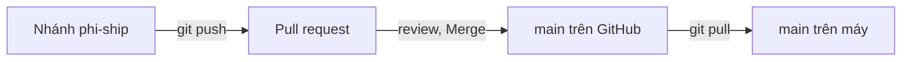

Tới giờ Git chỉ nằm trên máy bạn. Làm nhóm thì cần một kho chung để mọi người
gửi code lên và lấy code của nhau về. GitHub là nơi giữ kho chung đó, và pull
request là cách đề nghị gộp một nhánh vào `main` sau khi được người khác xem.

## Khái niệm

☁️ **Remote**: kho Git nằm trên máy khác, thường là GitHub, hay được đặt tên `origin`.

🔃 **Push / pull**: `git push` gửi commit của nhánh lên remote, `git pull` lấy commit mới từ remote về rồi merge vào nhánh đang đứng.

🙋 **Pull request (PR)**: đề nghị trên GitHub gộp một nhánh vào `main`, để người khác đọc code và góp ý trước khi merge.

## Ví dụ

Tạo repository rỗng trên GitHub tên `Shop`, rồi nối kho trên máy với nó:

```bash
git remote add origin https://github.com/an/Shop.git
git push -u origin main
```

- `git remote add origin <url>` đặt tên `origin` cho kho trên GitHub.
- `git push -u origin main` gửi nhánh `main` lên. `-u` ghi nhớ nhánh tương
  ứng, lần sau chỉ cần `git push`, `git pull`.

Quy trình làm một tính năng:

```bash
git switch -c phi-ship
# sửa code, commit
git push -u origin phi-ship
```

Sau đó mở trang repository trên GitHub, bấm **Compare & pull request**. Đồng
nghiệp đọc code và góp ý, bạn sửa rồi push tiếp lên cùng nhánh.

Khi pull request được đồng ý, bấm **Merge pull request** để gộp `phi-ship`
vào `main` trên GitHub. Cuối cùng, trên máy chuyển về `main` và chạy
`git pull` để lấy bản đã merge.



## Thử ngay

Chạy lệnh này một lần để `git pull` gộp bằng merge, như bài Branch và merge:

```bash
git config --global pull.rebase false
```

Bình vừa push một commit lên `main`. Bạn chưa pull, commit trên `main` của
mình rồi chạy `git push`. Không có đồng nghiệp thì tự đóng vai Bình: chạy
`git clone` kèm địa chỉ repository để tải nó về một thư mục khác, rồi commit
và push từ đó.

**Đoán trước khi chạy:** push có thành công không? Nếu không thì phải làm gì?

<details>
<summary>Xem kết quả</summary>

```text
 ! [rejected]        main -> main (fetch first)
error: failed to push some refs to 'https://github.com/an/Shop.git'
hint: Updates were rejected because the remote contains work that you do not
hint: have locally.
```

Bị từ chối. Remote có commit của Bình mà máy bạn chưa có.

Chạy `git pull` để lấy về và merge (có conflict thì xử lý như bài trước),
rồi `git push` lại. Nếu Git mở trình soạn thảo để hỏi lời mô tả cho merge, giữ nguyên nội dung,
lưu rồi đóng lại.

</details>

## Lỗi hay gặp

**Dùng `git push --force` khi bị từ chối.** Lệnh này ghi đè remote bằng bản
trên máy bạn, commit của Bình biến mất khỏi GitHub.

```bash
# SAI — xoá mất commit của người khác
git push --force
```

```bash
# ĐÚNG — lấy commit của người khác về trước
git pull
git push
```

Nhánh chung như `main` nên bật bảo vệ trên GitHub: không cho push thẳng,
mọi thay đổi phải qua pull request.

## Tóm tắt

- Remote `origin` là kho chung trên GitHub.
- `git push` gửi commit lên, `git pull` lấy commit về và merge.
- Mỗi tính năng: nhánh riêng, push, mở pull request, review, rồi merge.
- Push bị từ chối thì `git pull` trước. Không `push --force` lên nhánh chung.

```quiz
[
  {
    "prompt": "Chạy git push và nhận \"rejected ... (fetch first)\". Nguyên nhân là gì?",
    "options": [
      "Sai mật khẩu hoặc token GitHub",
      "Remote có commit máy bạn chưa có",
      "Máy bạn chưa có commit nào mới",
      "Nhánh main trên GitHub đã bị xoá"
    ],
    "answer": 2,
    "explain": "Git không cho push khi remote có commit mới hơn, để tránh ghi đè. Pull về trước rồi push lại."
  },
  {
    "prompt": "Vì sao nên merge vào main qua pull request thay vì push thẳng?",
    "options": [
      "Để GitHub tự sửa conflict giúp",
      "Để main tự chạy build sau mỗi lần push",
      "Để có người review trước khi vào main",
      "Vì GitHub không cho push thẳng lên main"
    ],
    "answer": 3,
    "explain": "Pull request là chỗ đồng nghiệp đọc code và góp ý, nên lỗi được phát hiện trước khi vào nhánh chung. GitHub chỉ chặn push thẳng khi bạn bật bảo vệ nhánh."
  },
  {
    "prompt": "Lệnh nào gửi nhánh phi-ship lên GitHub lần đầu và ghi nhớ nhánh tương ứng?",
    "options": [
      "git pull -u origin phi-ship",
      "git remote add origin phi-ship",
      "git switch -c origin/phi-ship",
      "git push -u origin phi-ship"
    ],
    "answer": 4,
    "explain": "push -u gửi nhánh lên origin và ghi nhớ, lần sau chỉ cần git push."
  }
]
```
