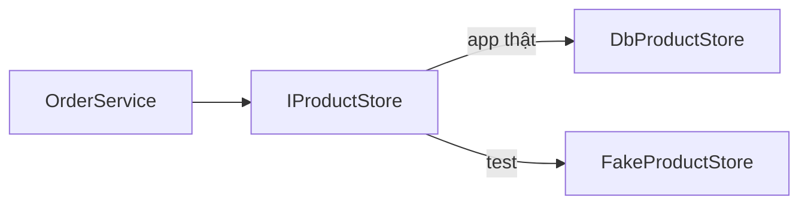

`OrderService` kiểm tồn kho rồi trừ kho qua `IProductStore`. Test nó với
`DbProductStore` thật thì phải bật Oracle và chuẩn bị dữ liệu, test chạy
chậm và lúc qua lúc đỏ tuỳ dữ liệu trong database. Thay `IProductStore` bằng
một bản giả trong bộ nhớ thì test chạy trong vài mili giây, lần nào cũng cho
cùng kết quả.

## Khái niệm

♻️ **Fake**: class tự viết implement cùng interface với phụ thuộc thật, giữ dữ liệu trong bộ nhớ để test dùng thay cho database hay API.

`FakeProductStore` ở bài Tách giao diện và dữ liệu của khoá WinForms là một
fake. Bài này viết lại nó, thêm bộ đếm số lần ghi.

Bài DIP và dependency injection cho `OrderService` nhận `IOrderRepository`
qua constructor. Ở đây `OrderService` cũng chỉ biết `IProductStore`, nên
nhận fake hay bản thật đều được.



## Ví dụ

Class cần test, nằm trong project `ShopApi`. `IProductStore` và `Product`
giữ đúng như bài Truy vấn với EF Core:

```csharp
public class OrderService
{
    private readonly IProductStore _store;

    public OrderService(IProductStore store)
    {
        _store = store;
    }

    public async Task<bool> PlaceAsync(
        int productId, int quantity)
    {
        List<Product> inStock =
            await _store.InStockAsync();
        Product? product =
            inStock.Find(p => p.Id == productId);
        if (product == null || product.Stock < quantity)
        {
            return false;
        }
        await _store.SetStockAsync(
            productId, product.Stock - quantity);
        return true;
    }
}

// Có sẵn trong ShopApi từ khoá ASP.NET Core
public interface IProductStore
{
    Task<List<Product>> InStockAsync();
    Task<bool> SetStockAsync(int id, int stock);
}

public class Product
{
    public int Id { get; set; }
    public string Name { get; set; } = "";
    public decimal Price { get; set; }
    public int Stock { get; set; }
}
```

Fake và test, nằm trong `ShopApi.Tests`:

```csharp
using Xunit;

public class FakeProductStore : IProductStore
{
    public List<Product> Products { get; } =
        new List<Product>();
    public int SetStockCalls { get; private set; }

    public Task<List<Product>> InStockAsync()
    {
        var result = Products.FindAll(p => p.Stock > 0);
        return Task.FromResult(result);
    }

    public Task<bool> SetStockAsync(int id, int stock)
    {
        SetStockCalls++;
        Product? p = Products.Find(x => x.Id == id);
        if (p == null)
        {
            return Task.FromResult(false);
        }
        p.Stock = stock;
        return Task.FromResult(true);
    }
}

public class OrderServiceTests
{
    [Fact]
    public async Task Place_EnoughStock_ReducesStock()
    {
        var store = new FakeProductStore();
        store.Products.Add(new Product
        {
            Id = 1, Name = "Bút bi", Stock = 120
        });
        var service = new OrderService(store);

        bool ok = await service.PlaceAsync(1, 20);

        Assert.True(ok);
        Assert.Equal(100, store.Products[0].Stock);
    }
}
```

- `Find` giống `FindAll` nhưng chỉ trả về phần tử đầu tiên thoả điều kiện,
  không có thì trả về `null`.
- Test có `await` thì khai báo `async Task`, như bài async/await cơ bản.
- Arrange tạo fake và nạp đúng dữ liệu test cần, không phụ thuộc database.
- `SetStockCalls` đếm số lần service gọi `SetStockAsync`, để test kiểm được
  service có ghi tồn kho hay không.
- `Task.FromResult` bọc sẵn kết quả thành `Task`, như ở bài Tách giao diện
  và dữ liệu.

## Thử ngay

Thêm test cho trường hợp hết hàng vào `OrderServiceTests`:

```csharp
using Xunit;

public class OrderServiceTests
{
    [Fact]
    public async Task Place_OutOfStock_DoesNotSave()
    {
        var store = new FakeProductStore();
        store.Products.Add(new Product
        {
            Id = 2, Name = "Vở", Stock = 0
        });
        var service = new OrderService(store);

        bool ok = await service.PlaceAsync(2, 1);

        Assert.False(ok);
        Assert.Equal(0, store.SetStockCalls);
    }
}
```

**Đoán trước khi chạy:** test qua hay đỏ? `SetStockCalls` bằng mấy?

<details>
<summary>Xem kết quả</summary>

```text
Passed!  - Failed: 0, ...
```

Qua. Vở có tồn kho 0 nên `InStockAsync` không trả về nó, service trả `false`
ngay mà không gọi `SetStockAsync`. `SetStockCalls` vẫn là 0, tức không có
lần ghi nào xuống kho.

</details>

## Lỗi hay gặp

**Quên `await` khi gọi method async trong test.** `PlaceAsync` trả về
`Task<bool>` chứ không phải `bool`.

```csharp
// SAI — lỗi compile CS1503: Task<bool> không phải bool
using Xunit;

public class OrderServiceTests
{
    [Fact]
    public void Place_NoAwait()
    {
        var service = new OrderService(
            new FakeProductStore());
        Assert.False(service.PlaceAsync(1, 5));
    }
}
```

```csharp
// ĐÚNG — test async Task, await kết quả
using Xunit;

public class OrderServiceTests
{
    [Fact]
    public async Task Place_Unknown_ReturnsFalse()
    {
        var service = new OrderService(
            new FakeProductStore());
        Assert.False(await service.PlaceAsync(1, 5));
    }
}
```

Cũng đừng viết test `async void`: xUnit báo cảnh báo `xUnit1048`, vì các bản
sau sẽ bỏ hỗ trợ kiểu này.

## Tóm tắt

- Fake implement cùng interface, giữ dữ liệu trong bộ nhớ.
- Class nhận interface qua constructor thì test truyền fake vào được.
- Fake có thể đếm lời gọi để kiểm "có ghi hay không".
- Test có `await` thì khai báo `async Task`, không dùng `async void`.

```quiz
[
  {
    "prompt": "Thêm method GetByIdAsync vào IProductStore. FakeProductStore trong project test sẽ thế nào?",
    "options": [
      "Không sao, vì fake chỉ dùng trong test",
      "xUnit tự thêm method đó vào fake",
      "Chỉ test nào gọi GetByIdAsync mới đỏ",
      "Lỗi compile tới khi fake có method đó"
    ],
    "answer": 4,
    "explain": "Fake implement IProductStore nên phải có đủ mọi method của interface. Thiếu một method là project test không build được."
  },
  {
    "prompt": "Mọi test OrderService dùng fake đều qua, nhưng app thật vẫn trừ kho sai trên Oracle. Vì sao có thể như vậy?",
    "options": [
      "Test không chạy code của DbProductStore",
      "xUnit bỏ qua lỗi trong method async",
      "Test dùng fake thì luôn qua",
      "OrderService chạy khác khi ở trong test"
    ],
    "answer": 1,
    "explain": "Fake thay chỗ DbProductStore, nên test chỉ kiểm logic của OrderService. Lỗi nằm trong phần ghi xuống Oracle thì test với fake không bắt được."
  },
  {
    "prompt": "Test có dùng await nên khai báo thế nào?",
    "options": [
      "public void",
      "public async Task",
      "public async void",
      "public static void"
    ],
    "answer": 2,
    "explain": "async Task để xUnit chờ test chạy xong và bắt được lỗi. async void bị cảnh báo xUnit1048."
  }
]
```
