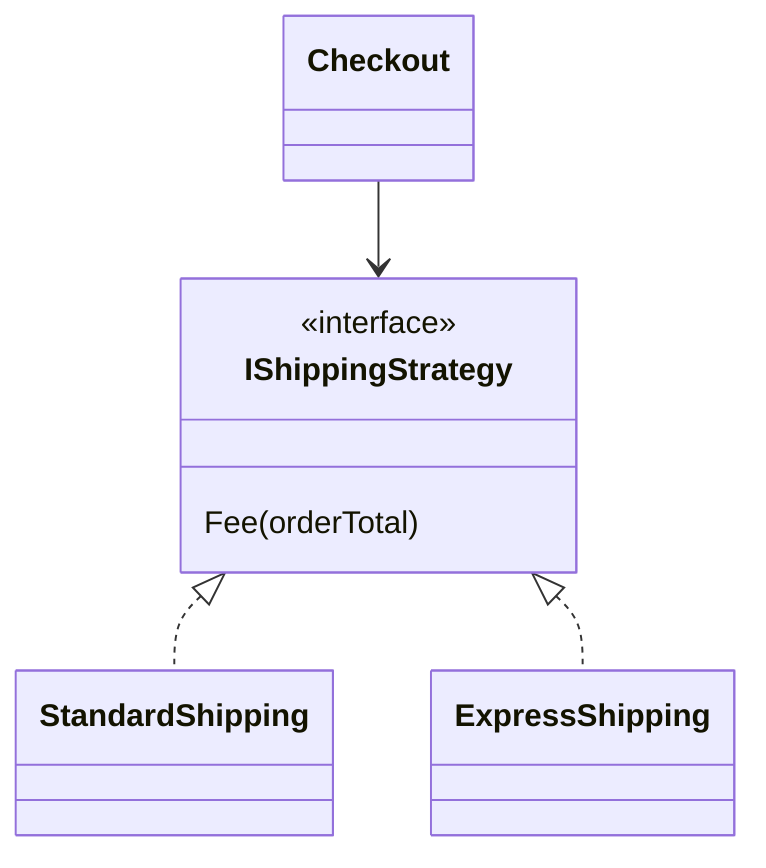

Cửa hàng có ba cách giao: tiêu chuẩn, hoả tốc, và khách tự đến lấy. Mỗi cách
tính phí một kiểu. Viết hết vào một method với `if` theo tên cách giao thì
mỗi lần thêm cách mới lại phải sửa method đó. Strategy tách mỗi cách tính
thành một class riêng.

## Khái niệm

📘 **Design pattern**: lời giải đã được đặt tên cho một vấn đề thiết kế hay gặp, để lập trình viên nói với nhau bằng một từ thay vì giải thích cả đoạn code.

♟️ **Strategy**: đặt mỗi cách làm của cùng một việc vào một class riêng implement chung một interface, rồi truyền cách làm cần dùng vào nơi sử dụng.

Đây chính là OCP ở khoá OOP: thêm cách giao mới là thêm class, không sửa code
cũ. `IProductStore` với `DbProductStore`, `FakeProductStore` cũng cùng ý
tưởng, và thường được gọi là Repository.

## Ví dụ

```csharp
var checkout = new Checkout(new StandardShipping());
Console.WriteLine(checkout.Total(200000m));   // 220000

public interface IShippingStrategy
{
    decimal Fee(decimal orderTotal);
}

public class StandardShipping : IShippingStrategy
{
    public decimal Fee(decimal orderTotal)
    {
        if (orderTotal >= 500000)
        {
            return 0;
        }
        return 20000;
    }
}

public class ExpressShipping : IShippingStrategy
{
    public decimal Fee(decimal orderTotal)
    {
        return 50000;
    }
}

public class Checkout
{
    private readonly IShippingStrategy _shipping;

    public Checkout(IShippingStrategy shipping)
    {
        _shipping = shipping;
    }

    public decimal Total(decimal subtotal)
    {
        return subtotal + _shipping.Fee(subtotal);
    }
}
```

- `IShippingStrategy` là "việc tính phí ship". Mỗi class là một cách làm.
- `Checkout` chỉ biết interface, nhận cách tính qua constructor như DIP.
- Đổi cách giao là đổi object truyền vào, `Checkout` không đổi dòng nào.



## Thử ngay

Thêm cách "khách tự đến lấy", miễn phí, rồi dùng thử:

```csharp
Console.WriteLine(
    new Checkout(new ExpressShipping()).Total(200000m));
Console.WriteLine(
    new Checkout(new PickupShipping()).Total(200000m));

public class PickupShipping : IShippingStrategy
{
    public decimal Fee(decimal orderTotal)
    {
        return 0;
    }
}
```

**Đoán trước khi chạy:** hai dòng in ra bao nhiêu? Phải sửa `Checkout` không?

<details>
<summary>Xem kết quả</summary>

```text
250000
200000
```

Hoả tốc cộng 50.000, tự lấy cộng 0. Thêm `PickupShipping` là thêm một class
mới, `Checkout` và hai cách giao cũ giữ nguyên.

</details>

## Lỗi hay gặp

**`if` theo tên cách giao rải trong code.** Thêm cách giao mới phải tìm và sửa
mọi chỗ có chuỗi `if` này, sót một chỗ là sai.

```csharp
// SAI — thêm cách giao mới phải sửa method này
decimal Fee(string method, decimal orderTotal)
{
    if (method == "express")
    {
        return 50000;
    }
    if (orderTotal >= 500000)
    {
        return 0;
    }
    return 20000;
}
```

```csharp
// ĐÚNG — nơi dùng chỉ nhận interface
public class Checkout
{
    private readonly IShippingStrategy _shipping;

    public Checkout(IShippingStrategy shipping)
    {
        _shipping = shipping;
    }
}
```

## Tóm tắt

- Design pattern là lời giải có tên cho vấn đề thiết kế hay gặp.
- Strategy: mỗi cách làm một class, chung một interface.
- Nơi dùng nhận interface qua constructor, đổi cách làm không phải sửa nó.
- Thêm cách mới là thêm class, đúng tinh thần OCP.

```quiz
[
  {
    "prompt": "Cửa hàng thêm cách giao \"giao trong 2 giờ\". Với Strategy, cần làm gì?",
    "options": [
      "Sửa Checkout thêm một nhánh if",
      "Sửa StandardShipping",
      "Thêm class TwoHourShipping implement IShippingStrategy",
      "Sửa interface IShippingStrategy"
    ],
    "answer": 3,
    "explain": "Thêm cách làm là thêm class mới. Code cũ giữ nguyên, đúng OCP."
  },
  {
    "prompt": "Checkout biết gì về cách tính phí ship?",
    "options": [
      "Chỉ biết interface IShippingStrategy",
      "Biết cả ba class cụ thể",
      "Biết tên cách giao dạng chuỗi",
      "Không dùng tới phí ship"
    ],
    "answer": 1,
    "explain": "Checkout chỉ gọi Fee qua interface, nên cách tính nào truyền vào cũng dùng được."
  },
  {
    "prompt": "Nguyên lý SOLID nào đứng sau Strategy rõ nhất?",
    "options": [
      "LSP",
      "ISP",
      "SRP",
      "OCP"
    ],
    "answer": 4,
    "explain": "Mở rộng bằng class mới mà không sửa code cũ chính là OCP."
  }
]
```
