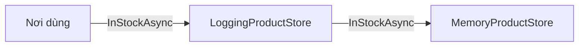

Cần ghi log mỗi lần đọc danh sách sản phẩm để xem vì sao API chậm. Sửa thẳng
`DbProductStore` thì việc log lẫn vào việc đọc database, và muốn
`FakeProductStore` có log lại phải sửa thêm class đó. Decorator thêm việc log
bằng một class bọc bên ngoài, không đụng tới class gốc.

## Khái niệm

🎁 **Decorator**: class implement cùng interface với class gốc, giữ object gốc bên trong, và làm thêm việc trước hoặc sau khi chuyển lời gọi cho object đó.

Nơi dùng vẫn chỉ thấy `IProductStore`, không biết mình đang dùng bản gốc hay
bản đã bọc. Bọc nhiều lớp cũng được, mỗi lớp thêm một việc.

## Ví dụ

`IProductStore` và `Product` giữ như bài Truy vấn với EF Core. Ví dụ dùng
`MemoryProductStore` thay cho `DbProductStore` để chạy được không cần
database:

```csharp
IProductStore store =
    new LoggingProductStore(new MemoryProductStore());
var products = await store.InStockAsync();

public class LoggingProductStore : IProductStore
{
    private readonly IProductStore _inner;

    public LoggingProductStore(IProductStore inner)
    {
        _inner = inner;
    }

    public async Task<List<Product>> InStockAsync()
    {
        Console.WriteLine("Bắt đầu đọc sản phẩm");
        var result = await _inner.InStockAsync();
        Console.WriteLine(
            $"Xong, {result.Count} sản phẩm");
        return result;
    }

    public Task<bool> SetStockAsync(int id, int stock)
    {
        return _inner.SetStockAsync(id, stock);
    }
}

public class MemoryProductStore : IProductStore
{
    public Task<List<Product>> InStockAsync()
    {
        var list = new List<Product>
        {
            new Product { Id = 1, Name = "Bút bi" }
        };
        return Task.FromResult(list);
    }

    public Task<bool> SetStockAsync(int id, int stock)
    {
        return Task.FromResult(true);
    }
}

// Có sẵn trong ShopApi từ khoá ASP.NET Core
public interface IProductStore
{
    Task<List<Product>> InStockAsync();
    Task<bool> SetStockAsync(int id, int stock);
}

public class Product
{
    public int Id { get; set; }
    public string Name { get; set; } = "";
    public decimal Price { get; set; }
    public int Stock { get; set; }
}
```

- `LoggingProductStore` implement `IProductStore` và giữ `_inner` cũng là
  `IProductStore`.
- `InStockAsync` in log, gọi `_inner`, in log tiếp. `SetStockAsync` chuyển
  thẳng cho `_inner`.
- Bọc `DbProductStore` hay `FakeProductStore` đều được, vì decorator chỉ biết
  interface. Nơi dùng không phải sửa.



## Thử ngay

Sửa `LoggingProductStore` để nhận thêm một cái tên và in tên đó trong hai dòng
log, rồi bọc hai lớp:

```csharp
IProductStore inner = new LoggingProductStore(
    "B", new MemoryProductStore());
IProductStore store =
    new LoggingProductStore("A", inner);
await store.InStockAsync();

public class LoggingProductStore : IProductStore
{
    private readonly string _name;
    private readonly IProductStore _inner;

    public LoggingProductStore(
        string name, IProductStore inner)
    {
        _name = name;
        _inner = inner;
    }

    public async Task<List<Product>> InStockAsync()
    {
        Console.WriteLine(_name + ": bắt đầu");
        var result = await _inner.InStockAsync();
        Console.WriteLine(
            $"{_name}: xong, {result.Count} sản phẩm");
        return result;
    }

    public Task<bool> SetStockAsync(int id, int stock)
    {
        return _inner.SetStockAsync(id, stock);
    }
}
```

**Đoán trước khi chạy:** bốn dòng log của A và B in ra theo thứ tự nào?

<details>
<summary>Xem kết quả</summary>

```text
A: bắt đầu
B: bắt đầu
B: xong, 1 sản phẩm
A: xong, 1 sản phẩm
```

Lời gọi đi từ lớp ngoài vào trong, kết quả đi từ trong ra ngoài. Middleware
trong bài Middleware và pipeline của khoá ASP.NET Core cũng chạy theo thứ tự
này.

</details>

## Lỗi hay gặp

**Kế thừa class gốc để thêm log.** Class log khi đó chỉ gắn với đúng một class
gốc, muốn log `FakeProductStore` phải viết thêm class khác.

```csharp
// SAI — gắn chặt với DbProductStore
public class LoggingDbProductStore : DbProductStore
{
    public LoggingDbProductStore(ShopDbContext db)
        : base(db)
    {
    }
}
```

```csharp
// ĐÚNG — bọc bất kỳ IProductStore nào
public class LoggingProductStore : IProductStore
{
    private readonly IProductStore _inner;

    public LoggingProductStore(IProductStore inner)
    {
        _inner = inner;
    }

    public Task<List<Product>> InStockAsync()
    {
        return _inner.InStockAsync();
    }

    public Task<bool> SetStockAsync(int id, int stock)
    {
        return _inner.SetStockAsync(id, stock);
    }
}
```

Đây là dùng composition thay cho kế thừa, như bài Composition của khoá OOP.

## Tóm tắt

- Decorator bọc object gốc, cùng interface, thêm việc trước hoặc sau.
- Class gốc và nơi dùng đều không phải sửa.
- Bọc nhiều lớp: lời gọi đi từ ngoài vào, kết quả đi từ trong ra.
- Hay dùng cho log, cache, đo thời gian, kiểm quyền.

```quiz
[
  {
    "prompt": "Muốn cache kết quả InStockAsync mà không sửa DbProductStore. Cách nào hợp nhất?",
    "options": [
      "Sửa DbProductStore thêm cache",
      "Viết CachingProductStore implement IProductStore, bọc DbProductStore",
      "Kế thừa DbProductStore",
      "Thêm cache vào controller"
    ],
    "answer": 2,
    "explain": "Decorator thêm việc cache bên ngoài, class gốc giữ nguyên và bản cache bọc được mọi IProductStore."
  },
  {
    "prompt": "Decorator khác kế thừa ở điểm nào?",
    "options": [
      "Decorator chạy nhanh hơn",
      "Không khác gì",
      "Decorator chỉ dùng cho log",
      "Decorator bọc bất kỳ object nào cùng interface, kế thừa gắn với một class cụ thể"
    ],
    "answer": 4,
    "explain": "Decorator giữ bên trong một object kiểu interface, nên bọc được mọi class implement interface đó."
  },
  {
    "prompt": "Bọc Timing(Logging(Db)). Gọi InStockAsync thì lớp nào chạy phần \"trước\" đầu tiên?",
    "options": [
      "Timing",
      "Logging",
      "Db",
      "Cùng lúc"
    ],
    "answer": 1,
    "explain": "Lời gọi đi từ lớp ngoài cùng vào trong, nên Timing chạy trước, rồi Logging, rồi Db."
  }
]
```
