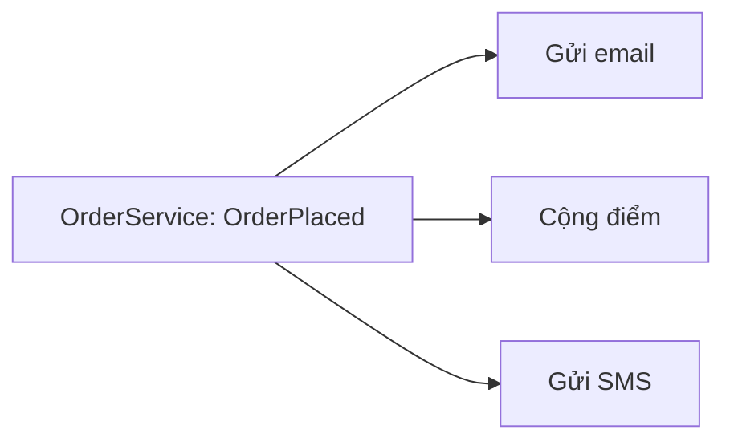

Đặt hàng xong phải gửi email, cộng điểm thành viên, gửi SMS. Nếu
`OrderService` tự gọi cả ba, mỗi việc mới lại phải sửa `OrderService`, và nó
phải biết mọi phần khác của hệ thống. Với Observer, `OrderService` chỉ thông
báo "đã đặt hàng", việc nào cần thì tự đăng ký nghe.

## Khái niệm

📣 **Observer**: một object phát thông báo khi có việc xảy ra, các object khác đăng ký nghe và tự xử lý, bên phát không cần biết ai đang nghe.

C# có sẵn cơ chế này là event, đã gặp ở bài Sự kiện của khoá WinForms: nút là
bên phát event `Click`, handler gắn bằng `+=` là bên nghe.

## Ví dụ

```csharp
var service = new OrderService();
service.OrderPlaced += (sender, code) =>
    Console.WriteLine("Gửi email cho " + code);
service.OrderPlaced += (sender, code) =>
    Console.WriteLine("Cộng điểm cho " + code);

service.Place("DH1");

public class OrderService
{
    public event EventHandler<string>? OrderPlaced;

    public void Place(string code)
    {
        Console.WriteLine("Đã lưu " + code);
        OrderPlaced?.Invoke(this, code);
    }
}
```

- `event EventHandler<string>?` khai báo một event gửi kèm một `string`, ở
  đây là mã đơn. Handler nhận `sender` (bên phát) và giá trị đó.
- `OrderPlaced?.Invoke(this, code)` gọi lần lượt mọi handler. Chưa có handler
  nào thì event là `null`, và `?.` (bài null và nullable) bỏ qua lời gọi.
- `OrderService` ở đây là bản rút gọn, chỉ giữ phần thông báo. Nó không biết
  gì về email hay điểm. Thêm việc gửi SMS là thêm một `+=` ở ngoài.



## Thử ngay

Chạy ví dụ, rồi thêm hai dòng sau vào cuối phần câu lệnh:

```csharp
var lonely = new OrderService();
lonely.Place("DH2");
```

**Đoán trước khi chạy:** toàn bộ chương trình in ra những dòng nào? Đơn DH2
không có ai nghe thì có lỗi không?

<details>
<summary>Xem kết quả</summary>

```text
Đã lưu DH1
Gửi email cho DH1
Cộng điểm cho DH1
Đã lưu DH2
```

Handler chạy theo thứ tự đăng ký. `lonely` không có handler nào, `?.` bỏ qua
lời gọi nên không lỗi.

</details>

## Lỗi hay gặp

**Gọi event mà không có `?.`.** Chưa ai đăng ký thì event là `null`, gọi thẳng
ném `NullReferenceException`.

```csharp
// SAI — không có handler là NullReferenceException
public class OrderService
{
    public event EventHandler<string>? OrderPlaced;

    public void Place(string code)
    {
        OrderPlaced(this, code);
    }
}
```

```csharp
// ĐÚNG — chỉ gọi khi có người nghe
public class OrderService
{
    public event EventHandler<string>? OrderPlaced;

    public void Place(string code)
    {
        OrderPlaced?.Invoke(this, code);
    }
}
```

## Tóm tắt

- Observer: bên phát thông báo, nhiều bên nghe tự phản ứng.
- Trong C#, dùng `event` để phát và `+=` để đăng ký.
- Bên phát không biết bên nghe, thêm việc mới không phải sửa bên phát.
- Phát event bằng `?.Invoke` để không lỗi khi chưa ai nghe.

```quiz
[
  {
    "prompt": "Thêm việc \"gửi SMS khi đặt hàng\" với Observer. Cần sửa OrderService không?",
    "options": [
      "Có, thêm lời gọi SmsSender vào Place",
      "Có, thêm event OrderPlacedSms mới",
      "Không, nhưng phải xoá handler cũ",
      "Không, đăng ký thêm handler"
    ],
    "answer": 4,
    "explain": "OrderService chỉ phát thông báo. Việc mới đăng ký một handler cho OrderPlaced từ bên ngoài bằng +=."
  },
  {
    "prompt": "Handler gửi email đăng ký trước và ném exception. Handler cộng điểm đăng ký sau nó có chạy không?",
    "options": [
      "Không, exception bay ra khỏi Invoke",
      "Có, event luôn gọi đủ mọi handler",
      "Có, nhưng chạy trước handler email",
      "Có, event tự bắt exception của handler"
    ],
    "answer": 1,
    "explain": "Invoke gọi lần lượt từng handler như gọi method thường. Handler ném exception thì các handler sau không chạy, exception đi tiếp ra Place như bài Exception."
  },
  {
    "prompt": "Place gọi OrderPlaced?.Invoke(this, code) trước dòng lưu đơn vào database. Rủi ro là gì?",
    "options": [
      "Không sao, thứ tự không quan trọng",
      "Email có thể gửi cho đơn chưa lưu",
      "Lỗi compile vì event phải gọi cuối",
      "Handler không chạy vì chưa có đơn"
    ],
    "answer": 2,
    "explain": "Handler chạy ngay khi event được phát. Lưu đơn sau đó mà lỗi thì khách đã nhận email cho một đơn không tồn tại, nên phát event sau khi lưu xong."
  }
]
```
