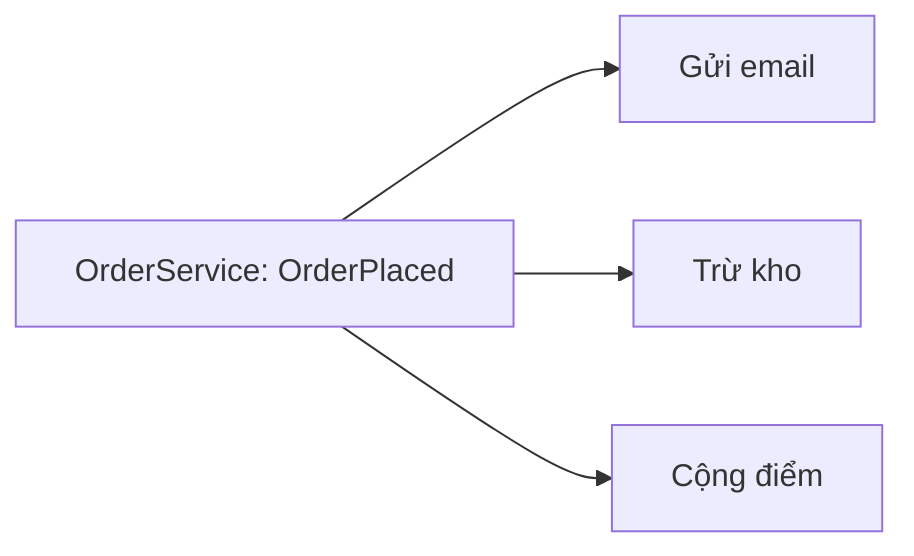

Đặt hàng xong phải gửi email, trừ kho, cộng điểm thành viên. Nếu
`OrderService` tự gọi cả ba, mỗi việc mới lại phải sửa `OrderService`, và nó
phải biết mọi phần khác của hệ thống. Observer để `OrderService` chỉ thông báo
"đã đặt hàng", ai quan tâm thì tự đăng ký nghe.

## Khái niệm

📣 **Observer**: một object phát thông báo khi có chuyện xảy ra, các object khác đăng ký nghe và tự phản ứng, bên phát không cần biết có ai nghe.

C# có sẵn cơ chế này là event, đã dùng ở bài Sự kiện của khoá WinForms: nút
`Click` là bên phát, handler gắn bằng `+=` là bên nghe.

## Ví dụ

```csharp
var service = new OrderService();
service.OrderPlaced += (sender, code) =>
    Console.WriteLine("Gửi email cho " + code);
service.OrderPlaced += (sender, code) =>
    Console.WriteLine("Trừ kho cho " + code);

service.Place("DH1");

public class OrderService
{
    public event EventHandler<string>? OrderPlaced;

    public void Place(string code)
    {
        Console.WriteLine("Đã lưu " + code);
        OrderPlaced?.Invoke(this, code);
    }
}
```

- `event EventHandler<string>` khai báo event mang theo một `string`, ở đây
  là mã đơn. Handler nhận `sender` và giá trị đó.
- `OrderPlaced?.Invoke(this, code)` phát thông báo. `?.` nghĩa là chỉ gọi khi
  có ít nhất một handler, không có thì bỏ qua.
- `OrderService` không biết gì về email hay kho. Thêm việc cộng điểm là thêm
  một `+=` ở ngoài, không sửa `OrderService`.



## Thử ngay

Chạy ví dụ, rồi thêm hai dòng sau vào cuối phần câu lệnh:

```csharp
var lonely = new OrderService();
lonely.Place("DH2");
```

**Đoán trước khi chạy:** toàn bộ chương trình in ra những dòng nào? Đơn DH2
không có ai nghe thì có lỗi không?

<details>
<summary>Xem kết quả</summary>

```text
Đã lưu DH1
Gửi email cho DH1
Trừ kho cho DH1
Đã lưu DH2
```

Handler chạy theo thứ tự đăng ký. `lonely` không có handler nào, `?.` bỏ qua
lời gọi nên không lỗi.

</details>

## Lỗi hay gặp

**Gọi event mà không có `?.`.** Chưa ai đăng ký thì event là `null`, gọi thẳng
ném `NullReferenceException`.

```csharp
// SAI — không có handler là NullReferenceException
public class OrderService
{
    public event EventHandler<string>? OrderPlaced;

    public void Place(string code)
    {
        OrderPlaced(this, code);
    }
}
```

```csharp
// ĐÚNG — chỉ gọi khi có người nghe
public class OrderService
{
    public event EventHandler<string>? OrderPlaced;

    public void Place(string code)
    {
        OrderPlaced?.Invoke(this, code);
    }
}
```

## Tóm tắt

- Observer: bên phát thông báo, nhiều bên nghe tự phản ứng.
- Trong C#, dùng `event` để phát và `+=` để đăng ký.
- Bên phát không biết bên nghe, thêm việc mới không phải sửa bên phát.
- Phát event bằng `?.Invoke` để không lỗi khi chưa ai nghe.

```quiz
[
  {
    "prompt": "Thêm việc \"gửi SMS khi đặt hàng\" với Observer. Cần sửa OrderService không?",
    "options": [
      "Có, thêm lời gọi SmsSender vào Place",
      "Có, thêm một event mới",
      "Không, chỉ cần đăng ký thêm một handler cho OrderPlaced",
      "Không làm được"
    ],
    "answer": 3,
    "explain": "OrderService chỉ phát thông báo. Việc mới đăng ký nghe từ bên ngoài bằng +=."
  },
  {
    "prompt": "Ba handler đăng ký vào OrderPlaced theo thứ tự email, kho, điểm. Chúng chạy theo thứ tự nào?",
    "options": [
      "Email, kho, điểm",
      "Ngẫu nhiên",
      "Điểm, kho, email",
      "Chỉ handler cuối chạy"
    ],
    "answer": 1,
    "explain": "Event gọi các handler theo thứ tự đăng ký."
  },
  {
    "prompt": "OrderPlaced(this, code) ném NullReferenceException. Nguyên nhân?",
    "options": [
      "code bằng null",
      "OrderService chưa được new",
      "Sai kiểu EventHandler",
      "Chưa có handler nào đăng ký nên event là null"
    ],
    "answer": 4,
    "explain": "Event không có handler thì là null. Dùng OrderPlaced?.Invoke(this, code) để an toàn."
  }
]
```
