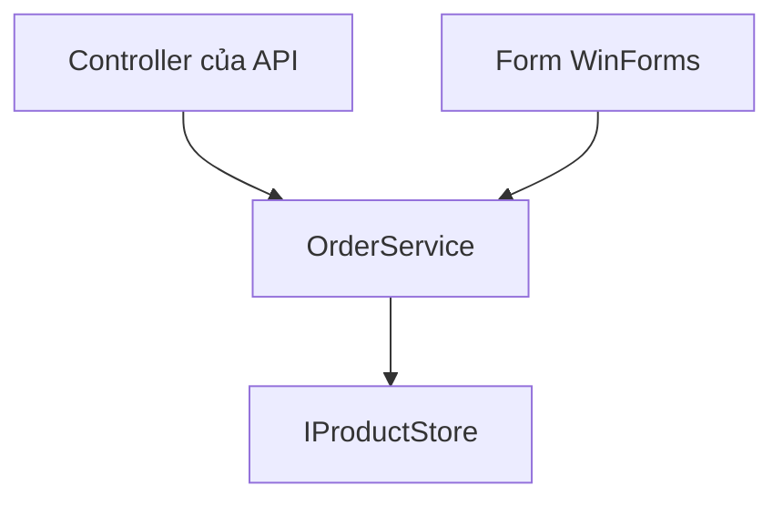

Quy tắc "hết hàng thì không cho đặt" đang nằm ở đâu? Nếu nó nằm lẫn trong
controller của API, thì app WinForms phải viết lại một bản, và hai bản sớm
muộn sẽ lệch nhau. Chia tầng tách code theo vai trò, để quy tắc nghiệp vụ chỉ
nằm ở một chỗ.

## Khái niệm

🍰 **Kiến trúc phân tầng (layered architecture)**: chia ứng dụng thành các tầng theo vai trò, mỗi tầng chỉ gọi xuống tầng ngay bên dưới.

| Tầng | Vai trò | Trong dự án cửa hàng |
|---|---|---|
| Giao diện (presentation) | nhận yêu cầu, hiển thị kết quả | controller của API, form WinForms |
| Nghiệp vụ (business) | quy tắc của cửa hàng | `OrderService`, `ShippingCalculator` |
| Dữ liệu (data) | đọc ghi database | `IProductStore`, `DbProductStore` |



## Ví dụ

Controller mỏng: nhận request, gọi tầng nghiệp vụ, trả kết quả. Quy tắc đặt
hàng nằm trong `OrderService` của bài Fake thay phụ thuộc:

```csharp
// ShopApi
using Microsoft.AspNetCore.Mvc;

[ApiController]
[Route("api/orders")]
public class OrdersController : ControllerBase
{
    private readonly OrderService _orders;

    public OrdersController(OrderService orders)
    {
        _orders = orders;
    }

    [HttpPost]
    public async Task<IActionResult> Place(
        int productId, int quantity)
    {
        bool ok = await _orders.PlaceAsync(
            productId, quantity);
        if (!ok)
        {
            return BadRequest("Không đủ hàng");
        }
        return Ok();
    }
}
```

- Controller không biết tồn kho được kiểm tra thế nào, cũng không biết có
  database. Nó chỉ đổi kết quả thành response HTTP: `BadRequest` hay `Ok`.
- `OrderService` không biết mình được gọi từ API hay từ form. Đăng ký nó như
  bài Dependency injection trong ASP.NET Core:
  `builder.Services.AddScoped<OrderService>();`.
- Controller nhận thẳng class `OrderService`, không qua interface: service
  nghiệp vụ không cần thay bằng bản khác, còn phần cần thay là database đã
  nằm sau `IProductStore`.
- Form WinForms có thể gọi đúng `OrderService.PlaceAsync`, nên hai app dùng
  cùng một quy tắc.

## Thử ngay

Gọi tầng nghiệp vụ từ một test, không cần API hay form. Thêm class này vào
`ShopApi.Tests`, dùng `FakeProductStore` của bài Fake thay phụ thuộc, rồi
chạy `dotnet test`:

```csharp
// ShopApi.Tests
using Xunit;

public class LayerTests
{
    [Fact]
    public async Task Place_WithoutUi()
    {
        var store = new FakeProductStore();
        store.Products.Add(new Product
        {
            Id = 1, Name = "Bút bi", Stock = 120
        });
        var orders = new OrderService(store);

        Assert.True(await orders.PlaceAsync(1, 20));
        Assert.False(await orders.PlaceAsync(1, 500));
        Assert.Equal(100, store.Products[0].Stock);
    }
}
```

**Đoán trước khi chạy:** test qua hay đỏ?

<details>
<summary>Xem kết quả</summary>

```text
Passed!  - Failed: 0, ...
```

Qua. Đơn 20 cái được đặt, kho còn 100. Đơn 500 cái bị từ chối vì chỉ còn 100. Tầng
nghiệp vụ chạy được mà không có giao diện nào, nên test được và dùng chung
được.

</details>

## Lỗi hay gặp

**Để quy tắc nghiệp vụ và `DbContext` trong controller.** Controller vừa đọc
database, vừa kiểm tra tồn kho, vừa trả HTTP. App WinForms không dùng lại
được, còn test thì phải dựng cả API.

```csharp
// SAI — ShopApi: quy tắc nghiệp vụ trong controller
[HttpPost]
public async Task<IActionResult> Place(int id, int qty)
{
    var product = await _db.Products.FindAsync(id);
    if (product == null || product.Stock < qty)
    {
        return BadRequest("Không đủ hàng");
    }
    product.Stock = product.Stock - qty;
    await _db.SaveChangesAsync();
    return Ok();
}
```

```csharp
// ĐÚNG — ShopApi: controller chỉ gọi service
using Microsoft.AspNetCore.Mvc;

public class OrdersController : ControllerBase
{
    private readonly OrderService _orders;

    public OrdersController(OrderService orders)
    {
        _orders = orders;
    }

    [HttpPost]
    public async Task<IActionResult> Place(
        int id, int qty)
    {
        bool ok = await _orders.PlaceAsync(id, qty);
        if (!ok)
        {
            return BadRequest("Không đủ hàng");
        }
        return Ok();
    }
}
```

## Tóm tắt

- Ba tầng: giao diện, nghiệp vụ, dữ liệu. Mỗi tầng chỉ gọi tầng dưới.
- Quy tắc nghiệp vụ nằm ở một chỗ, trong các service.
- Controller và form mỏng: nhận yêu cầu, gọi service, hiển thị kết quả.
- Tầng nghiệp vụ không phụ thuộc giao diện, nên test và dùng lại được.

```quiz
[
  {
    "prompt": "Quy tắc \"đơn trên 500.000 được miễn phí giao hàng\" nên nằm ở tầng nào?",
    "options": [
      "Giao diện, trong controller",
      "Dữ liệu, trong DbProductStore",
      "Nghiệp vụ, trong service",
      "Cấu hình, trong appsettings.json"
    ],
    "answer": 3,
    "explain": "Đó là quy tắc của cửa hàng, thuộc tầng nghiệp vụ. API và WinForms cùng gọi tới."
  },
  {
    "prompt": "Controller nên làm những việc gì?",
    "options": [
      "Đọc database, kiểm tra tồn kho",
      "Tính phí giao hàng cho đơn",
      "Gửi email xác nhận đơn hàng",
      "Gọi service, trả response HTTP"
    ],
    "answer": 4,
    "explain": "Controller thuộc tầng giao diện: nhận request, gọi service, đổi kết quả thành response HTTP. Việc nghiệp vụ và đọc ghi dữ liệu thuộc các tầng dưới."
  },
  {
    "prompt": "Vì sao đặt quy tắc đặt hàng trong OrderService lại giúp app WinForms?",
    "options": [
      "Form dùng lại quy tắc có sẵn",
      "Form chạy nhanh hơn vì bớt code",
      "Form không cần kết nối database",
      "Form không phải xử lý lỗi nữa"
    ],
    "answer": 1,
    "explain": "Form gọi cùng OrderService với API, nên quy tắc nằm một chỗ và hai app không lệch nhau. Form vẫn cần database qua IProductStore và vẫn phải xử lý lỗi."
  }
]
```
