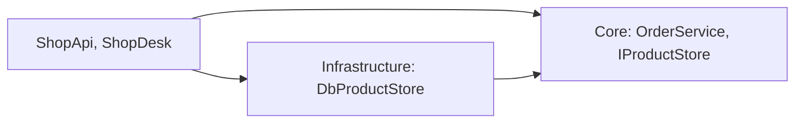

Chia tầng xong vẫn còn một câu hỏi: tầng nghiệp vụ gọi xuống tầng dữ liệu,
vậy nó có phụ thuộc vào Oracle không? Nếu có, đổi database là phải sửa cả quy
tắc nghiệp vụ. Clean Architecture đảo chiều phụ thuộc để phần lõi không biết
gì về database hay giao diện.

## Khái niệm

🧅 **Clean Architecture**: cách tổ chức ứng dụng đặt nghiệp vụ ở lõi, database và giao diện ở vòng ngoài, mọi phụ thuộc chỉ hướng từ ngoài vào lõi.

| Vòng | Chứa gì | Được biết tới |
|---|---|---|
| Core (lõi) | `Product`, `IProductStore`, `OrderService` | không biết vòng nào khác |
| Infrastructure | `ShopDbContext`, `DbProductStore`, EF Core | Core |
| Giao diện | API `ShopApi`, app `ShopDesk` | Core và Infrastructure |

Điểm mấu chốt: `IProductStore` nằm trong Core, còn class implement nó nằm ở
Infrastructure. Đây là DIP của khoá OOP, áp dụng cho cả ứng dụng.



## Ví dụ

Đặt hàng xong cần gửi email. Core cần "gửi email" nhưng không được biết máy
chủ email cụ thể, nên Core khai báo interface:

```csharp
// Core
public interface IEmailSender
{
    void Send(string to, string message);
}

public class CheckoutService
{
    private readonly IEmailSender _email;

    public CheckoutService(IEmailSender email)
    {
        _email = email;
    }

    public void Complete(string orderCode, string email)
    {
        _email.Send(email, "Đã nhận đơn " + orderCode);
    }
}
```

Infrastructure implement interface đó bằng công nghệ cụ thể:

```csharp
// Infrastructure
public class ConsoleEmailSender : IEmailSender
{
    public void Send(string to, string message)
    {
        Console.WriteLine($"Gửi {to}: {message}");
    }
}
```

- `CheckoutService` chỉ biết `IEmailSender`. Nó không biết email gửi bằng
  gì.
- Đổi sang dịch vụ email khác chỉ cần viết một class mới ở Infrastructure.
- Hai phần được ghép ở composition root như bài Tách giao diện và dữ liệu:
  `Program.cs` của API hay `Main` của WinForms.

## Thử ngay

Tạo một project console bằng `dotnet new console`, dán ba class trên vào
`Program.cs`, thêm ba dòng này ở đầu file rồi chạy. `Program.cs` đóng vai
composition root:

```csharp
// Program.cs của project console
IEmailSender sender = new ConsoleEmailSender();
var checkout = new CheckoutService(sender);
checkout.Complete("DH1", "an@shop.vn");
```

**Đoán trước khi chạy:** dòng in ra là gì, và class nào in nó?

<details>
<summary>Xem kết quả</summary>

```text
Gửi an@shop.vn: Đã nhận đơn DH1
```

`CheckoutService` của Core gọi `Send` qua interface, còn `ConsoleEmailSender`
của Infrastructure mới là class in ra. Test thì truyền một fake đếm số email,
không gửi thật.

</details>

## Lỗi hay gặp

**Đặt interface ở Infrastructure.** Core phải dùng tới Infrastructure để
lấy interface, tức lõi lại phụ thuộc vòng ngoài và kéo theo EF Core, Oracle.

```text
# SAI — lõi phụ thuộc vòng ngoài
Core            → dùng Infrastructure
Infrastructure  : IProductStore, DbProductStore
```

```text
# ĐÚNG — interface ở lõi, vòng ngoài implement
Core            : IProductStore, OrderService
Infrastructure  → dùng Core
                : DbProductStore implement IProductStore
```

## Tóm tắt

- Core chứa entity, interface và quy tắc nghiệp vụ, không biết database hay
  giao diện.
- Infrastructure implement các interface của Core bằng công nghệ cụ thể.
- Phụ thuộc chỉ hướng từ ngoài vào lõi.
- Interface nằm ở Core, class implement nằm ở vòng ngoài.

```quiz
[
  {
    "prompt": "Cửa hàng chuyển từ Oracle sang PostgreSQL. Với Clean Architecture, phần nào phải sửa?",
    "options": [
      "Core, nơi có IProductStore",
      "Infrastructure và dòng UseOracle",
      "OrderService và Product",
      "Mọi project trong solution"
    ],
    "answer": 2,
    "explain": "Chỉ Infrastructure (DbProductStore, ShopDbContext) và dòng UseOracle ở composition root biết database. Core và quy tắc nghiệp vụ giữ nguyên."
  },
  {
    "prompt": "IProductStore nên đặt ở project nào?",
    "options": [
      "Infrastructure, cạnh DbProductStore",
      "ShopApi, nơi đăng ký DI",
      "Core, cạnh OrderService",
      "ShopDesk, nơi có form"
    ],
    "answer": 3,
    "explain": "Interface thuộc về bên cần dùng nó, để lõi không phụ thuộc vòng ngoài. Vòng ngoài implement interface của lõi."
  },
  {
    "prompt": "Core có nên tham chiếu package Oracle.EntityFrameworkCore không?",
    "options": [
      "Có, để đọc dữ liệu nhanh hơn",
      "Có, vì OrderService cần dữ liệu",
      "Chỉ khi ShopDesk cũng dùng EF Core",
      "Không nên"
    ],
    "answer": 4,
    "explain": "Lõi không được biết công nghệ database. Core chỉ biết IProductStore, còn EF Core và Oracle nằm ở Infrastructure."
  }
]
```
