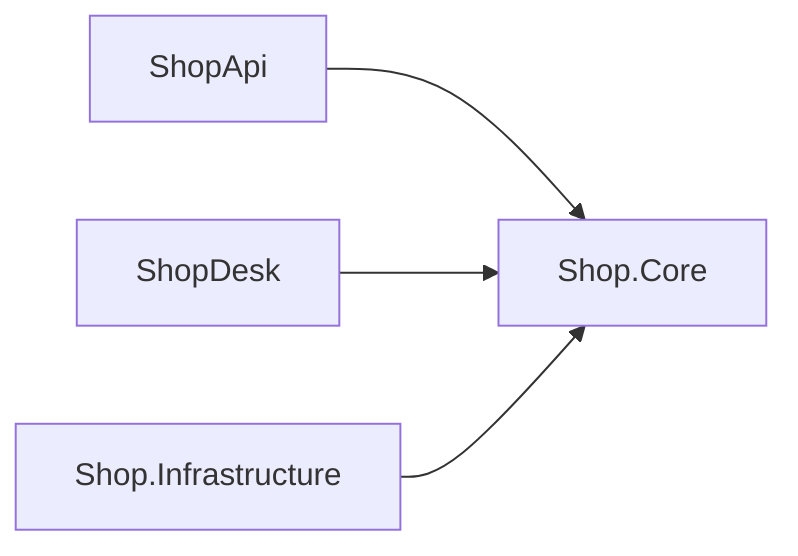

Ở khoá WinForms, `DbProductStore` phải chép nguyên từ API sang app kho. Sửa một
bên mà quên bên kia là hai app lệch nhau. Bài này đưa Core và Infrastructure
thành project riêng, rồi cho cả `ShopApi` lẫn `ShopDesk` tham chiếu tới, để
code chung chỉ có một bản.

## Khái niệm

📁 **Solution**: file `.sln` gom nhiều project lại, build và mở cùng lúc.

📗 **Class library**: project không chạy được một mình, chỉ chứa class để project khác tham chiếu, tạo bằng `dotnet new classlib`.

Project reference cho project này dùng class `public` của project kia. Chiều
tham chiếu chính là chiều phụ thuộc của bài Clean Architecture.

## Ví dụ

Trong thư mục chứa `ShopApi` và `ShopDesk`:

```bash
dotnet new sln -n Shop
dotnet new classlib -o Shop.Core
dotnet new classlib -o Shop.Infrastructure
dotnet sln add Shop.Core Shop.Infrastructure ShopApi ShopDesk
dotnet add Shop.Infrastructure reference Shop.Core
dotnet add ShopApi reference Shop.Core Shop.Infrastructure
dotnet add ShopDesk reference Shop.Core Shop.Infrastructure
dotnet build
```

Sau đó chuyển code:

| Project | Nhận những file |
|---|---|
| `Shop.Core` | `Product`, `IProductStore`, `OrderService` |
| `Shop.Infrastructure` | `ShopDbContext`, `DbProductStore`, package EF Core và Oracle |
| `ShopApi`, `ShopDesk` | xoá bản chép, chỉ giữ controller, form và phần ghép ở `Program.cs` |

```csharp
// Shop.Core/Product.cs
namespace Shop.Core;

public class Product
{
    public int Id { get; set; }
    public string Name { get; set; } = "";
    public decimal Price { get; set; }
    public int Stock { get; set; }
}
```

- `namespace Shop.Core;` như bài Ứng dụng WinForms đầu tiên. Project khác
  dùng bằng `using Shop.Core;`.
- `ShopApi` là `net9.0`, `ShopDesk` là `net9.0-windows`, cùng tham chiếu một
  `Shop.Core` `net9.0` được.
- Sửa `Product` một lần, `dotnet build` là cả API lẫn app kho cùng nhận.



## Thử ngay

Thử phá quy tắc của bài trước: thêm file này vào `Shop.Core` rồi chạy
`dotnet build Shop.Core`.

```csharp
// Shop.Core/Bad.cs
using Microsoft.EntityFrameworkCore;

namespace Shop.Core;

public class Bad
{
}
```

**Đoán trước khi chạy:** build qua hay lỗi?

<details>
<summary>Xem kết quả</summary>

```text
error CS0234: The type or namespace name 'EntityFrameworkCore'
does not exist in the namespace 'Microsoft' (are you missing
an assembly reference?)
```

Lỗi. `Shop.Core` không có package EF Core, nên không thể lỡ tay dùng database
trong lõi. Quy tắc "lõi không biết database" giờ được compiler kiểm hộ. Xoá
`Bad.cs` đi.

</details>

## Lỗi hay gặp

**Quên `public`.** Class không ghi gì mặc định là `internal`, chỉ dùng được
trong chính project đó.

```csharp
// SAI — ShopApi báo CS0122: Product is inaccessible
namespace Shop.Core;

class Product
{
    public int Id { get; set; }
}
```

```csharp
// ĐÚNG — public để project khác dùng được
namespace Shop.Core;

public class Product
{
    public int Id { get; set; }
}
```

Tham chiếu vòng cũng bị chặn: `Shop.Core` tham chiếu ngược lại
`Shop.Infrastructure` thì build báo `MSB4006: There is a circular dependency`.

## Tóm tắt

- Solution gom nhiều project. Class library chứa code dùng chung.
- `dotnet add A reference B` cho A dùng class `public` của B.
- Core và Infrastructure thành project riêng, API và WinForms cùng tham chiếu.
- Lõi không có package database, nên compiler chặn luôn việc dùng nhầm.

```quiz
[
  {
    "prompt": "ShopDesk cần dùng OrderService nằm trong Shop.Core. Lệnh nào đúng?",
    "options": [
      "dotnet add Shop.Core reference ShopDesk",
      "dotnet add ShopDesk reference Shop.Core",
      "dotnet sln add OrderService",
      "Chép OrderService sang ShopDesk"
    ],
    "answer": 2,
    "explain": "Project cần dùng thì tham chiếu tới project chứa class: ShopDesk tham chiếu Shop.Core."
  },
  {
    "prompt": "ShopApi báo CS0122 'Product' is inaccessible due to its protection level. Nguyên nhân?",
    "options": [
      "Thiếu dotnet build",
      "Sai namespace",
      "Chưa cài EF Core",
      "Class Product trong Shop.Core thiếu public"
    ],
    "answer": 4,
    "explain": "Class không ghi access modifier là internal, project khác không thấy được."
  },
  {
    "prompt": "Lợi ích lớn nhất của việc tách Shop.Core thành project riêng là gì?",
    "options": [
      "Build nhanh hơn",
      "Không cần test nữa",
      "API và WinForms dùng chung một bản code nghiệp vụ, và lõi không dùng nhầm database được",
      "Không cần namespace"
    ],
    "answer": 3,
    "explain": "Code chung chỉ có một bản, và compiler giữ đúng chiều phụ thuộc của Clean Architecture."
  }
]
```
