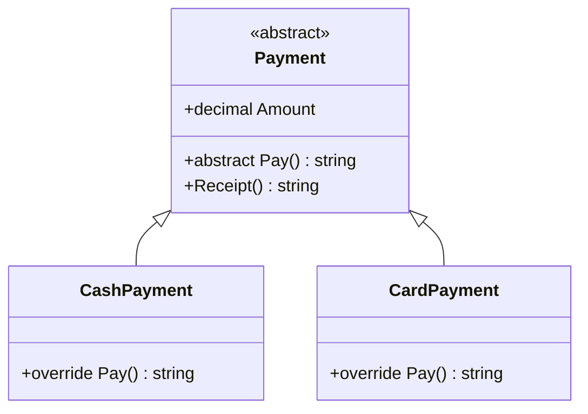

Cửa hàng nhận tiền mặt và thẻ: hình thức nào cũng có số tiền và in biên lai
giống nhau, nhưng cách trả tiền thì mỗi loại một kiểu. Một object
"thanh toán" chung chung, không rõ là tiền mặt hay thẻ, thì không có nghĩa.
Abstract class diễn tả đúng tình huống này.

## Khái niệm

🧩 **Trừu tượng (abstraction)**: chỉ đưa ra những gì nơi dùng cần biết, giấu đi chi tiết cách làm.

📐 **Abstract class**: class không tạo object trực tiếp được, chỉ dùng làm class cha cho các class khác.

✏️ **Abstract method**: method chỉ có khai báo, không có thân, mọi class con bắt buộc phải `override`.

## Ví dụ

```csharp
var payments = new List<Payment>
{
    new CashPayment { Amount = 50000m },
    new CardPayment { Amount = 120000m },
};

foreach (Payment p in payments)
{
    Console.WriteLine(p.Receipt());
}

abstract class Payment
{
    public decimal Amount { get; set; }

    public abstract string Pay();

    public string Receipt() => $"{Pay()} - {Amount}đ";
}

class CashPayment : Payment
{
    public override string Pay() => "Tiền mặt";
}

class CardPayment : Payment
{
    public override string Pay() => "Quẹt thẻ";
}
```

```text
Tiền mặt - 50000đ
Quẹt thẻ - 120000đ
```

- `abstract class Payment`: không viết được `new Payment()`.
- `public abstract string Pay();` không có thân. Mỗi class con tự viết cách
  trả tiền.
- `Receipt()` là method bình thường, viết một lần ở class cha và dùng chung.
- Vòng lặp chỉ biết `Payment`. Đó là trừu tượng: nơi dùng không cần biết là
  tiền mặt hay thẻ.



So với `virtual` ở bài trước:

| | `virtual` | `abstract` |
|---|---|---|
| Có thân ở class cha | có | không |
| Class con phải override | không bắt buộc | bắt buộc |

## Thử ngay

Chép ví dụ trên vào `Program.cs`. Thêm class dưới đây vào cuối file, và thêm
`new WalletPayment { Amount = 80000m },` vào list:

```csharp
class WalletPayment : Payment
{
    public override string Pay() => "Ví điện tử";
}
```

**Đoán trước khi chạy:** dòng biên lai thứ ba in ra gì?

<details>
<summary>Xem kết quả</summary>

```text
Tiền mặt - 50000đ
Quẹt thẻ - 120000đ
Ví điện tử - 80000đ
```

Dòng thứ ba là `Ví điện tử - 80000đ`. `WalletPayment` kế thừa `Receipt()` và
tự viết `Pay()`, nên vòng lặp không phải sửa gì.

</details>

## Lỗi hay gặp

**Tạo object từ abstract class.** Compiler chặn ngay.

```csharp
// SAI — lỗi compile: Payment là abstract
var p = new Payment();
```

```csharp
// ĐÚNG — tạo từ class con cụ thể
Payment p = new CashPayment();
```

**Class con quên viết abstract method.** Mọi abstract method đều phải được
`override`.

```csharp
// SAI — lỗi compile: thiếu override Pay()
class BankTransfer : Payment
{
}
```

```csharp
// ĐÚNG
class BankTransfer : Payment
{
    public override string Pay() => "Chuyển khoản";
}
```

## Tóm tắt

- Abstract class là class cha không tạo object trực tiếp được.
- Abstract method không có thân, class con bắt buộc `override`.
- Abstract class vẫn chứa được property và method bình thường để dùng chung.
- Trừu tượng: nơi dùng chỉ làm việc với class cha, không cần biết chi tiết
  từng loại.

```quiz
[
  {
    "prompt": "abstract class Shape { public abstract double Area(); } Dòng var s = new Shape(); thì sao?",
    "options": [
      "Lỗi compile",
      "Chạy được, Area trả về 0",
      "Lỗi khi chạy",
      "Chạy được nhưng Area báo lỗi khi gọi"
    ],
    "answer": 1,
    "explain": "Không tạo object từ abstract class được, nên compiler báo lỗi. Phải tạo object từ class con cụ thể, ví dụ new Circle()."
  },
  {
    "prompt": "Khi nào dùng abstract method thay vì virtual method?",
    "options": [
      "Khi muốn method chạy nhanh hơn",
      "Khi mọi class con phải tự viết cách làm",
      "Khi muốn class con không override được",
      "Khi class cha có sẵn cách làm mặc định"
    ],
    "answer": 2,
    "explain": "abstract bắt buộc class con viết. virtual có sẵn cách làm mặc định, class con muốn thì mới viết lại."
  },
  {
    "prompt": "abstract class Report có abstract method Build() và method thường Print(). Class SalesReport : Report cần viết gì tối thiểu?",
    "options": [
      "Cả Build() và Print()",
      "Chỉ Print()",
      "Chỉ override Build()",
      "Không cần viết gì"
    ],
    "answer": 3,
    "explain": "Chỉ abstract method là bắt buộc override. Print() đã có thân ở class cha nên được kế thừa sẵn."
  }
]
```
