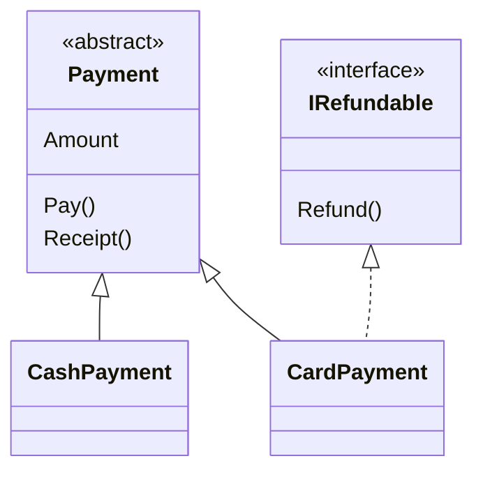

Không thể tạo object trực tiếp từ interface hay abstract class, và cả hai đều
bắt class khác viết method. Vậy khi nào dùng cái nào? Bài này đưa ra cách chọn
nhanh bằng một câu hỏi.

## Khái niệm

🆚 **Interface và abstract class**: interface nói class *làm được gì*, còn abstract class là class cha chứa sẵn phần *code chung* cho các class con.

| | Interface | Abstract class |
|---|---|---|
| Chứa code dùng chung | thường không | có |
| Có field thường, constructor | không | có |
| Một class dùng được mấy cái | nhiều | chỉ một |
| Diễn tả quan hệ | "làm được" | "là một" |

Câu hỏi để chọn: các class có **code chung** cần viết một lần không? Có thì
dùng abstract class. Chỉ cần cam kết một khả năng thì dùng interface.

## Ví dụ

```csharp
var card = new CardPayment { Amount = 120000m };
Console.WriteLine(card.Receipt());
card.Refund();

abstract class Payment
{
    public decimal Amount { get; set; }

    public abstract string Pay();

    public string Receipt() => $"{Pay()} - {Amount}đ";
}

interface IRefundable
{
    void Refund();
}

class CashPayment : Payment
{
    public override string Pay() => "Tiền mặt";
}

class CardPayment : Payment, IRefundable
{
    public override string Pay() => "Quẹt thẻ";

    public void Refund() =>
        Console.WriteLine($"Hoàn {Amount}đ về thẻ");
}
```

- `Payment` là abstract class vì mọi hình thức thanh toán dùng chung
  `Amount` và `Receipt()`.
- `IRefundable` là interface vì hoàn tiền chỉ là một khả năng. Thẻ làm được,
  tiền mặt thì không.
- `CardPayment : Payment, IRefundable`: kế thừa một class cha, đồng thời
  implement một interface. Class cha phải đứng đầu tiên.



## Thử ngay

Chép ví dụ trên vào `Program.cs`. Thêm class dưới đây vào cuối file, rồi thay
ba dòng đầu bằng đoạn gọi mới:

```csharp
class WalletPayment : Payment, IRefundable
{
    public override string Pay() => "Ví điện tử";

    public void Refund() =>
        Console.WriteLine($"Hoàn {Amount}đ về ví");
}
```

```csharp
var refunds = new List<IRefundable>
{
    new CardPayment { Amount = 120000m },
    new WalletPayment { Amount = 80000m },
};

foreach (IRefundable r in refunds)
{
    r.Refund();
}
```

**Đoán trước khi chạy:** thêm `new CashPayment()` vào list `refunds` thì có
được không?

<details>
<summary>Xem kết quả</summary>

```text
Hoàn 120000đ về thẻ
Hoàn 80000đ về ví
```

Không được, đó là lỗi compile. `CashPayment` không implement `IRefundable`,
nên không thêm vào `List<IRefundable>` được. Compiler chặn luôn việc hoàn
tiền mặt.

</details>

## Lỗi hay gặp

**Dùng abstract class cho một khả năng.** Class đã có cha thì không kế thừa
thêm class thứ hai được.

```csharp
// SAI — lỗi compile: chỉ được một class cha
class BankPayment : Payment, Refundable
{
    public override string Pay() => "Chuyển khoản";

    public override void Refund() =>
        Console.WriteLine(
            $"Hoàn {Amount}đ về tài khoản");
}

abstract class Refundable
{
    public abstract void Refund();
}
```

```csharp
// ĐÚNG — khả năng thì dùng interface
class BankPayment : Payment, IRefundable
{
    public override string Pay() => "Chuyển khoản";

    public void Refund() =>
        Console.WriteLine(
            $"Hoàn {Amount}đ về tài khoản");
}
```

**Dùng interface khi có code chung.** Mỗi class phải tự chép lại cùng một
đoạn code.

```csharp
// SAI — Receipt() bị chép giống hệt ở mọi class
interface IBill
{
    string Receipt();
}

class CashBill : IBill
{
    public decimal Amount { get; set; }
    public string Receipt() => $"Tiền mặt - {Amount}đ";
}
```

```csharp
// ĐÚNG — phần chung viết một lần ở class cha
abstract class Bill
{
    public decimal Amount { get; set; }

    public abstract string Kind();

    public string Receipt() => $"{Kind()} - {Amount}đ";
}

class CashBill : Bill
{
    public override string Kind() => "Tiền mặt";
}
```

## Tóm tắt

- Có code chung, quan hệ "là một": dùng abstract class.
- Chỉ cần cam kết một khả năng "làm được": dùng interface.
- Một class kế thừa một class cha, nhưng implement được nhiều interface.
- Hai thứ dùng cùng nhau được: `class CardPayment : Payment, IRefundable`.

```quiz
[
  {
    "prompt": "Class Truck đã kế thừa Vehicle. Giờ cần thêm khả năng \"theo dõi GPS\" cho Truck và cả Phone. Nên dùng gì?",
    "options": [
      "Abstract class GpsTrackable",
      "Kế thừa Truck từ Phone",
      "Interface IGpsTrackable",
      "Chép method GPS vào từng class"
    ],
    "answer": 3,
    "explain": "Truck đã có class cha nên không kế thừa thêm được. Truck và Phone cũng không cùng loại, chỉ chung một khả năng, nên interface là hợp lý."
  },
  {
    "prompt": "Các loại báo cáo đều có chung phần header, footer và cách in. Chỉ phần thân là khác nhau. Nên dùng gì?",
    "options": [
      "Interface IReport với ba method",
      "Mỗi báo cáo tự viết header, footer",
      "Một enum ReportType kèm switch",
      "Abstract class Report có BuildBody()"
    ],
    "answer": 4,
    "explain": "Có nhiều code chung cần viết một lần, chỉ phần thân khác nhau. Đó đúng là việc của abstract class."
  },
  {
    "prompt": "Khai báo nào hợp lệ, biết Animal là class còn ISwim và IFly là interface?",
    "options": [
      "class Duck : Animal, ISwim, IFly",
      "class Duck : ISwim, Animal, IFly",
      "class Duck : Animal, Animal",
      "class Duck : ISwim : IFly"
    ],
    "answer": 1,
    "explain": "Class cha đứng đầu tiên, sau đó là các interface, cách nhau bằng dấu phẩy."
  }
]
```
