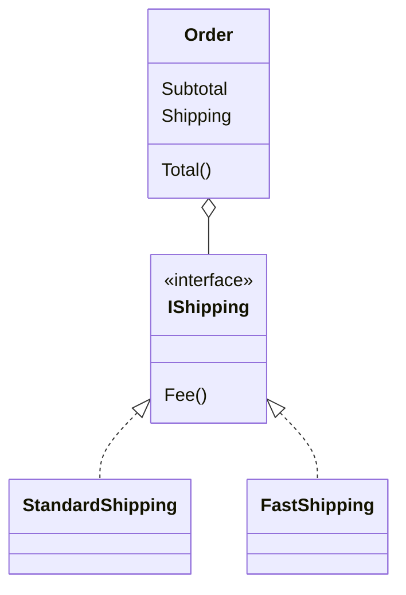

Đơn hàng có hai kiểu giao (thường, nhanh) và hai kiểu gói (thường, gói quà).
Dùng kế thừa thì phải có `FastOrder`, `GiftOrder`, `FastGiftOrder`… Mỗi
lựa chọn thêm vào lại làm số class tăng nhanh. Composition giải quyết việc này bằng cách
ghép các phần lại với nhau.

## Khái niệm

🧱 **Composition**: class chứa object của class khác làm property và giao việc cho object đó, thay vì kế thừa.

Đơn hàng không phải là một cách giao hàng, mà *có* một cách giao hàng, như
`Customer` có `Address` ở bài Kế thừa.

## Ví dụ

```csharp
var order = new Order
{
    Subtotal = 200000m,
    Shipping = new StandardShipping(),
};
Console.WriteLine(order.Total());   // 230000

interface IShipping
{
    decimal Fee(decimal subtotal);
}

class StandardShipping : IShipping
{
    public decimal Fee(decimal subtotal) => 30000m;
}

class FastShipping : IShipping
{
    public decimal Fee(decimal subtotal) => 60000m;
}

class Order
{
    public decimal Subtotal { get; set; }
    public IShipping Shipping { get; set; }
        = new StandardShipping();

    public decimal Total() =>
        Subtotal + Shipping.Fee(Subtotal);
}
```

- `Order` **có một** `IShipping`, và giao việc tính phí ship cho nó.
- Muốn đổi cách giao chỉ cần gán object khác cho `Shipping`. Không cần tạo
  class con của `Order`.
- Thêm kiểu giao mới chỉ cần thêm một class implement `IShipping`.



## Thử ngay

Chép ví dụ trên vào `Program.cs`, thay các dòng gọi ở đầu file bằng:

```csharp
var order = new Order { Subtotal = 200000m };
Console.WriteLine(order.Total());

order.Shipping = new FastShipping();
Console.WriteLine(order.Total());
```

**Đoán trước khi chạy:** cùng một object `order`, đổi `Shipping` rồi gọi lại
`Total()`. Hai dòng in ra có khác nhau không?

<details>
<summary>Xem kết quả</summary>

```text
230000
260000
```

Khác nhau. Object `order` vẫn là object cũ, chỉ phần giao hàng bên trong được
thay. Kế thừa không làm được việc này: một object đã tạo từ `FastOrder` thì
không thể đổi thành `StandardOrder`.

</details>

## Lỗi hay gặp

**Dùng kế thừa cho mọi tổ hợp lựa chọn.** Số class bằng tích số các lựa chọn.

```csharp
// SAI — 2 kiểu giao × 2 kiểu gói = 4 class con
class BaseOrder { }
class StandardOrder : BaseOrder { }
class FastOrder : BaseOrder { }
class StandardGiftOrder : StandardOrder { }
class FastGiftOrder : FastOrder { }
```

```csharp
// ĐÚNG — một class, ghép các phần lại
class GiftOrder
{
    public IShipping Shipping { get; set; }
        = new StandardShipping();
    public bool GiftWrap { get; set; }
}
```

Thêm kiểu giao thứ ba thì cách kế thừa cần 6 class con. Cách composition chỉ
thêm một class implement `IShipping`.

## Tóm tắt

- Composition: class **có** object khác làm property và giao việc cho nó.
- Kế thừa là "là một", composition là "có một".
- Composition đổi được hành vi ngay lúc chạy bằng cách gán object khác.
- Khi phân vân giữa hai cách, ưu tiên composition.

```quiz
[
  {
    "prompt": "Class Car cần dùng code của class Engine. Cách nào đúng?",
    "options": [
      "Car kế thừa Engine",
      "Car có property kiểu Engine",
      "Engine kế thừa Car",
      "Chép code Engine vào Car"
    ],
    "answer": 2,
    "explain": "Xe không phải là một động cơ, mà xe có một động cơ. Đó là quan hệ \"có một\", nên dùng composition."
  },
  {
    "prompt": "Order có property IDiscount Discount. Muốn áp dụng mã giảm giá khác cho một đơn đã tạo, cần làm gì?",
    "options": [
      "Tạo lại đơn hàng từ một class con khác",
      "Sửa class Order",
      "Gán order.Discount = new NewDiscount();",
      "Không làm được"
    ],
    "answer": 3,
    "explain": "Với composition, chỉ cần gán object khác cho property. Object Order vẫn giữ nguyên."
  },
  {
    "prompt": "Có 3 kiểu thanh toán và 3 kiểu giao hàng. Dùng kế thừa để tạo mọi tổ hợp thì cần khoảng bao nhiêu class đơn hàng?",
    "options": [
      "3",
      "6",
      "1",
      "9"
    ],
    "answer": 4,
    "explain": "3 × 3 = 9 tổ hợp. Dùng composition chỉ cần 1 class Order với 2 property, cộng 3 + 3 class nhỏ."
  }
]
```
