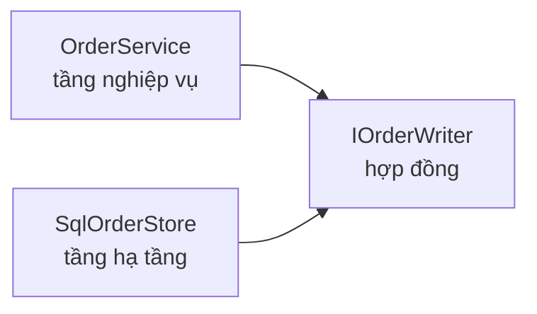

Bạn viết test cho một phép tính giảm giá. Nó chỉ cần đọc một đơn hàng.

Nhưng `IOrderRepository` có mười ba method, nên class giả trong test phải có đủ
mười ba. Mười hai cái ném `NotImplementedException`.

Test dài bốn mươi dòng để kiểm một phép nhân.

> **Học xong bài này bạn sẽ:** chia interface theo người dùng thay vì theo
> class; hiểu DIP lật ngược chiều phụ thuộc như thế nào; và biết chỗ nào thì
> `new` trực tiếp vẫn đúng.
>
> **Cần biết trước:** interface, constructor injection (chương trước).

## ISP: chia interface theo người dùng, không theo class

**Interface Segregation Principle**: đừng buộc ai phụ thuộc vào method họ không
dùng.

Chỗ dễ nhầm là ai mới là "người dùng" của một interface.

Không phải class implement nó. Là class **gọi** nó.

| Chia theo | Kết quả |
|---|---|
| Theo class implement | một interface to, ai cũng phải cài đủ |
| Theo **nơi gọi** | vài interface nhỏ, mỗi chỗ chỉ thấy phần nó cần |

```csharp
// SAI — mọi nơi nhìn thấy cả mười ba method
interface IOrderRepository
{
    Order? Get(int id);
    void Save(Order o);
    void Delete(int id);
    List<Order> Search(string q);
    // … chín method nữa
}
```

```csharp
// ĐÚNG — mỗi hợp đồng cho một nhu cầu
interface IOrderReader
{
    Order? Get(int id);
}

interface IOrderWriter
{
    void Save(Order o);
}
```

Một class vẫn implement được cả hai. Việc chia nhỏ là để **nơi gọi** chỉ khai
đúng phần nó cần.

```csharp
class DiscountCalculator(IOrderReader reader)
{
    public decimal For(int id) =>
        (reader.Get(id)?.Total ?? 0) * 0.1m;
}
```

Test cho class này giờ cần một class giả với đúng một method.

## DIP: cả hai tầng phụ thuộc vào cùng một hợp đồng

**Dependency Inversion Principle**: tầng nghiệp vụ không phụ thuộc vào tầng hạ
tầng; cả hai phụ thuộc vào một abstraction.

Chữ "inversion" nói về chiều mũi tên phụ thuộc. Nó không nói về thứ tự gọi.



Lúc chạy thì `OrderService` vẫn gọi xuống database. Nhưng lúc **compile**, nó
không biết SQL tồn tại.

| | Không có DIP | Có DIP |
|---|---|---|
| `OrderService` biết gì | biết `SqlOrderStore` | chỉ biết `IOrderWriter` |
| Interface do ai định nghĩa | tầng hạ tầng | tầng nghiệp vụ |
| Đổi sang Postgres | sửa nghiệp vụ | thêm một class hạ tầng |
| Test được mà không có database | không | được |

Dòng thứ hai của bảng là chi tiết hay bị bỏ qua nhất. Hợp đồng phải nằm ở
**tầng cần nó**, không nằm cạnh class implement.

## Thử ngay: đổi hạ tầng mà không sửa nghiệp vụ

Nói "không phụ thuộc vào database" thì nghe trừu tượng. Có một phép thử rất cụ
thể cho nó.

```csharp
var log = new List<string>();
var service = new OrderService(new FakeStore(log));

service.Place(new Order { Id = 7 });
Console.WriteLine(log.Count);
Console.WriteLine(log[0]);

interface IOrderWriter
{
    void Save(Order order);
}

class OrderService(IOrderWriter writer)
{
    public void Place(Order order) =>
        writer.Save(order);
}

class FakeStore(List<string> log) : IOrderWriter
{
    public void Save(Order order) =>
        log.Add($"đã lưu {order.Id}");
}
```

**Đoán trước khi chạy:** `OrderService` không hề biết `FakeStore` tồn tại. Hai
dòng in ra gì?

<details>
<summary>Đoán xong rồi — xem kết quả</summary>

```text
1
đã lưu 7
```

Không có database, không có connection string, không có `DbContext`.

Đó chính là phần trả công của DIP. Class giả kia không phải mẹo dành riêng cho
test — nó là bằng chứng rằng `OrderService` thật sự không phụ thuộc vào SQL.

Nếu bạn không viết được một `FakeStore` như vậy, nghĩa là chiều phụ thuộc chưa
lật.

</details>

## Không phải phụ thuộc nào cũng cần lật

Đây là chỗ DIP bị áp dụng quá tay nhiều nhất.

```csharp
// SAI — interface cho một phép tính thuần
interface IStringTrimmer
{
    string Trim(string s);
}
```

`string.Trim` không chạm ra ngoài, không có trạng thái, không có cách làm thứ
hai.

Bọc nó vào interface chỉ thêm một file.

| Phụ thuộc | Lật không |
|---|---|
| Database, HTTP, file, hàng đợi | **có** |
| Đồng hồ, số ngẫu nhiên | **có**, để test được |
| Thư viện tính toán thuần | không |
| Class trong cùng module, không chạm ra ngoài | không |

Phép thử: thứ đó có **chạm ra ngoài tiến trình** không, hoặc có làm test khó
lặp lại không. Hai câu trả lời "không" thì `new` trực tiếp vẫn đúng.

## Hai nguyên tắc này cùng gỡ một chỗ đau

Nhìn lại cái test bốn mươi dòng ở đầu bài. Nó đau vì cả hai lý do.

ISP sai nên class giả phải cài mười ba method.

DIP sai nên `DiscountCalculator` biết tới `SqlOrderRepository`, và test phải
dựng cả database.

Sửa cả hai thì test còn lại ba dòng:

```csharp
var calc = new DiscountCalculator(
    new StubReader(new Order { Total = 100 }));

Console.WriteLine(calc.For(1));
```

## Dấu hiệu trong code của bạn

- Class giả trong test có method ném `NotImplementedException` → interface đang to hơn nhu cầu của nơi gọi.
- Một interface trên mười method → chia theo nơi gọi, không chia theo class implement.
- Tầng nghiệp vụ `using` tên thư viện database → chiều phụ thuộc chưa lật.
- Interface nằm cùng project với class implement nó → hợp đồng đang ở sai tầng.
- Interface bọc một phép tính thuần, chỉ có một class implement → gián tiếp không mua được gì.

## Ghi nhớ

- ISP chia interface theo **nơi gọi**, không theo class implement.
- Một class vẫn implement được nhiều interface nhỏ, nên chia nhỏ không sinh thêm class.
- DIP lật chiều phụ thuộc lúc compile, còn lúc chạy vẫn gọi xuống hạ tầng.
- Hợp đồng nằm ở tầng cần nó, không nằm cạnh class implement.
- Chỉ lật những phụ thuộc chạm ra ngoài tiến trình, hoặc làm test khó lặp lại.

## Bước tiếp theo

Năm nguyên tắc đã đủ. Nhưng bài nào trong chương này cũng có một mục nói về cái
giá, và đó không phải tình cờ.

Bài cuối, **SOLID không phải checklist**, gom những cái giá ấy lại: khi nào năm
nguyên tắc đánh nhau, và một dự án thật thì đánh đổi ở đâu.

```quiz
[
  {
    "prompt": "Class giả trong test của bạn có mười hai method ném NotImplementedException. Điều đó chỉ ra vấn đề gì?",
    "options": [
      "Test viết chưa đủ kỹ",
      "Interface to hơn nhu cầu của nơi gọi, nên vi phạm ISP",
      "Thiếu một thư viện mock",
      "Class thật đang làm quá nhiều việc, nên vi phạm SRP"
    ],
    "answer": 2,
    "explain": "Nơi gọi chỉ cần một method, mà interface bắt nó phụ thuộc vào mười ba. Chia interface theo nhu cầu của nơi gọi thì class giả rút còn một method."
  },
  {
    "prompt": "Theo ISP, ai mới là \"người dùng\" của một interface?",
    "options": [
      "Class implement nó",
      "Class gọi nó",
      "Cả hai như nhau",
      "Người viết test"
    ],
    "answer": 2,
    "explain": "Chia theo class implement thì ra một interface to gom hết. Chia theo nơi gọi thì mỗi chỗ chỉ thấy phần nó dùng, và đó mới là điều ISP nói."
  },
  {
    "prompt": "DIP lật ngược cái gì?",
    "options": [
      "Thứ tự gọi lúc chạy: hạ tầng gọi nghiệp vụ thay vì ngược lại",
      "Thứ tự khởi tạo object trong container DI",
      "Chiều phụ thuộc lúc compile: cả hai tầng trỏ vào cùng một hợp đồng",
      "Thứ tự các project trong solution"
    ],
    "answer": 3,
    "explain": "Lúc chạy, nghiệp vụ vẫn gọi xuống database. Cái bị lật là chiều phụ thuộc lúc compile: nghiệp vụ chỉ biết interface, và interface đó do chính tầng nghiệp vụ định nghĩa."
  },
  {
    "prompt": "Phụ thuộc nào KHÔNG cần tách interface?",
    "options": [
      "Một class tính thuế thuần từ tham số truyền vào, chỉ có một cách tính",
      "Lớp đọc giờ hiện tại",
      "Lớp gọi API đối tác",
      "Lớp ghi file"
    ],
    "answer": 1,
    "explain": "Nó không chạm ra ngoài tiến trình và không làm test khó lặp lại, nên new trực tiếp vẫn đúng. Riêng đồng hồ thì nên tách, vì test phụ thuộc vào thời điểm chạy sẽ chập chờn."
  }
]
```
