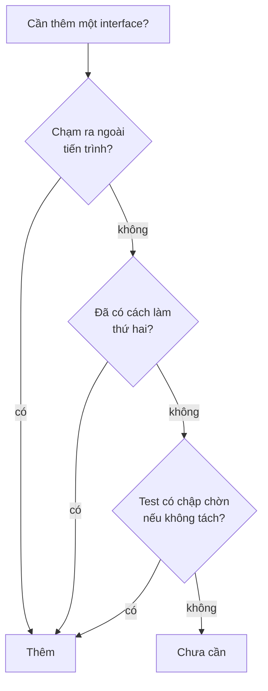

Một dự án nội bộ, ba người làm, hai trăm người dùng. Nó có 41 interface và 38
class implement.

Ba mươi bảy interface trong số đó có đúng một class implement, và sẽ mãi chỉ có
một. Chúng sinh ra vì "SOLID nói phải có interface".

Thêm một field vào form giờ phải mở bảy file.

> **Học xong bài này bạn sẽ:** nhìn SOLID như một bộ đánh đổi thay vì một danh
> sách phải tick; biết hai nguyên tắc nào hay đánh nhau; và có một mốc cụ thể để
> quyết định lúc nào nên trừu tượng hoá.
>
> **Cần biết trước:** cả năm nguyên tắc (ba bài trước).

## Mỗi nguyên tắc mua một thứ và trả bằng một thứ

Không có nguyên tắc nào miễn phí. Bảng này là cả chương gói lại.

| Nguyên tắc | Mua được | Trả bằng |
|---|---|---|
| SRP | mỗi thay đổi chạm ít file | nhiều file hơn, phải nhảy nhiều hơn |
| OCP | thêm tính năng không sửa code cũ | một tầng gián tiếp, đọc chậm hơn |
| LSP | lớp con dùng được ở mọi chỗ | cây kế thừa hẹp hơn, ít tự do hơn |
| ISP | nơi gọi chỉ thấy phần nó cần | nhiều interface nhỏ để theo dõi |
| DIP | đổi hạ tầng, test không cần database | phải đọc hai chỗ mới biết ai chạy |

Cột giữa chỉ đáng trả nếu bạn **thật sự cần** nó. Đó là toàn bộ câu chuyện.

## SRP và DIP kéo ngược nhau

Hai nguyên tắc hay bị coi là luôn đồng hành, mà thực ra chúng kéo ngược.

SRP muốn tách. DIP muốn thêm một hợp đồng giữa mỗi cặp tầng. Làm cả hai hết cỡ
thì ra 41 interface ở đầu bài.

| Làm tới đâu | Hệ quả |
|---|---|
| Không tách gì | `OrderService` hai nghìn dòng |
| Tách theo lý do đổi | ba, bốn class có tên nói được việc |
| Tách rồi bọc interface cho từng class | bảy file cho một field mới |

Chỗ đứng hợp lý là dòng giữa. Tách theo lý do đổi, nhưng chỉ bọc interface ở
**biên** — chỗ code của bạn chạm ra ngoài.

## Ba câu hỏi thay cho cả checklist

Bảng trên nói cái giá. Còn đây là cách quyết định có nên trả nó hay không.



Ba câu hỏi ấy gộp lại thành một câu. Bạn đang giải một vấn đề **có thật**, hay
đang đề phòng một vấn đề tưởng tượng?

Quy tắc thực dụng của nhiều nhóm là **đợi lần thứ hai**. Cách làm thứ hai xuất
hiện thì mới tách; trước đó thì `new` trực tiếp và đi tiếp.

## Nhìn lại hai nghìn dòng ở đầu chương

`OrderService` ban đầu vi phạm gần hết. Nhưng thứ tự sửa không phải theo bảng
chữ SOLID.

| Thứ tự | Việc | Vì sao trước |
|---|---|---|
| 1 | Tách theo lý do đổi (SRP) | ba nhóm người thôi va nhau ngay |
| 2 | Lật phụ thuộc ở biên (DIP) | test chạy được mà không cần database |
| 3 | Chia interface theo nơi gọi (ISP) | chỉ làm khi test bắt đầu thấy nặng |
| 4 | Mở sẵn cho loại mới (OCP) | chỉ làm khi loại thứ ba xuất hiện |

LSP không có trong bảng, vì nó không phải việc bạn làm. Nó là điều kiện phải
giữ mỗi lần bạn dùng kế thừa.

Hai bước đầu gỡ được phần lớn chỗ đau. Hai bước sau đợi bằng chứng.

## Thử ngay: đếm interface chỉ có một class implement

Con số này nói khá nhiều về một codebase.

```bash
grep -rhoE "interface I[A-Za-z]+" --include=*.cs src \
  | sort -u | sed 's/interface //' \
  | while read i; do
      n=$(grep -rl ": *$i\b" --include=*.cs src | wc -l)
      echo "$n $i"
    done | sort -n | head -20
```

**Đoán trước khi chạy:** bao nhiêu interface trong repo của bạn có đúng một
class implement? Và bao nhiêu trong số đó chạm ra ngoài tiến trình?

<details>
<summary>Đoán xong rồi — xem kết quả</summary>

```text
1 ITaxCalculator
1 IOrderIdGenerator
1 IStringNormalizer
2 IOrderReader
3 INotifier
```

Ba dòng đầu là ứng viên bỏ đi. Không loại nào chạm ra ngoài tiến trình, không
loại nào có cách làm thứ hai.

Con số `1` không tự động nghĩa là sai. `IOrderWriter` chỉ có một class SQL
implement vẫn đáng giữ. Nó là biên chạm database, và nó cho bạn test mà không
cần database.

Phép thử vẫn là ba câu hỏi ở trên, không phải con số.

</details>

## Dấu hiệu trong code của bạn

- Nhiều interface chỉ có một class implement, và không loại nào chạm ra ngoài tiến trình.
- Thêm một field vào form phải mở năm file trở lên → tầng gián tiếp nhiều hơn nhu cầu.
- Có `IOrderIdGenerator`, `IStringNormalizer` hay tương tự → trừu tượng hoá một phép tính thuần.
- Ba class luôn sửa cùng lúc → SRP bị áp dụng quá tay, gộp lại.
- Người mới vào nhóm mất một tuần mới tìm được chỗ đặt logic mới → cấu trúc đang đắt hơn phần nó mua được.

## Ghi nhớ

- Mỗi nguyên tắc mua một thứ và trả bằng một tầng gián tiếp.
- SRP và DIP kéo ngược nhau; chỗ đứng hợp lý là tách theo lý do đổi, bọc interface ở biên.
- Ba câu hỏi: có chạm ra ngoài, đã có cách thứ hai, test có chập chờn.
- Sửa theo thứ tự SRP rồi DIP; ISP và OCP đợi bằng chứng.
- LSP không phải việc để làm, mà là điều kiện phải giữ khi dùng kế thừa.

## Bước tiếp theo

Hết chương **SOLID trong code thật**. Bạn có năm nguyên tắc và, quan trọng hơn,
biết giá của từng cái.

Chương sau, **Design pattern hay gặp**, mở bằng một `if` kiểm tra `null` xuất
hiện ở bốn mươi chỗ. Và một pattern xoá sạch cả bốn mươi.

```quiz
[
  {
    "prompt": "Repo có 37 interface chỉ một class implement, không cái nào chạm ra ngoài tiến trình. Nhận xét nào đúng?",
    "options": [
      "Đúng chuẩn SOLID, mọi phụ thuộc đều đã trừu tượng hoá",
      "Đang trả tiền gián tiếp cho những vấn đề chưa có thật",
      "Cần thêm class implement thứ hai cho mỗi interface",
      "Không sao, interface không tốn gì lúc chạy"
    ],
    "answer": 2,
    "explain": "Giá của một interface không nằm ở hiệu năng, mà ở chỗ người đọc phải mở thêm một file mới biết ai đang chạy. Trả giá đó chỉ đáng khi bạn cần thay hay cần test được."
  },
  {
    "prompt": "Hai nguyên tắc nào hay kéo ngược nhau nhất khi áp dụng hết cỡ?",
    "options": [
      "LSP và OCP",
      "ISP và LSP",
      "SRP và DIP",
      "OCP và ISP"
    ],
    "answer": 3,
    "explain": "SRP muốn tách nhỏ, DIP muốn thêm một hợp đồng giữa mỗi cặp tầng. Làm hết cỡ cả hai thì mỗi class nhỏ lại kéo theo một interface, và thêm một field phải mở bảy file."
  },
  {
    "prompt": "Bạn đang cân nhắc tách interface cho một class tính thuế thuần, chỉ có một cách tính. Theo ba câu hỏi trong bài, nên làm gì?",
    "options": [
      "Chưa cần — không chạm ra ngoài, chưa có cách thứ hai, test không chập chờn",
      "Tách ngay, để sau này đổi cách tính cho dễ",
      "Tách, vì mọi class nghiệp vụ đều nên có interface",
      "Tách nếu class đó dài hơn năm mươi dòng"
    ],
    "answer": 1,
    "explain": "Cả ba câu hỏi đều trả lời không, nên new trực tiếp vẫn đúng. Quy tắc thực dụng là đợi lần thứ hai: có cách làm thứ hai thật thì mới tách, lúc đó việc tách cũng chỉ mất vài phút."
  },
  {
    "prompt": "Gặp một OrderService hai nghìn dòng, nên sửa theo thứ tự nào?",
    "options": [
      "Bọc interface cho mọi method trước, rồi mới tách class",
      "Mở sẵn cho loại mới (OCP) trước, vì đó là nguyên tắc quan trọng nhất",
      "Tách theo lý do đổi trước, rồi lật phụ thuộc ở biên",
      "Viết đủ test cho cả hai nghìn dòng trước khi sửa gì"
    ],
    "answer": 3,
    "explain": "Tách theo lý do đổi gỡ ngay chỗ ba nhóm người va nhau. Lật phụ thuộc ở biên cho phép test không cần database. Hai việc đó gỡ phần lớn chỗ đau; ISP và OCP thì đợi tới khi có bằng chứng là cần."
  }
]
```
