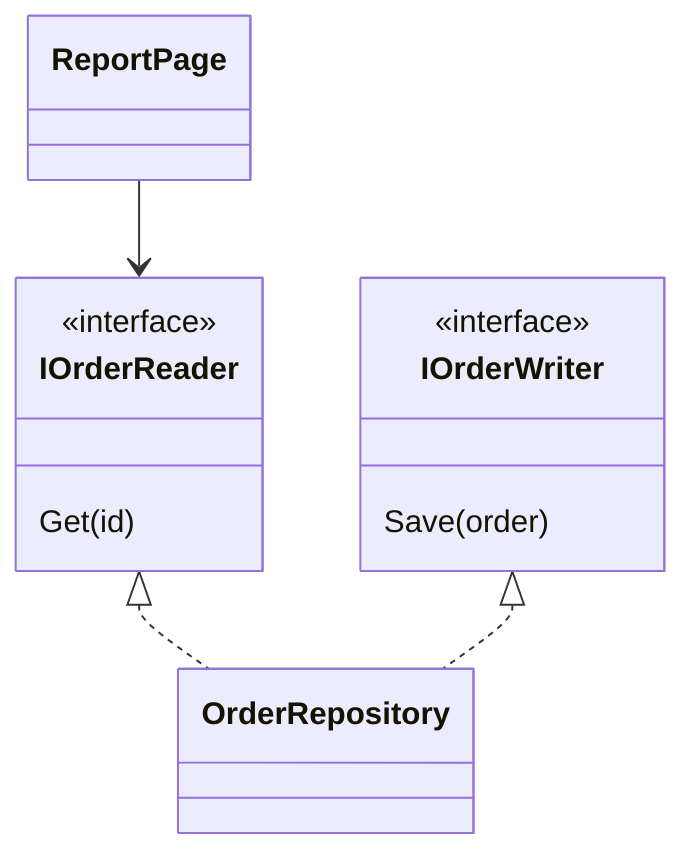

Interface `IOrderStore` có ba method: đọc, lưu, xoá. Trang báo cáo chỉ cần
đọc nhưng vẫn phải implement đủ ba method, hai method thừa chỉ ném
`NotImplementedException` (exception có sẵn báo method chưa viết). ISP tránh
việc ép class nhận những thứ nó không dùng.

## Khái niệm

✂️ **ISP (Interface Segregation Principle)**: không bắt class phụ thuộc vào những method nó không dùng, nên chia interface lớn thành nhiều interface nhỏ theo từng việc.

## Ví dụ

```csharp
var repo = new OrderRepository();
var page = new ReportPage(repo);
page.Show();

interface IOrderReader
{
    string Get(int id);
}

interface IOrderWriter
{
    void Save(string order);
}

class OrderRepository : IOrderReader, IOrderWriter
{
    public string Get(int id) => $"Đơn #{id}";
    public void Save(string order) =>
        Console.WriteLine($"Lưu {order}");
}

class ReportPage
{
    private readonly IOrderReader _reader;

    public ReportPage(IOrderReader reader)
    {
        _reader = reader;
    }

    public void Show() =>
        Console.WriteLine(_reader.Get(1));
}
```

- `IOrderReader` chỉ đọc, `IOrderWriter` chỉ ghi. Mỗi interface một việc.
- `OrderRepository` làm được cả hai nên implement cả hai.
- `ReportPage` chỉ cần đọc nên chỉ nhận `IOrderReader`. Sửa phần ghi không
  ảnh hưởng tới nó.



## Thử ngay

Chép ví dụ trên vào `Program.cs`, thêm hai dòng sau ngay dưới `page.Show();`:

```csharp
IOrderWriter writer = repo;
writer.Save("Đơn #2");
```

**Đoán trước khi chạy:** cùng một object `repo`, vừa truyền cho
`ReportPage` như một `IOrderReader`, vừa gán vào biến `IOrderWriter`. Có
được không?

<details>
<summary>Xem kết quả</summary>

```text
Đơn #1
Lưu Đơn #2
```

Được. Object implement nhiều interface thì đóng được vai của từng interface
đó. Mỗi nơi chỉ thấy đúng phần nó cần.

</details>

## Lỗi hay gặp

**Interface quá to, class phải implement cho có.** `NotImplementedException` là
dấu hiệu rõ nhất.

```csharp
// SAI — trang báo cáo bị ép implement cả ghi và xoá
interface IOrderStore
{
    string Get(int id);
    void Save(string order);
    void Delete(int id);
}

class ReportSource : IOrderStore
{
    public string Get(int id) => $"Đơn #{id}";
    public void Save(string order)
    {
        throw new NotImplementedException();
    }
    public void Delete(int id)
    {
        throw new NotImplementedException();
    }
}
```

```csharp
// ĐÚNG — trang báo cáo chỉ implement phần đọc
class ReportSource : IOrderReader
{
    public string Get(int id) => $"Đơn #{id}";
}
```

## Tóm tắt

- ISP: không bắt class phụ thuộc vào method nó không dùng.
- Chia interface lớn thành nhiều interface nhỏ theo từng việc.
- Một class implement được nhiều interface nhỏ khi nó làm được nhiều việc.
- `NotImplementedException` trong class implement là dấu hiệu interface quá
  to.

```quiz
[
  {
    "prompt": "IPrinter có Print(), Scan(), Fax(). Máy in rẻ chỉ in được, nên Scan và Fax ném NotImplementedException. Theo ISP nên làm gì?",
    "options": [
      "Giữ nguyên, ném exception là đủ",
      "Tách thành IPrint, IScan, IFax",
      "Bỏ class máy in rẻ",
      "Thêm method CanScan() vào IPrinter"
    ],
    "answer": 2,
    "explain": "Máy in rẻ chỉ nên implement IPrint. Máy đa năng thì implement cả ba interface nhỏ."
  },
  {
    "prompt": "Class Dashboard chỉ đọc dữ liệu đơn hàng. Constructor của nó nên nhận kiểu nào?",
    "options": [
      "IOrderWriter",
      "IOrderStore có đủ đọc, ghi, xoá",
      "IOrderReader",
      "OrderRepository"
    ],
    "answer": 3,
    "explain": "Dashboard chỉ cần đọc, nên chỉ phụ thuộc vào interface đọc. Nhận thứ lớn hơn là tự kéo thêm phụ thuộc không cần."
  },
  {
    "prompt": "IAccountService có Login(), Logout(), ChangePassword() và được năm class implement. Team thêm ResetPassword() vào interface này. Class nào phải sửa?",
    "options": [
      "Không class nào phải sửa",
      "Chỉ class đang gọi Login()",
      "Chỉ class cần ResetPassword()",
      "Cả năm class implement nó"
    ],
    "answer": 4,
    "explain": "Thêm method vào interface thì mọi class implement phải viết thêm, kể cả class không cần. Interface nhỏ theo từng việc giới hạn những lần sửa lan rộng như vậy."
  }
]
```
