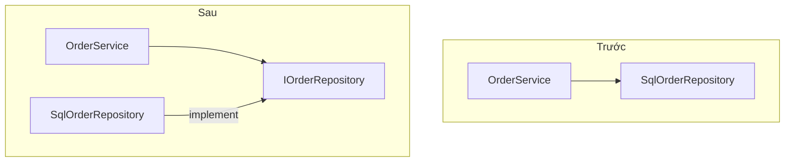

`OrderService` tự tạo `SqlOrderRepository` bên trong. Muốn chạy test thì phải
có database thật, muốn đổi sang lưu file thì phải sửa `OrderService`. DIP là
nguyên tắc cuối của SOLID, còn dependency injection là cách làm phổ biến nhất
để đạt được nó.

## Khái niệm

🔌 **DIP (Dependency Inversion Principle)**: code nghiệp vụ không phụ thuộc trực tiếp vào class cụ thể lo database hay email, mà cả hai cùng phụ thuộc vào interface.

💉 **Dependency injection (DI)**: class nhận những thứ nó cần qua constructor, thay vì tự `new` bên trong.

## Ví dụ

```csharp
var repo = new SqlOrderRepository();
var service = new OrderService(repo);
service.Place("Bút bi");

interface IOrderRepository
{
    void Save(string item);
}

class SqlOrderRepository : IOrderRepository
{
    public void Save(string item) =>
        Console.WriteLine($"SQL: lưu {item}");
}

class OrderService
{
    private readonly IOrderRepository _repo;

    public OrderService(IOrderRepository repo)
    {
        _repo = repo;
    }

    public void Place(string item) => _repo.Save(item);
}
```

- `OrderService` chỉ biết `IOrderRepository`, không biết có SQL. Đó là DIP.
- `OrderService` nhận repository qua constructor. Đó là DI.
- Nơi tạo `OrderService` quyết định dùng repository nào.
- Trong ASP.NET Core, framework tự tạo và truyền các object này. Bạn chỉ khai
  báo interface nào ứng với class nào.



## Thử ngay

Chép ví dụ trên vào `Program.cs`. Thêm class dưới đây vào cuối file, rồi đổi
`new SqlOrderRepository()` ở dòng đầu thành `new FakeOrderRepository()`:

```csharp
class FakeOrderRepository : IOrderRepository
{
    public void Save(string item) =>
        Console.WriteLine($"Giả lập: lưu {item}");
}
```

**Đoán trước khi chạy:** để chuyển sang repository giả, bạn đã phải sửa
mấy dòng trong `OrderService`?

<details>
<summary>Xem kết quả</summary>

```text
Giả lập: lưu Bút bi
```

Không dòng nào, chỉ đổi object truyền vào constructor. Viết test không cần
database thật cũng theo cách này: truyền vào một repository giả.

</details>

## Lỗi hay gặp

**Tự `new` bên trong class.** `OrderService` bị khoá cứng vào SQL.

```csharp
// SAI — không đổi được, không test được
class OrderService
{
    private readonly SqlOrderRepository _repo =
        new SqlOrderRepository();

    public void Place(string item) => _repo.Save(item);
}
```

**Nhận class cụ thể qua constructor.** Có DI nhưng vẫn phụ thuộc vào SQL, nên
chưa đạt DIP.

```csharp
// SAI — vẫn chỉ nhận được SqlOrderRepository
class OrderService
{
    private readonly SqlOrderRepository _repo;

    public OrderService(SqlOrderRepository repo)
    {
        _repo = repo;
    }
}
```

Cách sửa cho cả hai: nhận `IOrderRepository` qua constructor, như ở ví dụ
trên.

## Tóm tắt

- DIP: code nghiệp vụ phụ thuộc vào interface, không phụ thuộc vào class
  cụ thể.
- DI: nhận phụ thuộc qua constructor, không tự `new` bên trong.
- Nhờ DI, đổi cách làm hay viết test chỉ cần truyền object khác vào.
- Constructor nên nhận interface, không nhận class cụ thể.

```quiz
[
  {
    "prompt": "class ReportService { private readonly PdfExporter _pdf = new PdfExporter(); } Vấn đề chính là gì?",
    "options": [
      "Tốn bộ nhớ",
      "Sai quy ước đặt tên",
      "Khoá cứng vào PdfExporter, không đổi được và khó test",
      "Không có vấn đề gì"
    ],
    "answer": 3,
    "explain": "Tự new là khoá cứng vào một class cụ thể. Nhận IExporter qua constructor thì đổi cách xuất hay dùng bản giả khi test đều dễ."
  },
  {
    "prompt": "Constructor nào đúng tinh thần DIP?",
    "options": [
      "public PaymentService(IPaymentGateway gateway)",
      "public PaymentService(VnPayGateway gateway)",
      "public PaymentService() { _gateway = new VnPayGateway(); }",
      "public PaymentService(string gatewayName)"
    ],
    "answer": 1,
    "explain": "Nhận interface thì PaymentService không phụ thuộc vào cổng thanh toán cụ thể nào. Đổi cổng chỉ cần truyền class khác."
  },
  {
    "prompt": "Lợi ích lớn nhất của DI khi viết test là gì?",
    "options": [
      "Test chạy trên nhiều máy",
      "Không cần viết test nữa",
      "Code ngắn hơn",
      "Truyền được bản giả thay cho database, email, API thật"
    ],
    "answer": 4,
    "explain": "Class nhận phụ thuộc từ bên ngoài, nên khi test chỉ cần truyền bản giả vào, không cần hệ thống thật."
  }
]
```
