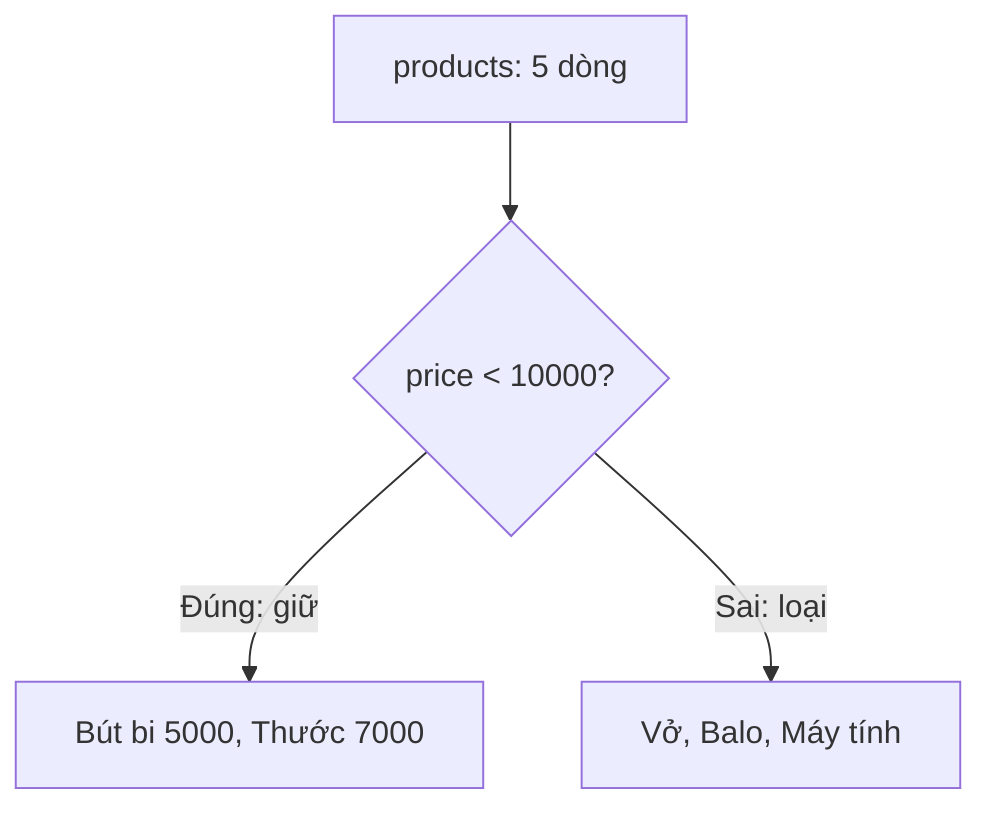

Cửa hàng có hàng nghìn sản phẩm, nhưng khách chỉ muốn xem món dưới 10.000đ.
Đọc cả bảng rồi tự lọc bằng mắt là không khả thi. Bài này hướng dẫn chọn đúng
cột và lọc đúng dòng ngay trong câu SQL.

## Khái niệm

🔍 **SELECT**: câu lệnh đọc dữ liệu, cho biết lấy những cột nào từ bảng nào.

🎯 **WHERE**: điều kiện lọc, chỉ giữ lại những dòng thoả điều kiện.

## Ví dụ

```sql
SELECT name, price
FROM products
WHERE price < 10000;
```

- `SELECT name, price`: chỉ lấy hai cột, thay vì `*` lấy tất cả.
- `FROM products`: đọc từ bảng `products`.
- `WHERE price < 10000`: chỉ giữ sản phẩm giá dưới 10.000đ.



Các toán tử hay dùng trong `WHERE`:

| Toán tử | Ý nghĩa | Ví dụ |
|---|---|---|
| `=` `<>` | bằng, khác | `city = 'Hà Nội'` |
| `>` `<` `>=` `<=` | so sánh | `stock > 0` |
| `AND` `OR` `NOT` | kết hợp điều kiện | `stock > 0 AND price < 10000` |
| `BETWEEN a AND b` | nằm trong khoảng, tính cả hai đầu | `price BETWEEN 5000 AND 12000` |
| `IN (...)` | bằng một trong các giá trị | `city IN ('Hà Nội', 'TP.HCM')` |
| `LIKE` | khớp mẫu: `%` là nhiều ký tự bất kỳ | `name LIKE 'B%'` |

## Thử ngay

```sql
SELECT name, price
FROM products
WHERE price BETWEEN 5000 AND 12000
ORDER BY price;
```

**Đoán trước khi chạy:** Vở giá đúng 12000. Nó có nằm trong kết quả không?

<details>
<summary>Xem kết quả</summary>

| NAME | PRICE |
|---|---|
| Bút bi | 5000 |
| Thước | 7000 |
| Vở | 12000 |

Có. `BETWEEN` tính cả hai đầu khoảng, nên 5000 và 12000 đều được giữ lại.

</details>

## Lỗi hay gặp

**Đặt chuỗi trong nháy kép.** Oracle hiểu `"Vở"` là tên cột, và báo
`ORA-00904: invalid identifier`.

```sql
-- SAI — lỗi: "Vở" bị hiểu là tên cột
SELECT * FROM products WHERE name = "Vở";
```

```sql
-- ĐÚNG — chuỗi dùng nháy đơn
SELECT * FROM products WHERE name = 'Vở';
```

**Trộn `AND` với `OR` mà không có ngoặc.** `AND` được tính trước `OR`, nên
câu dưới lấy mọi khách ở Hà Nội, cộng với khách tên An ở Đà Nẵng.

```sql
-- SAI — muốn khách tên An ở Hà Nội hoặc Đà Nẵng
SELECT name, city FROM customers
WHERE city = 'Hà Nội' OR city = 'Đà Nẵng'
  AND name = 'An';
```

```sql
-- ĐÚNG — ngoặc gom hai thành phố lại trước
SELECT name, city FROM customers
WHERE (city = 'Hà Nội' OR city = 'Đà Nẵng')
  AND name = 'An';
```

## Tóm tắt

- `SELECT cột FROM bảng WHERE điều kiện`.
- Chỉ lấy những cột cần, tránh `SELECT *` trong code thật.
- `BETWEEN` tính cả hai đầu, `IN` so với danh sách, `LIKE` khớp mẫu với `%`.
- Chuỗi dùng nháy đơn. Trộn `AND` với `OR` thì thêm ngoặc.

```quiz
[
  {
    "prompt": "Câu nào lấy sản phẩm có tên bắt đầu bằng chữ \"B\"?",
    "options": [
      "WHERE name = 'B%'",
      "WHERE name LIKE \"B%\"",
      "WHERE name LIKE 'B%'",
      "WHERE name IN ('B')"
    ],
    "answer": 3,
    "explain": "LIKE dùng để khớp mẫu, % thay cho mọi chuỗi ký tự phía sau. Chuỗi phải đặt trong nháy đơn."
  },
  {
    "prompt": "WHERE stock > 0 AND price < 10000 OR price > 400000 được Oracle hiểu thế nào?",
    "options": [
      "(stock > 0 AND price < 10000) OR price > 400000",
      "stock > 0 AND (price < 10000 OR price > 400000)",
      "Báo lỗi vì thiếu ngoặc",
      "Chỉ xét điều kiện đầu tiên"
    ],
    "answer": 1,
    "explain": "AND được tính trước OR. Muốn nghĩa khác thì phải tự thêm ngoặc."
  },
  {
    "prompt": "Cách nào gọn nhất để lấy khách ở Hà Nội, Đà Nẵng hoặc Huế?",
    "options": [
      "WHERE city = 'Hà Nội, Đà Nẵng, Huế'",
      "WHERE city BETWEEN 'Hà Nội' AND 'Huế'",
      "WHERE city LIKE 'Hà Nội%'",
      "WHERE city IN ('Hà Nội', 'Đà Nẵng', 'Huế')"
    ],
    "answer": 4,
    "explain": "IN so giá trị với từng phần tử trong danh sách, gọn hơn viết ba điều kiện nối bằng OR."
  }
]
```
