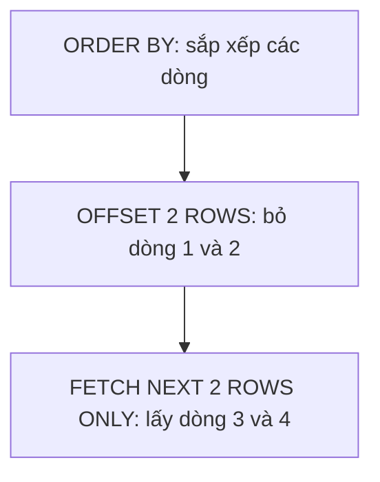

Trang chủ cửa hàng chỉ hiện 3 món đắt nhất. Trang danh sách thì chia mỗi
trang vài món, bấm "trang sau" để xem tiếp. Cả hai việc đều cần sắp xếp rồi
lấy đúng một đoạn kết quả.

## Khái niệm

↕️ **ORDER BY**: sắp xếp kết quả theo một hay nhiều cột, `ASC` là tăng dần (mặc định), `DESC` là giảm dần.

📄 **Phân trang (pagination)**: chỉ lấy một đoạn của kết quả, trong Oracle viết bằng `OFFSET ... ROWS FETCH NEXT ... ROWS ONLY`.

## Ví dụ

```sql
SELECT name, price
FROM products
ORDER BY price DESC
FETCH FIRST 3 ROWS ONLY;
```

- `ORDER BY price DESC`: giá cao xếp trước.
- `FETCH FIRST 3 ROWS ONLY`: chỉ lấy 3 dòng đầu sau khi đã sắp xếp.
- Sắp theo nhiều cột: `ORDER BY city, name`. Trùng thành phố thì xếp tiếp
  theo tên.

Trang thứ hai, mỗi trang 2 món:

```sql
SELECT name, price
FROM products
ORDER BY price DESC
OFFSET 2 ROWS FETCH NEXT 2 ROWS ONLY;
```



`OFFSET 2 ROWS` bỏ qua 2 dòng của trang đầu, `FETCH NEXT 2 ROWS ONLY` lấy 2
dòng tiếp theo. Muốn lấy trang thứ n thì bỏ qua
`(n - 1) × số dòng mỗi trang` dòng.

## Thử ngay

```sql
SELECT name, price
FROM products
ORDER BY price
OFFSET 1 ROWS FETCH NEXT 3 ROWS ONLY;
```

**Đoán trước khi chạy:** sắp giá tăng dần, bỏ qua 1 dòng rồi lấy 3 dòng.
Những món nào được lấy?

<details>
<summary>Xem kết quả</summary>

| NAME | PRICE |
|---|---|
| Thước | 7000 |
| Vở | 12000 |
| Balo | 350000 |

Sắp tăng dần là Bút bi, Thước, Vở, Balo, Máy tính. Bỏ qua Bút bi, lấy ba món
tiếp theo.

</details>

## Lỗi hay gặp

**Phân trang mà không `ORDER BY`.** Không có `ORDER BY` thì Oracle không đảm bảo
thứ tự nào cả, trang 2 có thể lặp lại món đã có ở trang 1.

```sql
-- SAI — thứ tự không xác định
SELECT name FROM products
OFFSET 2 ROWS FETCH NEXT 2 ROWS ONLY;
```

```sql
-- ĐÚNG
SELECT name FROM products
ORDER BY product_id
OFFSET 2 ROWS FETCH NEXT 2 ROWS ONLY;
```

**Dùng `ROWNUM` kèm `ORDER BY` trong cùng một câu.** Code Oracle cũ hay viết
như dưới. `ROWNUM` được đánh số **trước** khi sắp xếp, nên câu này lấy 3 dòng
bất kỳ rồi mới sắp, không phải 3 món đắt nhất.

```sql
-- SAI — không phải 3 món đắt nhất
SELECT name, price FROM products
WHERE ROWNUM <= 3
ORDER BY price DESC;
```

```sql
-- ĐÚNG
SELECT name, price FROM products
ORDER BY price DESC
FETCH FIRST 3 ROWS ONLY;
```

## Tóm tắt

- `ORDER BY cột` sắp tăng dần, thêm `DESC` để sắp giảm dần.
- `FETCH FIRST n ROWS ONLY` lấy n dòng đầu.
- Phân trang: `OFFSET bỏ_qua ROWS FETCH NEXT số_dòng ROWS ONLY`.
- Luôn `ORDER BY` trước khi lấy một đoạn kết quả. Tránh `ROWNUM` kèm
  `ORDER BY`.

```quiz
[
  {
    "prompt": "Mỗi trang 10 sản phẩm. Trang thứ 3 viết thế nào?",
    "options": [
      "OFFSET 3 ROWS FETCH NEXT 10 ROWS ONLY",
      "OFFSET 20 ROWS FETCH NEXT 10 ROWS ONLY",
      "OFFSET 30 ROWS FETCH NEXT 10 ROWS ONLY",
      "FETCH FIRST 30 ROWS ONLY"
    ],
    "answer": 2,
    "explain": "Trang 3 bỏ qua hai trang đầu, tức (3 - 1) × 10 = 20 dòng, rồi lấy 10 dòng."
  },
  {
    "prompt": "Muốn xem khách mới nhất trước, sắp theo ngày tạo. Viết thế nào?",
    "options": [
      "ORDER BY created_at",
      "ORDER BY created_at ASC",
      "ORDER BY created_at DESC",
      "WHERE created_at DESC"
    ],
    "answer": 3,
    "explain": "DESC sắp giảm dần, ngày gần nhất đứng đầu. Không ghi gì thì mặc định là ASC, tăng dần."
  },
  {
    "prompt": "Danh sách phân trang viết ORDER BY price. Hai món cùng giá 7000, lúc thì nằm ở trang 1, lúc lại ở trang 2. Sửa thế nào?",
    "options": [
      "Đổi thành ORDER BY price DESC",
      "Thêm DISTINCT sau SELECT",
      "Tăng số dòng mỗi trang",
      "ORDER BY price, product_id"
    ],
    "answer": 4,
    "explain": "Các dòng trùng giá không có thứ tự cố định giữa chúng. Sắp thêm theo khoá chính thì mỗi dòng có một vị trí duy nhất, trang nào cũng ổn định."
  }
]
```
