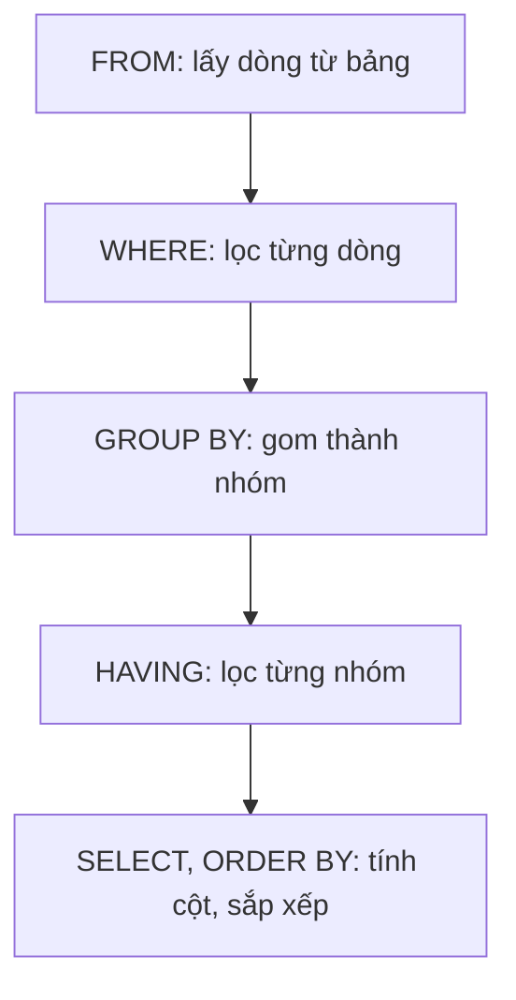

Tổng doanh thu của cả cửa hàng chỉ là một con số. Kế toán cần doanh thu của
**từng** đơn, và chỉ quan tâm những đơn lớn. Bài này chia dữ liệu thành từng
nhóm rồi tính riêng cho mỗi nhóm.

## Khái niệm

🧺 **GROUP BY**: gom các dòng có cùng giá trị ở một cột thành một nhóm, hàm tổng hợp được tính riêng cho từng nhóm.

🧹 **HAVING**: điều kiện lọc áp lên từng nhóm sau khi gom, khác với `WHERE` lọc từng dòng trước khi gom.

| | `WHERE` | `HAVING` |
|---|---|---|
| Lọc gì | từng dòng | từng nhóm |
| Chạy lúc nào | trước khi gom | sau khi gom |
| Dùng hàm tổng hợp | không | có |

## Ví dụ

```sql
SELECT order_id,
       COUNT(*)                   AS line_count,
       SUM(quantity * unit_price) AS total
FROM order_lines
GROUP BY order_id
ORDER BY order_id;
```

- `GROUP BY order_id`: các dòng hàng của cùng một đơn được gom thành một
  nhóm.
- Mỗi nhóm cho ra một dòng kết quả: mã đơn, số dòng hàng, tổng tiền.
- Cột nào trong `SELECT` không nằm trong hàm tổng hợp thì phải có trong
  `GROUP BY`.

Oracle xử lý một câu có đủ các phần theo thứ tự sau:



## Thử ngay

```sql
SELECT order_id,
       SUM(quantity * unit_price) AS total
FROM order_lines
GROUP BY order_id
HAVING SUM(quantity * unit_price) > 100000
ORDER BY order_id;
```

**Đoán trước khi chạy:** có 4 đơn hàng. Những đơn nào có tổng trên 100.000đ?

<details>
<summary>Xem kết quả</summary>

| ORDER_ID | TOTAL |
|---|---|
| 1 | 110000 |
| 2 | 350000 |
| 4 | 450000 |

Đơn 3 chỉ có 29.000đ (2 thước và 3 bút) nên bị `HAVING` loại. Đơn 1 gồm 10
bút và 5 vở, cộng lại là 110.000đ.

</details>

## Lỗi hay gặp

**Dùng hàm tổng hợp trong `WHERE`.** `WHERE` chạy trước khi gom nhóm, lúc đó
chưa có tổng nào để so. Oracle báo
`ORA-00934: group function is not allowed here`.

```sql
-- SAI — lỗi: WHERE không dùng được SUM
SELECT order_id FROM order_lines
WHERE SUM(quantity * unit_price) > 100000
GROUP BY order_id;
```

```sql
-- ĐÚNG — điều kiện trên nhóm đặt ở HAVING
SELECT order_id FROM order_lines
GROUP BY order_id
HAVING SUM(quantity * unit_price) > 100000;
```

**Lấy cột không có trong `GROUP BY`.** Một đơn có nhiều sản phẩm nên Oracle không
biết phải hiện `product_id` nào cho đơn đó và báo lỗi `ORA-00979`.

```sql
-- SAI — lỗi: product_id không được gom
SELECT order_id, product_id, COUNT(*)
FROM order_lines
GROUP BY order_id;
```

## Tóm tắt

- `GROUP BY cột` chia dữ liệu thành nhóm, hàm tổng hợp tính cho từng nhóm.
- Cột trong `SELECT` phải nằm trong hàm tổng hợp hoặc trong `GROUP BY`.
- `WHERE` lọc dòng trước khi gom, `HAVING` lọc nhóm sau khi gom.
- Thứ tự xử lý: `FROM`, `WHERE`, `GROUP BY`, `HAVING`, `SELECT`, `ORDER BY`.

```quiz
[
  {
    "prompt": "Muốn đếm số khách hàng ở mỗi thành phố. Câu nào đúng?",
    "options": [
      "SELECT city, COUNT(*) FROM customers",
      "SELECT city, COUNT(*) FROM customers WHERE city GROUP BY",
      "SELECT city, COUNT(*) FROM customers GROUP BY city",
      "SELECT COUNT(city) FROM customers HAVING city"
    ],
    "answer": 3,
    "explain": "GROUP BY city chia khách theo thành phố, COUNT(*) đếm số dòng trong từng nhóm."
  },
  {
    "prompt": "Chỉ lấy những thành phố có từ 2 khách trở lên. Điều kiện đặt ở đâu?",
    "options": [
      "HAVING COUNT(*) >= 2",
      "WHERE COUNT(*) >= 2",
      "GROUP BY COUNT(*) >= 2",
      "ORDER BY COUNT(*) >= 2"
    ],
    "answer": 1,
    "explain": "Điều kiện áp lên kết quả đã gom nhóm thì đặt ở HAVING. WHERE chạy trước khi có nhóm."
  },
  {
    "prompt": "Chỉ tính doanh thu các dòng hàng của sản phẩm số 1, rồi gom theo đơn. Điều kiện product_id = 1 đặt ở đâu?",
    "options": [
      "HAVING product_id = 1",
      "Trong SUM(product_id = 1)",
      "ORDER BY product_id = 1",
      "WHERE product_id = 1"
    ],
    "answer": 4,
    "explain": "Điều kiện xét từng dòng và không dùng hàm tổng hợp thì đặt ở WHERE để lọc trước khi gom."
  }
]
```
