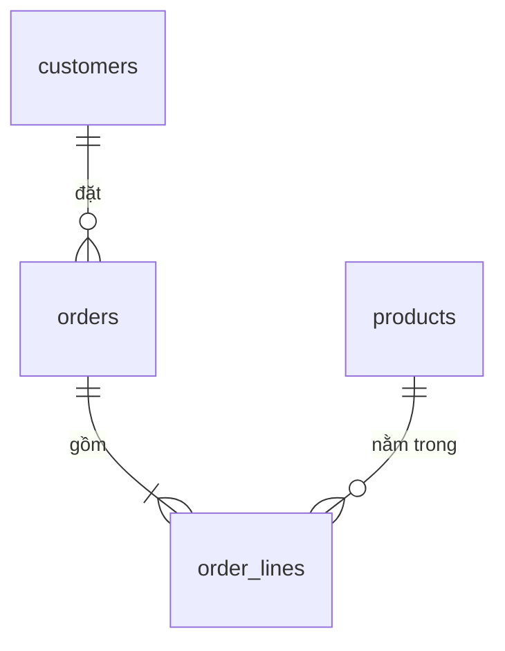

Bảng `orders` không lưu tên khách, chỉ lưu `customer_id`. Tên, email, thành
phố nằm ở bảng `customers`. Hai bảng nối với nhau qua cột này, và database
phải chặn những đơn hàng trỏ tới một khách không tồn tại.

## Khái niệm

🔗 **Khoá ngoại (foreign key)**: cột trỏ tới khoá chính của một bảng khác, database không cho lưu giá trị không có bên bảng kia.

🌳 **Quan hệ một-nhiều**: một dòng ở bảng này ứng với nhiều dòng ở bảng khác, ví dụ một khách hàng có nhiều đơn hàng.

## Ví dụ

Bảng `orders` trong script dữ liệu mẫu khai báo khoá ngoại như bản rút gọn
dưới đây:

```sql
CREATE TABLE order_samples (
  order_id    NUMBER PRIMARY KEY,
  customer_id NUMBER NOT NULL
              REFERENCES customers (customer_id)
);
```

- `REFERENCES customers (customer_id)`: giá trị của cột phải có trong
  `customers.customer_id`.
- Một khách có thể có nhiều đơn, nên `customer_id` được lặp lại trong
  `orders`.
- Bảng chứa khoá ngoại gọi là bảng con, bảng được trỏ tới gọi là bảng cha.
- Khác C# nơi `Customer` có thể giữ `List<Order>`, bảng cha không lưu danh
  sách: mỗi dòng con tự lưu khoá của cha.

Bốn bảng của cửa hàng nối với nhau như sau:



## Thử ngay

```sql
SELECT order_id, customer_id, status
FROM orders
ORDER BY order_id;
```

**Đoán trước khi chạy:** khách số mấy có hai đơn hàng, và khách số 4 có đơn
nào không?

<details>
<summary>Xem kết quả</summary>

| ORDER_ID | CUSTOMER_ID | STATUS |
|---|---|---|
| 1 | 1 | PAID |
| 2 | 1 | NEW |
| 3 | 2 | PAID |
| 4 | 3 | CANCELLED |

Khách số 1 (An) có hai đơn. Khách số 4 (Dũng) không có đơn nào. Muốn thấy
tên khách thay vì mã, cần nối hai bảng bằng `JOIN` ở bài sau.

</details>

## Lỗi hay gặp

**Thêm đơn cho khách không tồn tại.** `INSERT` thêm dòng, `DELETE` xoá dòng
(học kỹ ở chương Thay đổi dữ liệu). Không có khách số 99, Oracle báo lỗi
`ORA-02291`: không tìm thấy dòng cha.

```sql
-- SAI — lỗi: không có khách số 99
INSERT INTO orders (customer_id, order_date, status)
  VALUES (99, DATE '2025-03-01', 'NEW');
```

```sql
-- ĐÚNG — khách số 4 có thật
INSERT INTO orders (customer_id, order_date, status)
  VALUES (4, DATE '2025-03-01', 'NEW');
```

**Xoá khách đang có đơn hàng.** Nếu xoá được, các đơn đó sẽ trỏ tới một khách
không còn tồn tại, nên Oracle chặn lại với lỗi `ORA-02292`: vẫn còn dòng con.

```sql
-- SAI — lỗi: khách số 1 vẫn còn đơn hàng
DELETE FROM customers WHERE customer_id = 1;
```

```sql
-- ĐÚNG — xoá dòng con trước (đơn 1 và 2 của An), rồi mới xoá khách
DELETE FROM order_lines WHERE order_id IN (1, 2);
DELETE FROM orders WHERE customer_id = 1;
DELETE FROM customers WHERE customer_id = 1;
```

Hai khối ĐÚNG ở trên sửa dữ liệu mẫu. Thử xong, chạy `ROLLBACK;` để huỷ
(bài Transaction sẽ giải thích).

## Tóm tắt

- Khoá ngoại là cột trỏ tới khoá chính của bảng khác.
- Database chặn giá trị khoá ngoại không tồn tại bên bảng cha.
- Không xoá được dòng cha khi vẫn còn dòng con trỏ tới nó.
- Một khách nhiều đơn, một đơn nhiều dòng hàng: đó là quan hệ một-nhiều.

```quiz
[
  {
    "prompt": "Bảng order_lines có cột product_id trỏ tới products. Thêm một dòng hàng với product_id = 50 trong khi chỉ có 5 sản phẩm. Chuyện gì xảy ra?",
    "options": [
      "Thêm được, product_id để trống",
      "Báo lỗi vì không có sản phẩm số 50",
      "Thêm được, Oracle tự tạo sản phẩm số 50",
      "Thêm được nhưng không hiện khi SELECT"
    ],
    "answer": 2,
    "explain": "Khoá ngoại bắt buộc giá trị phải có bên bảng cha. Không có sản phẩm 50 thì Oracle báo ORA-02291."
  },
  {
    "prompt": "Trong quan hệ khách hàng và đơn hàng, cột khoá ngoại nằm ở bảng nào?",
    "options": [
      "customers, vì khách có nhiều đơn",
      "Cả hai bảng",
      "orders, vì mỗi đơn thuộc về một khách",
      "Không bảng nào"
    ],
    "answer": 3,
    "explain": "Khoá ngoại nằm ở phía \"nhiều\". Mỗi đơn lưu customer_id của khách đã đặt nó."
  },
  {
    "prompt": "Vì sao orders chỉ lưu customer_id mà không lưu luôn tên và email của khách?",
    "options": [
      "Để bảng orders ít cột, đỡ tốn chỗ",
      "Để JOIN chạy nhanh hơn khi nối bằng số",
      "Vì khoá ngoại bắt buộc phải là cột số",
      "Để thông tin khách chỉ nằm ở một chỗ"
    ],
    "answer": 4,
    "explain": "Chép tên và email vào mọi đơn thì khi khách đổi email phải sửa hàng loạt dòng, dễ sót. Lưu khoá ngoại thì chỉ sửa ở customers."
  }
]
```
