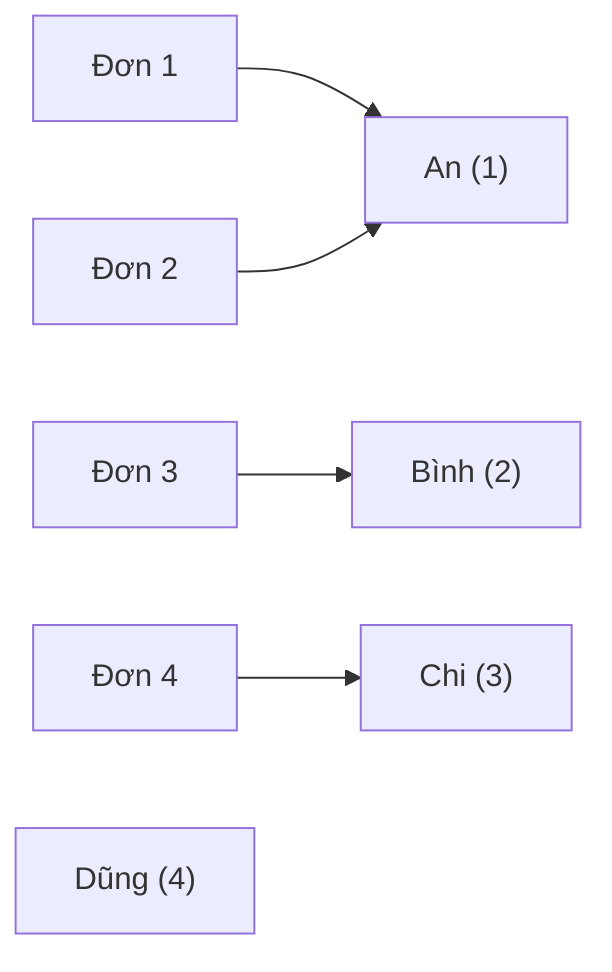

Danh sách đơn hàng chỉ có `customer_id`, nhưng nhân viên cần thấy tên khách.
Tên nằm ở bảng `customers`. `JOIN` ghép hai bảng lại trong một câu truy vấn
dựa trên khoá ngoại.

## Khái niệm

🤝 **INNER JOIN**: ghép dòng của hai bảng theo một điều kiện, chỉ giữ những cặp dòng khớp nhau.

🏷️ **Bí danh bảng (table alias)**: tên ngắn đặt cho bảng trong câu truy vấn, ví dụ `orders o`, để viết `o.status` thay vì `orders.status`.

## Ví dụ

```sql
SELECT o.order_id, c.name, o.status
FROM orders o
JOIN customers c ON c.customer_id = o.customer_id
ORDER BY o.order_id;
```

- `JOIN` là viết tắt của `INNER JOIN`.
- `ON c.customer_id = o.customer_id`: ghép mỗi đơn với đúng khách của nó.
- `o` và `c` là bí danh. Hai bảng có cột trùng tên thì bắt buộc ghi rõ cột
  của bảng nào.
- Muốn nối thêm bảng thứ ba thì viết thêm một `JOIN ... ON ...`.

Mỗi đơn được ghép với đúng một khách, còn Dũng không khớp đơn nào nên không
có trong kết quả:



## Thử ngay

Đơn số 3 gồm những sản phẩm nào? Tên sản phẩm nằm ở `products`, số lượng nằm
ở `order_lines`:

```sql
SELECT p.name, l.quantity
FROM order_lines l
JOIN products p ON p.product_id = l.product_id
WHERE l.order_id = 3
ORDER BY p.name;
```

**Đoán trước khi chạy:** kết quả có mấy dòng?

<details>
<summary>Xem kết quả</summary>

| NAME | QUANTITY |
|---|---|
| Bút bi | 3 |
| Thước | 2 |

Hai dòng, vì đơn 3 có hai dòng hàng. Mỗi dòng hàng được ghép với đúng sản
phẩm có cùng `product_id`.

</details>

## Lỗi hay gặp

**Dùng `AS` cho bí danh bảng.** Oracle cho viết `AS` trước bí danh **cột**,
nhưng không cho viết trước bí danh **bảng**, nên câu dưới báo lỗi cú pháp.

```sql
-- SAI — lỗi: Oracle không nhận AS trước bí danh bảng
SELECT o.order_id FROM orders AS o;
```

```sql
-- ĐÚNG
SELECT o.order_id FROM orders o;
```

**Liệt kê hai bảng mà quên điều kiện nối.** Câu lệnh không báo lỗi, nhưng mỗi đơn bị
ghép với **mọi** khách: 4 đơn × 4 khách thành 16 dòng vô nghĩa.

```sql
-- SAI — 16 dòng, ghép tất cả với tất cả
SELECT o.order_id, c.name
FROM orders o, customers c;
```

Luôn viết `JOIN ... ON` để điều kiện nối nằm ngay cạnh bảng được nối.

## Tóm tắt

- `JOIN bảng ON điều_kiện` ghép dòng của hai bảng, chỉ giữ cặp khớp nhau.
- Điều kiện nối thường là khoá ngoại bằng khoá chính.
- Đặt bí danh ngắn cho bảng. Oracle không cho viết `AS` trước bí danh bảng.
- Thiếu điều kiện nối thì mọi dòng ghép với mọi dòng.

```quiz
[
  {
    "prompt": "Muốn lấy tên sản phẩm cho mỗi dòng hàng. Điều kiện ON nào đúng?",
    "options": [
      "ON l.line_id = p.product_id",
      "ON l.order_id = p.product_id",
      "ON p.product_id = l.product_id",
      "ON p.name = l.quantity"
    ],
    "answer": 3,
    "explain": "order_lines.product_id là khoá ngoại trỏ tới products.product_id. Nối hai cột này với nhau."
  },
  {
    "prompt": "Bảng orders có 4 dòng, customers có 4 dòng. SELECT * FROM orders, customers; trả về bao nhiêu dòng?",
    "options": [
      "16",
      "4",
      "8",
      "Báo lỗi"
    ],
    "answer": 1,
    "explain": "Không có điều kiện nối thì mỗi dòng bảng này ghép với mọi dòng bảng kia: 4 × 4 = 16."
  },
  {
    "prompt": "SELECT customer_id FROM orders o JOIN customers c ON c.customer_id = o.customer_id; báo lỗi ORA-00918. Vì sao?",
    "options": [
      "Thiếu ORDER BY",
      "JOIN phải viết là INNER JOIN",
      "Bí danh phải có AS",
      "Cả hai bảng đều có customer_id, phải ghi o.customer_id hoặc c.customer_id"
    ],
    "answer": 4,
    "explain": "Cột trùng tên ở hai bảng thì Oracle không biết lấy của bảng nào. Ghi rõ bí danh trước tên cột."
  }
]
```
