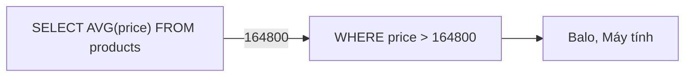

Muốn tìm sản phẩm đắt hơn giá trung bình thì không viết được
`WHERE price > AVG(price)`, vì bài GROUP BY và HAVING đã cho thấy hàm tổng hợp
trong `WHERE` báo lỗi.
Phải tính giá trung bình trước, rồi dùng con số đó để lọc. Subquery làm được việc này trong một câu.

## Khái niệm

🪆 **Subquery**: câu `SELECT` đặt bên trong một câu SQL khác, kết quả của nó được dùng như một giá trị hoặc một danh sách.

## Ví dụ

```sql
SELECT name, price
FROM products
WHERE price > (SELECT AVG(price) FROM products)
ORDER BY price;
```

- Câu trong ngoặc chạy trước, trả về một con số: giá trung bình là 164800.
- Câu bên ngoài dùng con số đó để lọc, ra Balo và Máy tính.
- Subquery trả về **một** giá trị thì so sánh bằng `=`, `>`, `<`.
- Subquery trả về **nhiều** dòng thì dùng `IN`.



## Thử ngay

Khách nào có ít nhất một đơn đã thanh toán?

```sql
SELECT name
FROM customers
WHERE customer_id IN (
  SELECT customer_id FROM orders WHERE status = 'PAID'
)
ORDER BY customer_id;
```

**Đoán trước khi chạy:** An có một đơn `PAID` và một đơn `NEW`, Chi chỉ có
đơn `CANCELLED`. Ai nằm trong kết quả?

<details>
<summary>Xem kết quả</summary>

| NAME |
|---|
| An |
| Bình |

Subquery trả về danh sách mã khách có đơn `PAID`: 1 và 2. An có ít nhất một
đơn `PAID` nên được giữ. Chi không có đơn nào như vậy.

</details>

## Lỗi hay gặp

**So sánh bằng `=` với subquery trả về nhiều dòng.** Oracle báo
`ORA-01427: single-row subquery returns more than one row`.

```sql
-- SAI — lỗi: có hai khách ở Hà Nội
SELECT order_id FROM orders
WHERE customer_id = (
  SELECT customer_id FROM customers
  WHERE city = 'Hà Nội'
);
```

```sql
-- ĐÚNG — nhiều giá trị thì dùng IN
SELECT order_id FROM orders
WHERE customer_id IN (
  SELECT customer_id FROM customers
  WHERE city = 'Hà Nội'
);
```

**`NOT IN` với danh sách có NULL.** Email của Chi là NULL. Chỉ cần danh sách
có một giá trị NULL là `NOT IN` không trả về dòng nào.

```sql
-- SAI — không trả về dòng nào
SELECT name FROM customers
WHERE email NOT IN (
  SELECT email FROM customers WHERE city = 'Hà Nội'
);
```

```sql
-- ĐÚNG — loại NULL khỏi danh sách
SELECT name FROM customers
WHERE email NOT IN (
  SELECT email FROM customers
  WHERE city = 'Hà Nội' AND email IS NOT NULL
);
```

## Tóm tắt

- Subquery là câu `SELECT` lồng trong câu khác, chạy trước để lấy giá trị.
- Trả về một giá trị thì dùng `=`, `>`, `<`. Trả về nhiều dòng thì dùng `IN`.
- Dùng subquery để lọc theo giá trị tổng hợp như trung bình.
- Cẩn thận `NOT IN` khi danh sách có thể chứa NULL.

```quiz
[
  {
    "prompt": "Tìm đơn hàng của khách tên An. Câu nào đúng, biết có thể có nhiều khách trùng tên An?",
    "options": [
      "WHERE customer_id = (SELECT customer_id FROM customers WHERE name = 'An')",
      "WHERE name = 'An'",
      "WHERE customer_id IN (SELECT customer_id FROM customers WHERE name = 'An')",
      "WHERE customer_id = 'An'"
    ],
    "answer": 3,
    "explain": "Có thể có nhiều khách tên An, subquery trả nhiều dòng nên phải dùng IN. Dùng = sẽ lỗi ORA-01427."
  },
  {
    "prompt": "Tìm sản phẩm có giá cao nhất. Câu nào đúng?",
    "options": [
      "WHERE price = (SELECT MAX(price) FROM products)",
      "WHERE price = MAX(price)",
      "WHERE MAX(price)",
      "HAVING price = MAX(price)"
    ],
    "answer": 1,
    "explain": "Subquery tính giá lớn nhất trước, câu ngoài lấy sản phẩm có đúng giá đó. Không dùng MAX trực tiếp trong WHERE được."
  },
  {
    "prompt": "WHERE id NOT IN (1, 2, NULL) trả về bao nhiêu dòng?",
    "options": [
      "Mọi dòng trừ id 1 và 2",
      "Chỉ các dòng có id NULL",
      "Báo lỗi",
      "Không dòng nào"
    ],
    "answer": 4,
    "explain": "So sánh với NULL không bao giờ cho kết quả đúng, nên điều kiện NOT IN không đúng với dòng nào. Phải loại NULL khỏi danh sách."
  }
]
```
