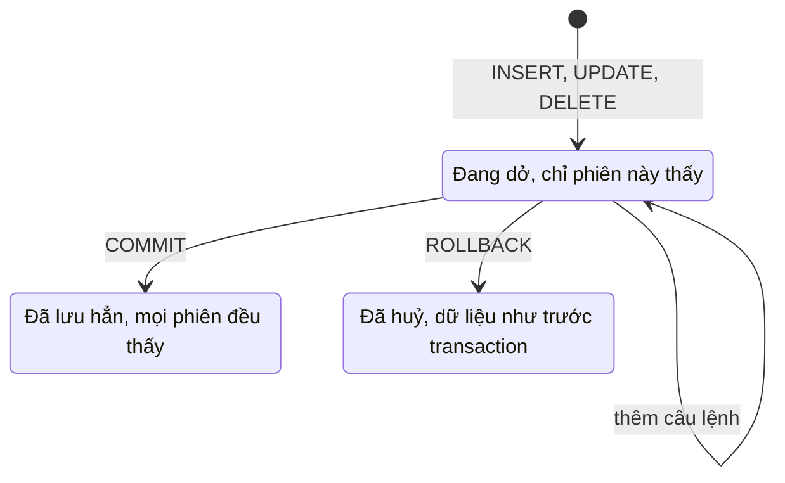

Đặt một đơn hàng gồm ba bước: thêm đơn, thêm dòng hàng, trừ tồn kho. Nếu mất
điện sau bước thứ hai thì đơn đã tạo mà kho chưa trừ, dữ liệu bị lệch. Ba bước
phải cùng thành công hoặc cùng bị huỷ. Transaction đảm bảo điều đó.

## Khái niệm

🔄 **Transaction**: nhóm câu lệnh thay đổi dữ liệu được thực hiện trọn vẹn cùng nhau, hoặc tất cả có hiệu lực, hoặc không câu nào có hiệu lực.

✅ **COMMIT**: xác nhận mọi thay đổi trong transaction, từ lúc này người khác mới thấy chúng và chúng không còn bị mất.

↩️ **ROLLBACK**: huỷ mọi thay đổi chưa `COMMIT`, đưa dữ liệu về như lúc bắt đầu transaction.

## Ví dụ

```sql
INSERT INTO orders (customer_id, order_date, status)
  VALUES (4, DATE '2025-03-01', 'NEW');

INSERT INTO order_lines
  (order_id, product_id, quantity, unit_price)
  VALUES ((SELECT MAX(order_id) FROM orders), 3, 1, 350000);

UPDATE products SET stock = stock - 1
WHERE product_id = 3;

COMMIT;
```

- `(SELECT MAX(order_id) FROM orders)` lấy mã của đơn vừa thêm.
- Trong Oracle, câu `INSERT`, `UPDATE` hoặc `DELETE` đầu tiên tự mở một
  transaction.
- Các thay đổi chỉ được lưu hẳn khi chạy `COMMIT`.
- Có lỗi giữa chừng thì gọi `ROLLBACK` để huỷ cả ba bước.
- Trước khi `COMMIT`, chỉ phiên (một kết nối đang mở tới Oracle) đã thực hiện
  thay đổi mới thấy chúng. Người khác vẫn thấy dữ liệu cũ.

Khối trên lưu hẳn dữ liệu, kể cả thay đổi còn dở từ trước. Thử xong, chạy khối
làm mới ở bài đầu khoá trước khi học bài sau.



## Thử ngay

```sql
UPDATE products SET stock = stock - 5
WHERE product_id = 1;

ROLLBACK;

SELECT name, stock FROM products
WHERE product_id = 1;
```

**Đoán trước khi chạy:** bút bi có 120 cây, vừa trừ 5 rồi `ROLLBACK`. Tồn kho
là 115 hay 120?

<details>
<summary>Xem kết quả</summary>

| NAME | STOCK |
|---|---|
| Bút bi | 120 |

Là 120. `ROLLBACK` huỷ câu `UPDATE` vì nó chưa được `COMMIT`.

</details>

## Lỗi hay gặp

**Quên `COMMIT`.** Bạn thấy dữ liệu đã đổi trong phiên của mình, nhưng người
khác thì không. Đóng kết nối mà chưa `COMMIT` thì thay đổi có thể mất.

**Chạy `CREATE TABLE` giữa transaction.** Câu lệnh tạo bảng (DDL) trong Oracle
tự `COMMIT` mọi thay đổi đang dở. `ROLLBACK` sau đó không huỷ được câu
`UPDATE` phía trước nữa.

```sql
-- SAI — CREATE TABLE đã tự COMMIT câu UPDATE
UPDATE products SET stock = 0 WHERE product_id = 1;
CREATE TABLE temp_log (note VARCHAR2(100));
ROLLBACK;
SELECT stock FROM products WHERE product_id = 1;
```

Câu `SELECT` cuối trả về 0 chứ không phải 120. Tạo bảng trước, rồi mới bắt
đầu thay đổi dữ liệu.

```sql
-- ĐÚNG — tạo bảng xong mới UPDATE, ROLLBACK trả lại 120
CREATE TABLE order_log (note VARCHAR2(100));
UPDATE products SET stock = 0 WHERE product_id = 1;
ROLLBACK;
SELECT stock FROM products WHERE product_id = 1;
```

Khối SAI đã lưu hẳn tồn kho 0 cho bút bi. Chạy khối làm mới ở bài đầu khoá
trước khi học bài sau.

## Tóm tắt

- Transaction gom nhiều câu lệnh thành một khối: cùng thành công hoặc cùng
  bị huỷ.
- `COMMIT` lưu hẳn thay đổi, `ROLLBACK` huỷ thay đổi chưa lưu.
- Chưa `COMMIT` thì người khác chưa thấy thay đổi.
- `CREATE TABLE` và các lệnh DDL khác tự `COMMIT` trong Oracle.

```quiz
[
  {
    "prompt": "Chuyển 100.000đ từ tài khoản A sang B gồm hai câu UPDATE. Câu thứ hai lỗi. Nên làm gì?",
    "options": [
      "COMMIT để giữ câu thứ nhất",
      "Chạy lại câu thứ hai rồi thôi",
      "Không cần làm gì",
      "ROLLBACK để huỷ cả câu thứ nhất"
    ],
    "answer": 4,
    "explain": "Hai câu phải cùng thành công. Câu hai lỗi thì ROLLBACK, nếu không A bị trừ tiền mà B không được cộng."
  },
  {
    "prompt": "Bạn INSERT một đơn hàng, rồi INSERT dòng hàng của đơn đó, rồi ROLLBACK. Còn lại gì?",
    "options": [
      "Không còn gì, cả hai bị huỷ",
      "Còn đơn, chỉ dòng hàng bị huỷ",
      "Còn cả hai, INSERT tự lưu ngay",
      "Báo lỗi, ROLLBACK chỉ huỷ một câu"
    ],
    "answer": 1,
    "explain": "ROLLBACK không giống Ctrl+Z huỷ câu cuối. Nó huỷ mọi thay đổi từ lần COMMIT gần nhất, ở đây là cả hai câu INSERT."
  },
  {
    "prompt": "UPDATE ...; CREATE TABLE ...; ROLLBACK; Câu UPDATE có bị huỷ không?",
    "options": [
      "Có, ROLLBACK huỷ mọi thứ",
      "Không, UPDATE đã được lưu",
      "Chỉ huỷ nếu CREATE TABLE lỗi",
      "Báo lỗi ở câu CREATE TABLE"
    ],
    "answer": 2,
    "explain": "Trong Oracle, lệnh DDL như CREATE TABLE tự COMMIT những thay đổi đang dở trước khi chạy."
  }
]
```
